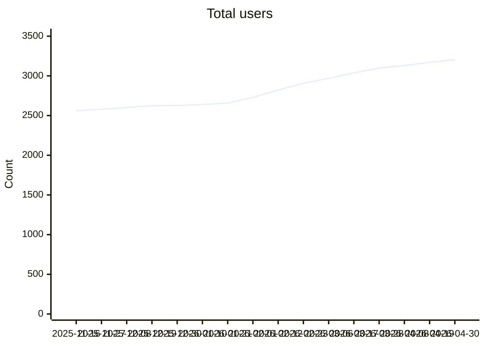
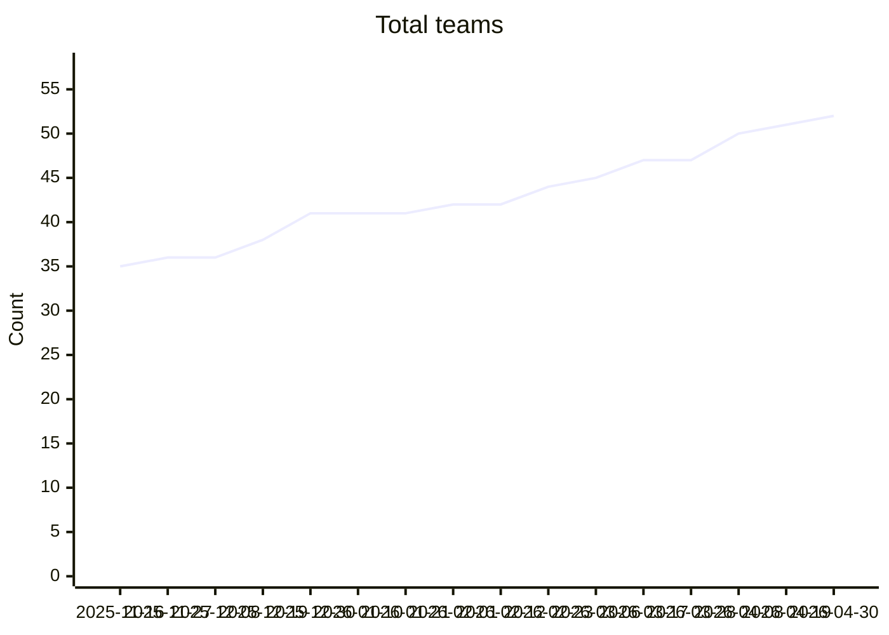
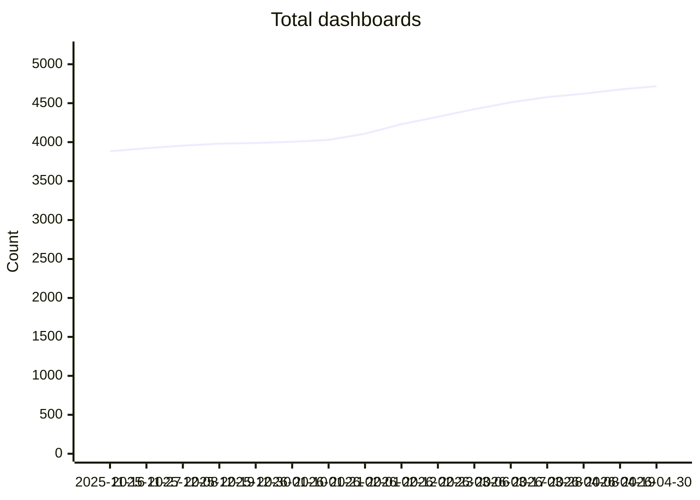
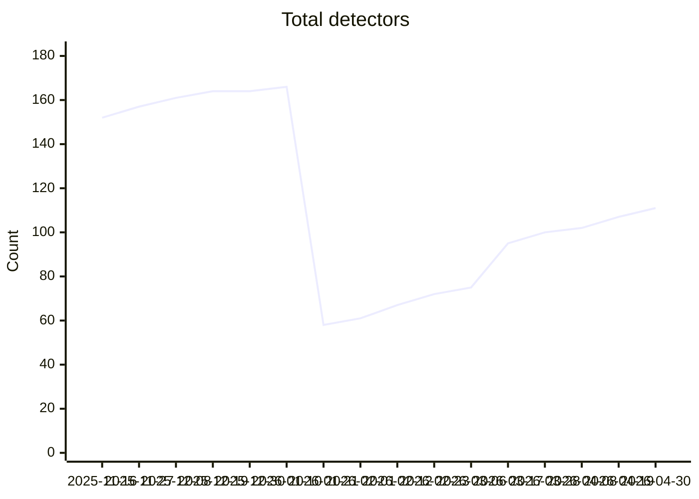
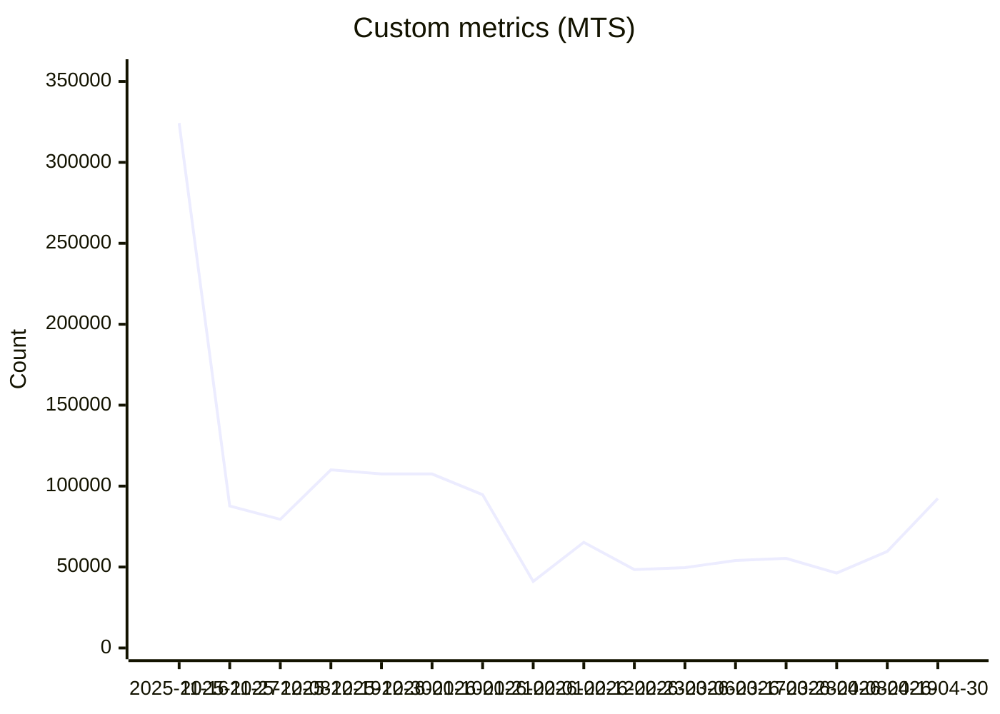
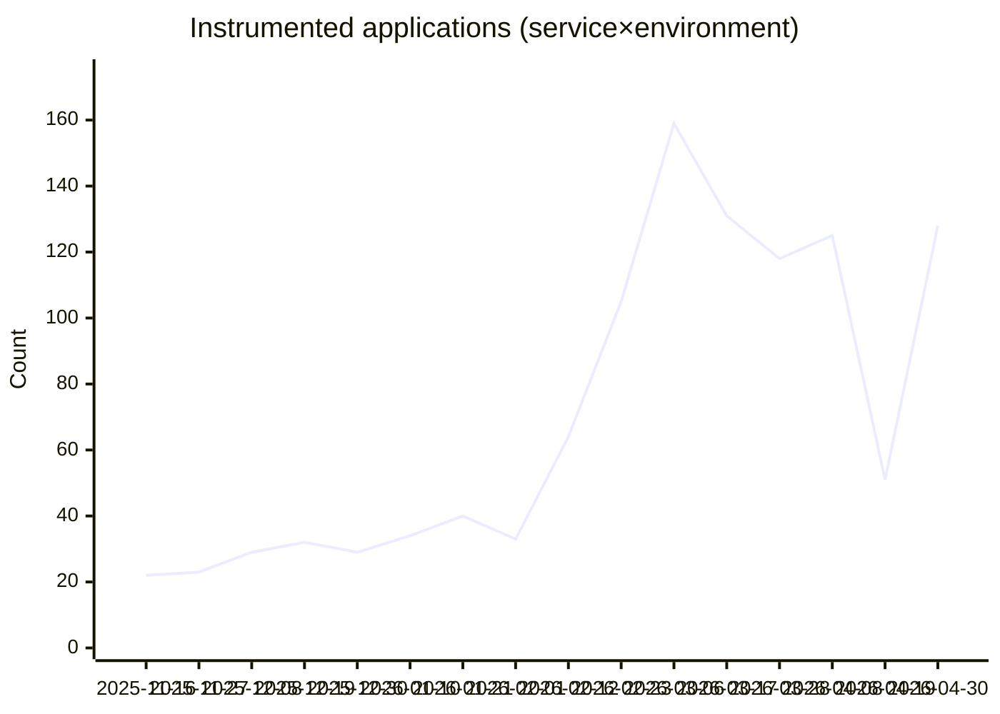

# Show Playground O11y Health Check

| Field | Value |
| --- | --- |
| Customer / purpose | Show Playground |
| Assessment date (UTC) | 2026-05-04T22:08:11Z |
| Realm | us1 |
| Scope | full · License + Platform engagement + IM + Detectors + Dashboards + APM + RUM + Synthetics + Token + OpenTelemetry Collectors (automated) |

## Severity legend

| Level | Meaning |
| --- | --- |
| Green | Healthy or normal |
| Yellow | Warning or lower criticality |
| Red | Critical or immediate attention |

## Executive summary

- License utilization: **13** Red, **0** Orange, **0** Yellow entitlement rows (latest complete month severity per entitlement).
- **Platform engagement:** **6** KPI trend series (``sf.org`` org counters; APM apps / custom metrics only when licensed per snapshot).
- **Infrastructure monitoring (metrics):** Usage analytics returned **9** metric row(s) (average hourly MTS).
- **Infrastructure monitoring (integrations):** **194** integration(s) listed (sorted by type).
- **Detectors:** analyzed **247** of **247** listed detectors (heuristic severities; confirm in UI).
- **Dashboards:** analyzed **150** of **4748** listed dashboards (chart/detector heuristics; confirm in UI).
- APM: snapshot over **24** hour(s); review domain subsections for Yellow/Red rows.
- **RUM:** SignalFlow window **168** hour(s); volume/MMS tables when `sf.org` series split by application; bot/custom-event/TMS rows are UI-only in this automation (see Findings).
- **Synthetics:** listed **165** synthetic test(s) (heuristic severities; confirm in UI).
- **Tokens:** listed **1** org token(s) (name column only in report).
- **OpenTelemetry Collectors:** **3** collector instance row(s) from metrics.
- **Coverage:** every checklist domain in this run that has a script was executed; see each section for gaps or placeholders.

- **Scope:** License utilization, Platform engagement, Infrastructure monitoring (metrics + integrations), Detectors, Dashboards, APM, Real User Monitoring (RUM), Synthetics, Token, OpenTelemetry Collectors, Other domains not executed

## License utilization

Analyze each license subscription and compare the usage over the previous 3 months. For each product the usage is broken down by utilization %.

### Severity legend

| Color | Criteria |
| --- | --- |
| Green | Utilization from 40% to 85% |
| Yellow | Utilization less than 40% |
| Orange | Utilization greater than 85% and up to 100% |
| Red | Utilization greater than 100% |

### APM

#### Entitlement: APM hosts (host model)

| Color | YYYY-MM | Subscription | Utilization | Utilization % |
| --- | --- | --- | --- | --- |
| Red | 2026-04 | 200 | 20.37 | 10.2% |
| Red | 2026-03 | 200 | 24.06 | 12.0% |
| Red | 2026-02 | 200 | 20.17 | 10.1% |

#### Recommendation

Review utilization trends and subscription alignment for this entitlement; adjust capacity or workloads as needed.

#### Entitlement: APM containers / serverless

| Color | YYYY-MM | Subscription | Utilization | Utilization % |
| --- | --- | --- | --- | --- |
| Red | 2026-04 | 4,000 | 75.99 | 1.9% |
| Red | 2026-03 | 4,000 | 89.85 | 2.2% |
| Red | 2026-02 | 4,000 | 59.13 | 1.5% |

#### Recommendation

Review utilization trends and subscription alignment for this entitlement; adjust capacity or workloads as needed.

#### Entitlement: APM Monitoring MetricSets (MMS)

| Color | YYYY-MM | Subscription | Utilization | Utilization % |
| --- | --- | --- | --- | --- |
| Yellow | 2026-04 | 8,000 | 5,556.94 | 69.5% |
| Red | 2026-03 | 8,000 | 1,589.43 | 19.9% |
| Red | 2026-02 | 8,000 | 13,112.59 | 163.9% |

#### Recommendation

Review utilization trends and subscription alignment for this entitlement; adjust capacity or workloads as needed.

#### Entitlement: APM Troubleshooting MetricSets (TMS)

| Color | YYYY-MM | Subscription | Utilization | Utilization % |
| --- | --- | --- | --- | --- |
| Red | 2026-04 | 80,000 | 2,180.34 | 2.7% |
| Red | 2026-03 | 80,000 | 1,943.6 | 2.4% |
| Red | 2026-02 | 80,000 | 2,287.15 | 2.9% |

#### Recommendation

Review utilization trends and subscription alignment for this entitlement; adjust capacity or workloads as needed.

#### Entitlement: APM trace volume

| Color | YYYY-MM | Subscription (MB) | Utilization (MB) | Utilization % |
| --- | --- | --- | --- | --- |
| Red | 2026-04 | 4,096 | 147,643,825,302.95 | 3,604,585,578.7% |
| Red | 2026-03 | 4,096 | 63,629,511,779.23 | 1,553,454,877.4% |
| Red | 2026-02 | 4,096 | 68,272,918,392.59 | 1,666,819,296.7% |

#### Recommendation

Review utilization trends and subscription alignment for this entitlement; adjust capacity or workloads as needed.

#### Entitlement: Profiling ingest

*Subscription allowance (bytes) is derived post-query from APM host/TAPM metrics per License_utilizations.md. Host model: Enterprise path 10.24 MB/host vs Standard 5.12 MB/host (subscription.containers/hosts ≈ 20 picks Enterprise path). See `profiling_derived` in JSON.*

| Color | YYYY-MM | Subscription (MB) | Utilization (MB) | Utilization % |
| --- | --- | --- | --- | --- |
| Red | 2026-04 | 2,048 | -326.54 | -15.9% |
| Red | 2026-03 | 2,048 | -479.14 | -23.4% |
| Red | 2026-02 | 2,048 | -450.1 | -22.0% |

#### Recommendation

Review utilization trends and subscription alignment for this entitlement; adjust capacity or workloads as needed.

### Infrastructure Monitoring

#### Entitlement: IM hosts

| Color | YYYY-MM | Subscription | Utilization | Utilization % |
| --- | --- | --- | --- | --- |
| Red | 2026-04 | 1,000 | 201.65 | 20.2% |
| Red | 2026-03 | 1,000 | 378.49 | 37.9% |
| Red | 2026-02 | 1,000 | 382.59 | 38.3% |

#### Recommendation

Review utilization trends and subscription alignment for this entitlement; adjust capacity or workloads as needed.

#### Entitlement: IM containers

| Color | YYYY-MM | Subscription | Utilization | Utilization % |
| --- | --- | --- | --- | --- |
| Red | 2026-04 | 20,000 | 2,144.11 | 10.7% |
| Red | 2026-03 | 20,000 | 2,959.23 | 14.8% |
| Red | 2026-02 | 20,000 | 2,103.6 | 10.5% |

#### Recommendation

Review utilization trends and subscription alignment for this entitlement; adjust capacity or workloads as needed.

#### Entitlement: Custom metrics (MTS-based)

| Color | YYYY-MM | Subscription | Utilization | Utilization % |
| --- | --- | --- | --- | --- |
| Red | 2026-04 | 200,000 | 64,135.04 | 32.1% |
| Red | 2026-03 | 200,000 | 52,963.97 | 26.5% |
| Red | 2026-02 | 200,000 | 53,920.91 | 27.0% |

#### Recommendation

Review utilization trends and subscription alignment for this entitlement; adjust capacity or workloads as needed.

### RUM

#### Entitlement: RUM sessions (monthly model)

| Color | YYYY-MM | Subscription | Utilization | Utilization % |
| --- | --- | --- | --- | --- |
| Red | 2026-04 | 2,000,000 | 1,083.1 | 0.1% |
| Red | 2026-03 | 2,000,000 | 1,084.41 | 0.1% |
| Red | 2026-02 | 2,000,000 | 1,209.89 | 0.1% |

#### Recommendation

Review utilization trends and subscription alignment for this entitlement; adjust capacity or workloads as needed.

#### Entitlement: RUM MMS

| Color | YYYY-MM | Subscription | Utilization | Utilization % |
| --- | --- | --- | --- | --- |
| Red | 2026-04 | 24,000 | 3,363.6 | 14.0% |
| Yellow | 2026-03 | 24,000 | 10,416.53 | 43.4% |
| Red | 2026-02 | 24,000 | 7,713.04 | 32.1% |

#### Recommendation

Review utilization trends and subscription alignment for this entitlement; adjust capacity or workloads as needed.

### Synthetics

#### Entitlement: Synthetic browser test runs

| Color | YYYY-MM | Subscription | Utilization | Utilization % |
| --- | --- | --- | --- | --- |
| Red | 2026-04 | 100,000 | 222.26 | 0.2% |
| Red | 2026-03 | 100,000 | 246.7 | 0.2% |
| Red | 2026-02 | 100,000 | 248.25 | 0.2% |

#### Recommendation

Review utilization trends and subscription alignment for this entitlement; adjust capacity or workloads as needed.

#### Entitlement: Synthetic API test runs

| Color | YYYY-MM | Subscription | Utilization | Utilization % |
| --- | --- | --- | --- | --- |
| Red | 2026-04 | 1,000,000 | 59.68 | 0.0% |
| Red | 2026-03 | 1,000,000 | 66.81 | 0.0% |
| Red | 2026-02 | 1,000,000 | 64.57 | 0.0% |

#### Recommendation

Review utilization trends and subscription alignment for this entitlement; adjust capacity or workloads as needed.

#### Entitlement: Synthetic uptime test runs

| Color | YYYY-MM | Subscription | Utilization | Utilization % |
| --- | --- | --- | --- | --- |
| Red | 2026-04 | 1,000,000 | 240.43 | 0.0% |
| Red | 2026-03 | 1,000,000 | 238.94 | 0.0% |
| Red | 2026-02 | 1,000,000 | 238.81 | 0.0% |

#### Recommendation

Review utilization trends and subscription alignment for this entitlement; adjust capacity or workloads as needed.

## Platform engagement

### Engagement Trends

<!-- O11Y_PE_KPI:eyJzY2hlbWEiOiJvMTF5X3BlX3ZpZXdlcl9rcGkvdjEiLCJjdXJyZW50V2luZG93U3RhcnQiOiIyMDI2LTA0LTI3IiwiY3VycmVudFdpbmRvd0VuZCI6IjIwMjYtMDUtMDQiLCJiYXNlbGluZVdpbmRvd1N0YXJ0IjoiMjAyNS0xMS0wNSIsImJhc2VsaW5lV2luZG93RW5kIjoiMjAyNS0xMS0xMiIsImtwaXMiOlt7ImlkIjoib3JnX3VzZXJzIiwibGFiZWwiOiJUb3RhbCB1c2VycyIsImN1cnJlbnQiOjMyMDUuMTAwNDUxMDQ5OTg1LCJiYXNlbGluZSI6MjU0MS4zMDUxOTQ4MDUxOTUsInBjdENoYW5nZSI6MjYuMTIwMjQ5NDUyOTg1Mjc3LCJlcnJvciI6bnVsbCwicG9pbnRzIjpbWzE3NjY5NjY0MDAwMDAsMjYyOC4wXSxbMTc2NzEzOTIwMDAwMCwyNjI4LjBdLFsxNzY3MzEyMDAwMDAwLDI2MjkuMF0sWzE3Njc0ODQ4MDAwMDAsMjYyOS4wXSxbMTc2NzY1NzYwMDAwMCwyNjMwLjBdLFsxNzY3ODMwNDAwMDAwLDI2MzQuNjUyMTczOTEzMDQzNV0sWzE3NjgwMDMyMDAwMDAsMjYzOC45NTY1MjE3MzkxMzA1XSxbMTc2ODE3NjAwMDAwMCwyNjM5LjBdLFsxNzY4MzQ4ODAwMDAwLDI2NDUuNTQ1NDU0NTQ1NDU0NV0sWzE3Njg1MjE2MDAwMDAsMjY1Mi4zMTgxODE4MTgxODJdLFsxNzY4Njk0NDAwMDAwLDI2NTUuMF0sWzE3Njg4NjcyMDAwMDAsMjY1Ni40MzQ3ODI2MDg2OTU1XSxbMTc2OTA0MDAwMDAwMCwyNjYwLjYwODY5NTY1MjE3NF0sWzE3NjkyMTI4MDAwMDAsMjY3MC4wODY5NTY1MjE3MzldLFsxNzY5Mzg1NjAwMDAwLDI2NzUuMF0sWzE3Njk1NTg0MDAwMDAsMjY4OS4yNzI3MjcyNzI3Mjc1XSxbMTc2OTczMTIwMDAwMCwyNzA2LjY4MTgxODE4MTgxOF0sWzE3Njk5MDQwMDAwMDAsMjcyOC4wXSxbMTc3MDA3NjgwMDAwMCwyNzMxLjM0NzgyNjA4Njk1NjVdLFsxNzcwMjQ5NjAwMDAwLDI3NTEuNTkwOTA5MDkwOTA5XSxbMTc3MDQyMjQwMDAwMCwyNzg0LjM0NzgyNjA4Njk1NjVdLFsxNzcwNTk1MjAwMDAwLDI3OTIuMF0sWzE3NzA3NjgwMDAwMDAsMjgxMi42NjY2NjY2NjY2NjY1XSxbMTc3MDk0MDgwMDAwMCwyODI4Ljk1NDU0NTQ1NDU0NTVdLFsxNzcxMTEzNjAwMDAwLDI4NzMuMF0sWzE3NzEyODY0MDAwMDAsMjg3My42OTU2NTIxNzM5MTNdLFsxNzcxNDU5MjAwMDAwLDI4ODcuMzE4MTgxODE4MTgyXSxbMTc3MTYzMjAwMDAwMCwyOTAyLjM5MTMwNDM0NzgyNl0sWzE3NzE4MDQ4MDAwMDAsMjkwNi4wNDM0NzgyNjA4Njk1XSxbMTc3MTk3NzYwMDAwMCwyOTI1LjgyNjA4Njk1NjUyMTVdLFsxNzcyMTUwNDAwMDAwLDI5MzguODYzNjM2MzYzNjM2NV0sWzE3NzIzMjMyMDAwMDAsMjk0OS4wXSxbMTc3MjQ5NjAwMDAwMCwyOTUxLjM0NzgyNjA4Njk1NjVdLFsxNzcyNjY4ODAwMDAwLDI5NjAuNjE5MDQ3NjE5MDQ3N10sWzE3NzI4NDE2MDAwMDAsMjk3NS4wNDU0NTQ1NDU0NTQ1XSxbMTc3MzAxNDQwMDAwMCwyOTgzLjBdLFsxNzczMTg3MjAwMDAwLDMwMTAuNl0sWzE3NzMzNjAwMDAwMDAsMzAyNS45NTIzODA5NTIzODA3XSxbMTc3MzUzMjgwMDAwMCwzMDM3LjBdLFsxNzczNzA1NjAwMDAwLDMwMzcuNTkwOTA5MDkwOTA5XSxbMTc3Mzg3ODQwMDAwMCwzMDU5LjUyMTczOTEzMDQzNV0sWzE3NzQwNTEyMDAwMDAsMzA3Mi42OTU2NTIxNzM5MTNdLFsxNzc0MjI0MDAwMDAwLDMwNzUuNDM0NzgyNjA4Njk1NV0sWzE3NzQzOTY4MDAwMDAsMzA4Mi4wNDM0NzgyNjA4Njk1XSxbMTc3NDU2OTYwMDAwMCwzMDkwLjVdLFsxNzc0NzQyNDAwMDAwLDMxMDAuODY5NTY1MjE3MzkxNV0sWzE3NzQ5MTUyMDAwMDAsMzEwMi41NjUyMTczOTEzMDQ1XSxbMTc3NTA4ODAwMDAwMCwzMTEwLjBdLFsxNzc1MjYwODAwMDAwLDMxMTYuMzE4MTgxODE4MTgyXSxbMTc3NTQzMzYwMDAwMCwzMTIwLjM5MTMwNDM0NzgyNl0sWzE3NzU2MDY0MDAwMDAsMzEzMS40NzgyNjA4Njk1NjVdLFsxNzc1Nzc5MjAwMDAwLDMxNDMuMDkwOTA5MDkwOTA5XSxbMTc3NTk1MjAwMDAwMCwzMTUzLjBdLFsxNzc2MTI0ODAwMDAwLDMxNTMuMF0sWzE3NzYyOTc2MDAwMDAsMzE1Ni4xNzM5MTMwNDM0Nzg1XSxbMTc3NjQ3MDQwMDAwMCwzMTY3LjA0NTQ1NDU0NTQ1NDVdLFsxNzc2NjQzMjAwMDAwLDMxNzAuMF0sWzE3NzY4MTYwMDAwMDAsMzE3OC42MDg2OTU2NTIxNzRdLFsxNzc2OTg4ODAwMDAwLDMxODcuNzM5MTMwNDM0NzgyNV0sWzE3NzcxNjE2MDAwMDAsMzE5NS4wXSxbMTc3NzMzNDQwMDAwMCwzMTk1LjA0MzQ3ODI2MDg2OTVdLFsxNzc3NTA3MjAwMDAwLDMyMDMuODI2MDg2OTU2NTIxNV0sWzE3Nzc2ODAwMDAwMDAsMzIwOS41MjM4MDk1MjM4MDk2XSxbMTc3Nzg1MjgwMDAwMCwzMjExLjBdXX0seyJpZCI6InRlYW1zIiwibGFiZWwiOiJUb3RhbCB0ZWFtcyIsImN1cnJlbnQiOjUyLjAsImJhc2VsaW5lIjozNC45MTU1ODQ0MTU1ODQ0MSwicGN0Q2hhbmdlIjo0OC45MzA2MzA0NjMwODM1MiwiZXJyb3IiOm51bGwsInBvaW50cyI6W1sxNzY2OTY2NDAwMDAwLDQxLjBdLFsxNzY3MTM5MjAwMDAwLDQxLjBdLFsxNzY3MzEyMDAwMDAwLDQxLjBdLFsxNzY3NDg0ODAwMDAwLDQxLjBdLFsxNzY3NjU3NjAwMDAwLDQxLjBdLFsxNzY3ODMwNDAwMDAwLDQxLjBdLFsxNzY4MDAzMjAwMDAwLDQxLjBdLFsxNzY4MTc2MDAwMDAwLDQxLjBdLFsxNzY4MzQ4ODAwMDAwLDQxLjBdLFsxNzY4NTIxNjAwMDAwLDQxLjBdLFsxNzY4Njk0NDAwMDAwLDQxLjBdLFsxNzY4ODY3MjAwMDAwLDQxLjBdLFsxNzY5MDQwMDAwMDAwLDQxLjBdLFsxNzY5MjEyODAwMDAwLDQxLjBdLFsxNzY5Mzg1NjAwMDAwLDQxLjBdLFsxNzY5NTU4NDAwMDAwLDQxLjBdLFsxNzY5NzMxMjAwMDAwLDQxLjMxODE4MTgxODE4MTgyXSxbMTc2OTkwNDAwMDAwMCw0Mi4wXSxbMTc3MDA3NjgwMDAwMCw0Mi4wXSxbMTc3MDI0OTYwMDAwMCw0MS4wXSxbMTc3MDQyMjQwMDAwMCw0MS4wXSxbMTc3MDU5NTIwMDAwMCw0MS4wXSxbMTc3MDc2ODAwMDAwMCw0MS4wOTUyMzgwOTUyMzgwOTVdLFsxNzcwOTQwODAwMDAwLDQyLjBdLFsxNzcxMTEzNjAwMDAwLDQzLjBdLFsxNzcxMjg2NDAwMDAwLDQ0LjBdLFsxNzcxNDU5MjAwMDAwLDQ0LjBdLFsxNzcxNjMyMDAwMDAwLDQ0LjBdLFsxNzcxODA0ODAwMDAwLDQ0LjBdLFsxNzcxOTc3NjAwMDAwLDQ0LjBdLFsxNzcyMTUwNDAwMDAwLDQ0LjI3MjcyNzI3MjcyNzI3XSxbMTc3MjMyMzIwMDAwMCw0NS4wXSxbMTc3MjQ5NjAwMDAwMCw0NS4wXSxbMTc3MjY2ODgwMDAwMCw0NS4wXSxbMTc3Mjg0MTYwMDAwMCw0NS4wXSxbMTc3MzAxNDQwMDAwMCw0NS4wXSxbMTc3MzE4NzIwMDAwMCw0NS4wXSxbMTc3MzM2MDAwMDAwMCw0NS4wXSxbMTc3MzUzMjgwMDAwMCw0Ny4wXSxbMTc3MzcwNTYwMDAwMCw0Ny4wXSxbMTc3Mzg3ODQwMDAwMCw0Ny4wXSxbMTc3NDA1MTIwMDAwMCw0Ny4wXSxbMTc3NDIyNDAwMDAwMCw0Ny4wXSxbMTc3NDM5NjgwMDAwMCw0Ny4wXSxbMTc3NDU2OTYwMDAwMCw0Ny4wXSxbMTc3NDc0MjQwMDAwMCw0Ny4wXSxbMTc3NDkxNTIwMDAwMCw0Ny4wXSxbMTc3NTA4ODAwMDAwMCw0Ny4wXSxbMTc3NTI2MDgwMDAwMCw0OC4xODE4MTgxODE4MTgxOF0sWzE3NzU0MzM2MDAwMDAsNDkuMF0sWzE3NzU2MDY0MDAwMDAsNTAuMF0sWzE3NzU3NzkyMDAwMDAsNDkuNTQ1NDU0NTQ1NDU0NTVdLFsxNzc1OTUyMDAwMDAwLDUwLjBdLFsxNzc2MTI0ODAwMDAwLDUwLjBdLFsxNzc2Mjk3NjAwMDAwLDUwLjBdLFsxNzc2NDcwNDAwMDAwLDUxLjBdLFsxNzc2NjQzMjAwMDAwLDUxLjBdLFsxNzc2ODE2MDAwMDAwLDUxLjBdLFsxNzc2OTg4ODAwMDAwLDUxLjBdLFsxNzc3MTYxNjAwMDAwLDUyLjBdLFsxNzc3MzM0NDAwMDAwLDUyLjBdLFsxNzc3NTA3MjAwMDAwLDUyLjBdLFsxNzc3NjgwMDAwMDAwLDUyLjBdLFsxNzc3ODUyODAwMDAwLDUyLjBdXX0seyJpZCI6ImRhc2hib2FyZHMiLCJsYWJlbCI6IlRvdGFsIGRhc2hib2FyZHMiLCJjdXJyZW50Ijo0NzIwLjczMDA5NTk5MDk2NSwiYmFzZWxpbmUiOjM4MzEuNzAyMTQ1NjgwNDA2NCwicGN0Q2hhbmdlIjoyMy4yMDE5MDY1MjkwMDI3MDYsImVycm9yIjpudWxsLCJwb2ludHMiOltbMTc2Njk2NjQwMDAwMCwzOTg3LjA4Njk1NjUyMTczOV0sWzE3NjcxMzkyMDAwMDAsMzk5MC4wXSxbMTc2NzMxMjAwMDAwMCwzOTkxLjBdLFsxNzY3NDg0ODAwMDAwLDM5OTEuMF0sWzE3Njc2NTc2MDAwMDAsMzk5Mi4wXSxbMTc2NzgzMDQwMDAwMCwzOTk3LjY1MjE3MzkxMzA0MzVdLFsxNzY4MDAzMjAwMDAwLDQwMDQuMTczOTEzMDQzNDc4NV0sWzE3NjgxNzYwMDAwMDAsNDAwNy4wXSxbMTc2ODM0ODgwMDAwMCw0MDE0LjU0NTQ1NDU0NTQ1NDVdLFsxNzY4NTIxNjAwMDAwLDQwMjAuOTA5MDkwOTA5MDkxXSxbMTc2ODY5NDQwMDAwMCw0MDI0LjBdLFsxNzY4ODY3MjAwMDAwLDQwMjcuMjE3MzkxMzA0MzQ4XSxbMTc2OTA0MDAwMDAwMCw0MDMxLjYwODY5NTY1MjE3NF0sWzE3NjkyMTI4MDAwMDAsNDA0MS43ODI2MDg2OTU2NTJdLFsxNzY5Mzg1NjAwMDAwLDQwNDkuMF0sWzE3Njk1NTg0MDAwMDAsNDA2OS40MDkwOTA5MDkwOTFdLFsxNzY5NzMxMjAwMDAwLDQwODYuNjgxODE4MTgxODE4XSxbMTc2OTkwNDAwMDAwMCw0MTA4LjBdLFsxNzcwMDc2ODAwMDAwLDQxMTEuMzQ3ODI2MDg2OTU3XSxbMTc3MDI0OTYwMDAwMCw0MTM4LjkwOTA5MDkwOTA5MV0sWzE3NzA0MjI0MDAwMDAsNDE4OC4wXSxbMTc3MDU5NTIwMDAwMCw0MTk3LjBdLFsxNzcwNzY4MDAwMDAwLDQyMTguMDk1MjM4MDk1MjM4NV0sWzE3NzA5NDA4MDAwMDAsNDIzOS4wXSxbMTc3MTExMzYwMDAwMCw0Mjg1LjBdLFsxNzcxMjg2NDAwMDAwLDQyODUuMTMwNDM0NzgyNjA5XSxbMTc3MTQ1OTIwMDAwMCw0Mjk5LjYzNjM2MzYzNjM2NF0sWzE3NzE2MzIwMDAwMDAsNDMyMC42MDg2OTU2NTIxNzRdLFsxNzcxODA0ODAwMDAwLDQzMjQuOTEzMDQzNDc4MjYxXSxbMTc3MTk3NzYwMDAwMCw0MzQ4LjIxNzM5MTMwNDM0OF0sWzE3NzIxNTA0MDAwMDAsNDM4NS41Nzg5NDczNjg0MjFdLFsxNzcyMzIzMjAwMDAwLDQzOTUuMF0sWzE3NzI0OTYwMDAwMDAsNDM5OC43MzkxMzA0MzQ3ODNdLFsxNzcyNjY4ODAwMDAwLDQ0MTYuMjM4MDk1MjM4MDk1XSxbMTc3Mjg0MTYwMDAwMCw0NDMxLjBdLFsxNzczMDE0NDAwMDAwLDQ0MzkuMF0sWzE3NzMxODcyMDAwMDAsNDQ2Ny4xNV0sWzE3NzMzNjAwMDAwMDAsNDQ4OS4zNjM2MzYzNjM2MzZdLFsxNzczNTMyODAwMDAwLDQ1MDkuMF0sWzE3NzM3MDU2MDAwMDAsNDUxMC4wNDU0NTQ1NDU0NTVdLFsxNzczODc4NDAwMDAwLDQ1NDAuOTEzMDQzNDc4MjYxXSxbMTc3NDA1MTIwMDAwMCw0NTUwLjYwODY5NTY1MjE3NF0sWzE3NzQyMjQwMDAwMDAsNDU1Mi4zMTgxODE4MTgxODJdLFsxNzc0Mzk2ODAwMDAwLDQ1NTguNDM0NzgyNjA4Njk2XSxbMTc3NDU2OTYwMDAwMCw0NTcwLjM5MTMwNDM0NzgyNl0sWzE3NzQ3NDI0MDAwMDAsNDU4MC44Njk1NjUyMTczOTFdLFsxNzc0OTE1MjAwMDAwLDQ1ODMuMzQ3ODI2MDg2OTU3XSxbMTc3NTA4ODAwMDAwMCw0NTkzLjQ1NDU0NTQ1NDU0NV0sWzE3NzUyNjA4MDAwMDAsNDYwNS4yNzI3MjcyNzI3MjddLFsxNzc1NDMzNjAwMDAwLDQ2MTAuMzkxMzA0MzQ3ODI2XSxbMTc3NTYwNjQwMDAwMCw0NjIxLjY5NTY1MjE3MzkxM10sWzE3NzU3NzkyMDAwMDAsNDYzOC4xNzM5MTMwNDM0NzhdLFsxNzc1OTUyMDAwMDAwLDQ2NTEuMF0sWzE3NzYxMjQ4MDAwMDAsNDY1MS4yNjA4Njk1NjUyMTddLFsxNzc2Mjk3NjAwMDAwLDQ2NjEuOTU0NTQ1NDU0NTQ1XSxbMTc3NjQ3MDQwMDAwMCw0NjczLjA0NTQ1NDU0NTQ1NV0sWzE3NzY2NDMyMDAwMDAsNDY3Ni4wXSxbMTc3NjgxNjAwMDAwMCw0Njg2Ljk1NjUyMTczOTEzXSxbMTc3Njk4ODgwMDAwMCw0Njk3LjkwOTA5MDkwOTA5MV0sWzE3NzcxNjE2MDAwMDAsNDcwOC4wXSxbMTc3NzMzNDQwMDAwMCw0NzA4LjM0NzgyNjA4Njk1N10sWzE3Nzc1MDcyMDAwMDAsNDcxOC4xMzA0MzQ3ODI2MDldLFsxNzc3NjgwMDAwMDAwLDQ3MjUuNTQ1NDU0NTQ1NDU1XSxbMTc3Nzg1MjgwMDAwMCw0NzI5LjEzMDQzNDc4MjYwOV1dfSx7ImlkIjoiZGV0ZWN0b3JzIiwibGFiZWwiOiJUb3RhbCBkZXRlY3RvcnMiLCJjdXJyZW50IjoxMTEuMzgxMzY2NDU5NjI3MzMsImJhc2VsaW5lIjoxNDguOTY4ODMxMTY4ODMxMTcsInBjdENoYW5nZSI6LTI1LjIzMTc2NDUzMzc1MzIxLCJlcnJvciI6bnVsbCwicG9pbnRzIjpbWzE3NjY5NjY0MDAwMDAsMTY0LjBdLFsxNzY3MTM5MjAwMDAwLDE2NC40XSxbMTc2NzMxMjAwMDAwMCwxNjQuNF0sWzE3Njc0ODQ4MDAwMDAsMTY0LjRdLFsxNzY3NjU3NjAwMDAwLDE2NC41NzM5MTMwNDM0NzgyNl0sWzE3Njc4MzA0MDAwMDAsMTY1LjZdLFsxNzY4MDAzMjAwMDAwLDE2Ni4wXSxbMTc2ODE3NjAwMDAwMCwxNjYuMF0sWzE3NjgzNDg4MDAwMDAsMTY2LjkwOTA5MDkwOTA5MDldLFsxNzY4NTIxNjAwMDAwLDU3LjY5MDkwOTA5MDkwOTA5XSxbMTc2ODY5NDQwMDAwMCw1OC4wXSxbMTc2ODg2NzIwMDAwMCw1OC4wXSxbMTc2OTA0MDAwMDAwMCw1OC4wXSxbMTc2OTIxMjgwMDAwMCw1OC40XSxbMTc2OTM4NTYwMDAwMCw1OC40XSxbMTc2OTU1ODQwMDAwMCw1OC43MDkwOTA5MDkwOTA5MV0sWzE3Njk3MzEyMDAwMDAsNjAuNDkwOTA5MDkwOTA5MDg1XSxbMTc2OTkwNDAwMDAwMCw2MS4yXSxbMTc3MDA3NjgwMDAwMCw2MS4yXSxbMTc3MDI0OTYwMDAwMCw2MS40MTgxODE4MTgxODE4MTRdLFsxNzcwNDIyNDAwMDAwLDYzLjQ3ODI2MDg2OTU2NTIxXSxbMTc3MDU5NTIwMDAwMCw2Ni4wXSxbMTc3MDc2ODAwMDAwMCw2Ni4wOTUyMzgwOTUyMzgxXSxbMTc3MDk0MDgwMDAwMCw2OC4zODE4MTgxODE4MTgxOV0sWzE3NzExMTM2MDAwMDAsNjkuNl0sWzE3NzEyODY0MDAwMDAsNzAuMF0sWzE3NzE0NTkyMDAwMDAsNzAuMzQ1NDU0NTQ1NDU0NTRdLFsxNzcxNjMyMDAwMDAwLDcxLjMzOTEzMDQzNDc4MjYyXSxbMTc3MTgwNDgwMDAwMCw3MS44OTU2NTIxNzM5MTMwNF0sWzE3NzE5Nzc2MDAwMDAsNzEuNTEzMDQzNDc4MjYwODddLFsxNzcyMTUwNDAwMDAwLDczLjUyMzYzNjM2MzYzNjM3XSxbMTc3MjMyMzIwMDAwMCw3NC4wXSxbMTc3MjQ5NjAwMDAwMCw3NC4wNTIxNzM5MTMwNDM0OF0sWzE3NzI2Njg4MDAwMDAsNzQuNjY2NjY2NjY2NjY2NjZdLFsxNzcyODQxNjAwMDAwLDc2LjE4MTgxODE4MTgxODE5XSxbMTc3MzAxNDQwMDAwMCw4Mi4wXSxbMTc3MzE4NzIwMDAwMCw5MS4wMzk5OTk5OTk5OTk5OV0sWzE3NzMzNjAwMDAwMDAsOTMuMjU0NTQ1NDU0NTQ1NDVdLFsxNzczNTMyODAwMDAwLDk0LjBdLFsxNzczNzA1NjAwMDAwLDk1LjMwOTA5MDkwOTA5MDkxXSxbMTc3Mzg3ODQwMDAwMCw5Ny4xMTMwNDM0NzgyNjA4OF0sWzE3NzQwNTEyMDAwMDAsOTYuNjI2MDg2OTU2NTIxNzNdLFsxNzc0MjI0MDAwMDAwLDk4LjM2NTIxNzM5MTMwNDM2XSxbMTc3NDM5NjgwMDAwMCw5OS41ODI2MDg2OTU2NTIxN10sWzE3NzQ1Njk2MDAwMDAsOTkuNl0sWzE3NzQ3NDI0MDAwMDAsOTkuNl0sWzE3NzQ5MTUyMDAwMDAsOTkuNl0sWzE3NzUwODgwMDAwMDAsMTAwLjBdLFsxNzc1MjYwODAwMDAwLDEwMC4zMjcyNzI3MjcyNzI3M10sWzE3NzU0MzM2MDAwMDAsMTAxLjJdLFsxNzc1NjA2NDAwMDAwLDEwMS43MzkxMzA0MzQ3ODI2MV0sWzE3NzU3NzkyMDAwMDAsMTAyLjczMDQzNDc4MjYwODddLFsxNzc1OTUyMDAwMDAwLDEwNC40XSxbMTc3NjEyNDgwMDAwMCwxMDUuNTY1MjE3MzkxMzA0MzRdLFsxNzc2Mjk3NjAwMDAwLDEwNi40XSxbMTc3NjQ3MDQwMDAwMCwxMDcuMl0sWzE3NzY2NDMyMDAwMDAsMTA3LjJdLFsxNzc2ODE2MDAwMDAwLDEwNy43MDQzNDc4MjYwODY5NF0sWzE3NzY5ODg4MDAwMDAsMTA4LjgxODE4MTgxODE4MTgzXSxbMTc3NzE2MTYwMDAwMCwxMTAuOF0sWzE3NzczMzQ0MDAwMDAsMTEwLjhdLFsxNzc3NTA3MjAwMDAwLDExMS4yNjk1NjUyMTczOTEzXSxbMTc3NzY4MDAwMDAwMCwxMTEuNl0sWzE3Nzc4NTI4MDAwMDAsMTExLjZdXX0seyJpZCI6ImN1c3RvbV9tZXRyaWNzIiwibGFiZWwiOiJDdXN0b20gbWV0cmljcyAoTVRTKSIsImN1cnJlbnQiOjg4NDM5LjA5ODIxNDI4NTcxLCJiYXNlbGluZSI6MjU0NzM1LjkxNDMxNjIzOTMzLCJwY3RDaGFuZ2UiOi02NS4yODIwNDU3NDA3MTQxLCJlcnJvciI6bnVsbCwicG9pbnRzIjpbWzE3NjY5NjY0MDAwMDAsMTA4NjQ5LjY0NTgzMzMzMzMzXSxbMTc2NzEzOTIwMDAwMCwxMDY5MzEuNTQxNjY2NjY2NjddLFsxNzY3MzEyMDAwMDAwLDEwNDczOC45MjM2MTExMTExMV0sWzE3Njc0ODQ4MDAwMDAsMTAyMDY3Ljk2NTI3Nzc3Nzc4XSxbMTc2NzY1NzYwMDAwMCwxMDMzNTcuNDY1Mjc3Nzc3NzhdLFsxNzY3ODMwNDAwMDAwLDEwMjMxOC44ODg4ODg4ODg4OV0sWzE3NjgwMDMyMDAwMDAsMTA3NTAxLjMwNTU1NTU1NTU2XSxbMTc2ODE3NjAwMDAwMCw5OTAzNy4zMTk0NDQ0NDQ0NF0sWzE3NjgzNDg4MDAwMDAsOTkxNTEuNjExMTExMTExMTFdLFsxNzY4NTIxNjAwMDAwLDEwNTg5Mi41MjgxNjkwMTQwOF0sWzE3Njg2OTQ0MDAwMDAsOTMwNDMuMjM2MTExMTExMTFdLFsxNzY4ODY3MjAwMDAwLDkzNTIxLjY0NTgzMzMzMzMzXSxbMTc2OTA0MDAwMDAwMCwxMTIzOTAuMF0sWzE3NjkyMTI4MDAwMDAsMTIyOTkzLjQ3OTE2NjY2NjY3XSxbMTc2OTM4NTYwMDAwMCwxMTg4MDYuOTA5NzIyMjIyMjJdLFsxNzY5NTU4NDAwMDAwLDExNjcyNS41OTcyMjIyMjIyMl0sWzE3Njk3MzEyMDAwMDAsOTczMzcuNTI0MTM3OTMxMDNdLFsxNzY5OTA0MDAwMDAwLDQxMTIxLjk3MjIyMjIyMjIyXSxbMTc3MDA3NjgwMDAwMCw1MjQ2Ni4yMzYxMTExMTExMV0sWzE3NzAyNDk2MDAwMDAsNTkyNjguNjY2NjY2NjY2NjY0XSxbMTc3MDQyMjQwMDAwMCw3MjEzNi4xODc1XSxbMTc3MDU5NTIwMDAwMCw1OTY2MS4zODE5NDQ0NDQ0NDVdLFsxNzcwNzY4MDAwMDAwLDY1OTY4LjI3Nzc3Nzc3Nzc4XSxbMTc3MDk0MDgwMDAwMCw2NTAxOS4yMjkxNjY2NjY2NjRdLFsxNzcxMTEzNjAwMDAwLDQ2MzMyLjg4ODg4ODg4ODg5XSxbMTc3MTI4NjQwMDAwMCwzNTg0OC4xOTQ0NDQ0NDQ0NDVdLFsxNzcxNDU5MjAwMDAwLDQ1MTgzLjYxMzc5MzEwMzQ1XSxbMTc3MTYzMjAwMDAwMCw0NzAzMC42MDQxNjY2NjY2NjRdLFsxNzcxODA0ODAwMDAwLDQ4MzgzLjY1Mjc3Nzc3Nzc4XSxbMTc3MTk3NzYwMDAwMCw0OTI0MS44MDU1NTU1NTU1NTVdLFsxNzcyMTUwNDAwMDAwLDQ1MDE5LjM4NjIwNjg5NjU1XSxbMTc3MjMyMzIwMDAwMCw0NjEzMy4zMDU1NTU1NTU1NTVdLFsxNzcyNDk2MDAwMDAwLDQ2MjIyLjI0MzA1NTU1NTU1NV0sWzE3NzI2Njg4MDAwMDAsNDk2NTQuMzQ3MjIyMjIyMjJdLFsxNzcyODQxNjAwMDAwLDUwOTA1LjQxMzc5MzEwMzQ1XSxbMTc3MzAxNDQwMDAwMCw0ODIzMy43OTE2NjY2NjY2NjRdLFsxNzczMTg3MjAwMDAwLDU0NTc0LjQxNjY2NjY2NjY2NF0sWzE3NzMzNjAwMDAwMDAsNTQ2NzMuMDY5NDQ0NDQ0NDQ1XSxbMTc3MzUzMjgwMDAwMCw1NTA0NS42MjVdLFsxNzczNzA1NjAwMDAwLDU0MDQxLjY5NDQ0NDQ0NDQ0NV0sWzE3NzM4Nzg0MDAwMDAsNTQzNTUuOTAyNzc3Nzc3NzhdLFsxNzc0MDUxMjAwMDAwLDU2NDk3LjQzNzVdLFsxNzc0MjI0MDAwMDAwLDU2NzgzLjkzMDU1NTU1NTU1NV0sWzE3NzQzOTY4MDAwMDAsNTgxNTcuNjExMTExMTExMTFdLFsxNzc0NTY5NjAwMDAwLDU2NzYwLjg4MTk0NDQ0NDQ0NV0sWzE3NzQ3NDI0MDAwMDAsNTQwMzQuOTcyMjIyMjIyMjJdLFsxNzc0OTE1MjAwMDAwLDUwNTMzLjM1NDE2NjY2NjY2NF0sWzE3NzUwODgwMDAwMDAsNDcxNTAuMjIyMjIyMjIyMjJdLFsxNzc1MjYwODAwMDAwLDQ0OTQ3LjE4NzVdLFsxNzc1NDMzNjAwMDAwLDQzODAxLjc1XSxbMTc3NTYwNjQwMDAwMCw0NjI2NC4xNDU4MzMzMzMzMzZdLFsxNzc1Nzc5MjAwMDAwLDUyMDQxLjkwMjc3Nzc3Nzc4XSxbMTc3NTk1MjAwMDAwMCw0OTU4My4yNjM4ODg4ODg4OV0sWzE3NzYxMjQ4MDAwMDAsNDY0NzMuOTIzNjExMTExMTFdLFsxNzc2Mjk3NjAwMDAwLDU5NjU4LjAwNjk0NDQ0NDQ0NV0sWzE3NzY0NzA0MDAwMDAsNTk3NzguMjc3Nzc3Nzc3NzhdLFsxNzc2NjQzMjAwMDAwLDU5NzU2LjU0ODYxMTExMTExXSxbMTc3NjgxNjAwMDAwMCw5NTI5Mi4zOTU4MzMzMzMzM10sWzE3NzY5ODg4MDAwMDAsOTQ4NTcuNzc3Nzc3Nzc3NzhdLFsxNzc3MTYxNjAwMDAwLDkyMjI2LjU4MzMzMzMzMzMzXSxbMTc3NzMzNDQwMDAwMCw4NTY3Ni4xODA1NTU1NTU1Nl0sWzE3Nzc1MDcyMDAwMDAsOTIzMzkuMjAxMzg4ODg4ODldLFsxNzc3NjgwMDAwMDAwLDg3ODQ2LjY5NDQ0NDQ0NDQ0XSxbMTc3Nzg1MjgwMDAwMCw4NjMwMi42ODA1NTU1NTU1Nl1dfSx7ImlkIjoiaW5zdHJ1bWVudGVkX2FwcHMiLCJsYWJlbCI6Ikluc3RydW1lbnRlZCBhcHBsaWNhdGlvbnMgKHNlcnZpY2VcdTAwZDdlbnZpcm9ubWVudCkiLCJjdXJyZW50IjoxMjIuMTQyODU3MTQyODU3MTQsImJhc2VsaW5lIjozOS4xNDI4NTcxNDI4NTcxNDYsInBjdENoYW5nZSI6MjEyLjA0Mzc5NTYyMDQzNzk1LCJlcnJvciI6bnVsbCwicG9pbnRzIjpbWzE3NjY5NjY0MDAwMDAsMzAuMF0sWzE3NjcxMzkyMDAwMDAsMjkuMF0sWzE3NjczMTIwMDAwMDAsMzAuMF0sWzE3Njc0ODQ4MDAwMDAsMjkuMF0sWzE3Njc2NTc2MDAwMDAsMzEuMF0sWzE3Njc4MzA0MDAwMDAsMzIuMF0sWzE3NjgwMDMyMDAwMDAsMzQuMF0sWzE3NjgxNzYwMDAwMDAsMjkuMF0sWzE3NjgzNDg4MDAwMDAsMzYuMF0sWzE3Njg1MjE2MDAwMDAsNDIuMF0sWzE3Njg2OTQ0MDAwMDAsMzAuMF0sWzE3Njg4NjcyMDAwMDAsMzYuMF0sWzE3NjkwNDAwMDAwMDAsMzguMF0sWzE3NjkyMTI4MDAwMDAsNDAuMF0sWzE3NjkzODU2MDAwMDAsMzMuMF0sWzE3Njk1NTg0MDAwMDAsMzYuMF0sWzE3Njk3MzEyMDAwMDAsNDIuMF0sWzE3Njk5MDQwMDAwMDAsMzMuMF0sWzE3NzAwNzY4MDAwMDAsMzYuMF0sWzE3NzAyNDk2MDAwMDAsNDMuMF0sWzE3NzA0MjI0MDAwMDAsNzQuMF0sWzE3NzA1OTUyMDAwMDAsNTUuMF0sWzE3NzA3NjgwMDAwMDAsNTcuMF0sWzE3NzA5NDA4MDAwMDAsNjYuMF0sWzE3NzExMTM2MDAwMDAsNTYuMF0sWzE3NzEyODY0MDAwMDAsNTYuMF0sWzE3NzE0NTkyMDAwMDAsOTUuMF0sWzE3NzE2MzIwMDAwMDAsMTQ2LjBdLFsxNzcxODA0ODAwMDAwLDEwNS4wXSxbMTc3MTk3NzYwMDAwMCwxMjEuMF0sWzE3NzIxNTA0MDAwMDAsODcuMF0sWzE3NzIzMjMyMDAwMDAsNjQuMF0sWzE3NzI0OTYwMDAwMDAsODAuMF0sWzE3NzI2Njg4MDAwMDAsMTYxLjBdLFsxNzcyODQxNjAwMDAwLDEyMy4wXSxbMTc3MzAxNDQwMDAwMCw3NC4wXSxbMTc3MzE4NzIwMDAwMCwxNDcuMF0sWzE3NzMzNjAwMDAwMDAsMTkxLjBdLFsxNzczNTMyODAwMDAwLDE2MC4wXSxbMTc3MzcwNTYwMDAwMCwxMzEuMF0sWzE3NzM4Nzg0MDAwMDAsMTQ4LjBdLFsxNzc0MDUxMjAwMDAwLDEyOC4wXSxbMTc3NDIyNDAwMDAwMCwxMTAuMF0sWzE3NzQzOTY4MDAwMDAsMTc4LjBdLFsxNzc0NTY5NjAwMDAwLDExMS4wXSxbMTc3NDc0MjQwMDAwMCw5My4wXSxbMTc3NDkxNTIwMDAwMCw5NS4wXSxbMTc3NTA4ODAwMDAwMCwxMTcuMF0sWzE3NzUyNjA4MDAwMDAsNzYuMF0sWzE3NzU0MzM2MDAwMDAsNzguMF0sWzE3NzU2MDY0MDAwMDAsMTI1LjBdLFsxNzc1Nzc5MjAwMDAwLDEyMi4wXSxbMTc3NTk1MjAwMDAwMCw5NS4wXSxbMTc3NjEyNDgwMDAwMCw4My4wXSxbMTc3NjI5NzYwMDAwMCw2My4wXSxbMTc3NjQ3MDQwMDAwMCw2MS4wXSxbMTc3NjY0MzIwMDAwMCw1MS4wXSxbMTc3NjgxNjAwMDAwMCw4OC4wXSxbMTc3Njk4ODgwMDAwMCw5MS4wXSxbMTc3NzE2MTYwMDAwMCw4Ni4wXSxbMTc3NzMzNDQwMDAwMCwxMDAuMF0sWzE3Nzc1MDcyMDAwMDAsMTI4LjBdLFsxNzc3NjgwMDAwMDAwLDE2My4wXSxbMTc3Nzg1MjgwMDAwMCwxMTYuMF1dfV19 -->

Trend comparison of org-level usage signals vs a baseline window **~6 months earlier**. **Current** / **baseline** are means over the configured trailing windows (see Findings). Charts use the same SignalFlow resolution as the series.

### Results

#### KPI summary

| KPI | Current | Baseline (~6 mo prior) | Δ% |
| --- | ---: | ---: | ---: |
| Total users | 3205.1 | 2541.31 | +26.12% |
| Total teams | 52 | 34.92 | +48.93% |
| Total dashboards | 4720.73 | 3831.7 | +23.20% |
| Total detectors | 111.38 | 148.97 | -25.23% |
| Custom metrics (MTS) | 88439.1 | 254735.91 | -65.28% |
| Instrumented applications (service×environment) | 122.14 | 39.14 | +212.04% |

#### Trend charts

##### Total users

##### Total teams

##### Total dashboards

##### Total detectors

##### Custom metrics (MTS)

##### Instrumented applications (service×environment)

### Findings

- *No findings.*

### Recommendation

Use these trends with **license** and **usage** sections: sustained drops in users or teams may reflect identity cleanup; rises in dashboards/detectors may warrant governance reviews. Validate sharp moves in **Chart Builder** before acting.

### User Analysis

### Results

| Metric | Value |
| --- | --- |
| Directory / 30-day unique logins | *Not collected here — requires admin / usage reporting* |

### Recommendation

Treat org **user directory** size as membership, not login frequency, unless a supported usage export is available.

## Infrastructure monitoring health checks

### Metric Cardinality & Volume

List of metrics with high cardinality and whether they are being utilized in detectors, dashboards, or API. Only metrics with **% Over Total ≥ 1%** are listed.

### Results

| Metric Name | Billing Class | Cardinality (MTS) | Utilization | % Over Total |
| --- | --- | --- | --- | --- |
| apiserver_request_duration_seconds_bucket | Default / Bundled (Infra) | 24,620 | R0 - Unused | 7.64% |
| k8s.container.status.reason | Default / Bundled (Infra) | 19,674.79 | R0 - Unused | 6.11% |
| apiserver_request_total | Default / Bundled (Infra) | 9,880.67 | R1 - Inactive Charts | 3.07% |
| http.client.request.duration_bucket | Default / Bundled (App) | 7,123.67 | R0 - Unused | 2.21% |
| apiserver_request_duration_seconds | Default / Bundled (Infra) | 5,433.71 | R1 - Inactive Charts | 1.69% |
| http.client.request.body.size_bucket | Custom | 4,912.92 | R0 - Unused | 1.53% |
| http.client.response.body.size_bucket | Custom | 4,781.29 | R0 - Unused | 1.48% |
| apiserver_response_sizes_bucket | Custom | 4,477 | R0 - Unused | 1.39% |
| hubble_flows_processed_total | Default / Bundled (Infra) | 4,111.17 | R1 - Inactive Charts | 1.28% |

### Recommendation

Use Metric Pipeline Management (MPP) to create rules to archive or drop metrics and dimensions not being used in detectors, dashboards, or API calls. Consider enabling auto-archiving rules.

### Analyze Integrations

Analyze cloud integrations (AWS, GCP, Azure) to see if all services have been enabled. Breakdown of each integration with the sources of data being pulled.

### Results

| Integration Type | Integration Name | Active (T/F) |
| --- | --- | --- |
| AIDefense | aidefense-test | True |
| AWSCloudWatch | AWS | True |
| AWSCloudWatch | AWS | False |
| AWSCloudWatch | AWS | False |
| AWSCloudWatch | AWS | False |
| AWSCloudWatch | AWS | False |
| AWSCloudWatch | AWS | False |
| AWSCloudWatch | AWS | False |
| AWSCloudWatch | AWS | False |
| AWSCloudWatch | AWS | False |
| AWSCloudWatch | AWS | True |
| AWSCloudWatch | AWS | True |
| AWSCloudWatch | AWS | False |
| AWSCloudWatch | AWS | False |
| AWSCloudWatch | AWS | False |
| AWSCloudWatch | AWS | True |
| AWSCloudWatch | AWS | False |
| AWSCloudWatch | AWS | False |
| AWSCloudWatch | AWS | True |
| AWSCloudWatch | AWS | False |
| AWSCloudWatch | AWS | False |
| AWSCloudWatch | AWS | False |
| AWSCloudWatch | AWS | False |
| AWSCloudWatch | AWS | False |
| AWSCloudWatch | AWS | False |
| AWSCloudWatch | AWS | False |
| AWSCloudWatch | AWS | False |
| AWSCloudWatch | AWS | False |
| AWSCloudWatch | AWS | False |
| AWSCloudWatch | AWS | False |
| AWSCloudWatch | AWS | False |
| AWSCloudWatch | AWS | False |
| AWSCloudWatch | AWS | False |
| AWSCloudWatch | AWS | False |
| AWSCloudWatch | AWS | False |
| AWSCloudWatch | AWS | True |
| AWSCloudWatch | AWS | False |
| AWSCloudWatch | AWS | False |
| AWSCloudWatch | AWS | False |
| AWSCloudWatch | AWS | False |
| AWSCloudWatch | AWS | False |
| AWSCloudWatch | AWS | False |
| AWSCloudWatch | AWS | False |
| AWSCloudWatch | AWS | False |
| AWSCloudWatch | AWS | False |
| AWSCloudWatch | AWS | False |
| AWSCloudWatch | AWS | False |
| AWSCloudWatch | AWS | False |
| AWSCloudWatch | AWS | False |
| AWSCloudWatch | AWS | False |
| AWSCloudWatch | AWS | False |
| AWSCloudWatch | AWS | False |
| AWSCloudWatch | AWS | False |
| AWSCloudWatch | AWS | False |
| AWSCloudWatch | AWS | False |
| AWSCloudWatch | AWS | False |
| AWSCloudWatch | AWS | False |
| AWSCloudWatch | AWS | False |
| AWSCloudWatch | AWS - O11-For-AI | True |
| AWSCloudWatch | AWS jiyoon | True |
| AWSCloudWatch | AWS ledeoliv | False |
| AWSCloudWatch | AWS-Bedrock-inframon | True |
| AWSCloudWatch | AWS-connection-name | False |
| AWSCloudWatch | AWS-connection-name | False |
| AWSCloudWatch | AWS-fdumont | False |
| AWSCloudWatch | AWS-lciukaj | True |
| AWSCloudWatch | AWS3 | False |
| AWSCloudWatch | AWS_divantso | False |
| AWSCloudWatch | CK Secondary (Europe) | True |
| AWSCloudWatch | Doug-AWS | True |
| Azure | AJM Azure Connection | True |
| Azure | Azure | False |
| Azure | Azure | False |
| Azure | Azure | False |
| Azure | Azure | False |
| Azure | Azure | False |
| Azure | Azure | False |
| Azure | Azure | False |
| Azure | Azure | False |
| Azure | Azure | False |
| Azure | Azure | True |
| Azure | Azure | False |
| Azure | Azure | False |
| Azure | Azure | False |
| Azure | Azure AVD Demo | True |
| Azure | jiyoon-azure-jellyfish4 | True |
| AzureAD | SAML SSO | True |
| AzureAD | SAML SSO | True |
| AzureAD | SAML SSO | True |
| GCP | bea gcloud | True |
| GCP | dbagachwa-gcp-dev | False |
| GCP | derek-GCP-WorkloadIdentityTest | False |
| GCP | GCP | False |
| GCP | GCP | False |
| GCP | GCP | False |
| GCP | GCP | False |
| GCP | GCP | False |
| GCP | GCP | False |
| GCP | GCP | False |
| GCP | GCP | False |
| GCP | GCP-DBA-DEV | True |
| GCP | GCP-vertexai-test | True |
| GCP | jmerivir gcp | True |
| GCP | klempine gcp | True |
| LLM | Azure OpenAI | True |
| LLM | o11y-for-ai | False |
| Okta | Okta SSO (AD) | True |
| Okta | SAML SSO | True |
| Okta | SAML SSO | True |
| PagerDuty | TR-PD-TEST | True |
| RumTe | ThousandEyes Integration - 1/26/2026, 2:51:12 PM | False |
| RumTe | ThousandEyes Integration - 1/26/2026, 3:23:37 PM | False |
| RumTe | ThousandEyes Integration - 1/28/2026, 9:20:16 PM | False |
| RumTe | ThousandEyes Integration - 1/28/2026, 9:41:24 PM | False |
| RumTe | ThousandEyes Integration - 1/30/2026, 10:15:43 AM | False |
| RumTe | ThousandEyes Integration - 12/19/2025, 3:36:47 PM | True |
| RumTe | ThousandEyes Integration - 2/17/2026, 11:09:30 AM | False |
| RumTe | ThousandEyes Integration - 26.2.2026, 14:43:19 | False |
| RumTe | ThousandEyes Integration - 26/02/2026, 13:40:33 | False |
| RumTe | ThousandEyes Integration - 3/10/2026, 10:30:01 AM | True |
| RumTe | ThousandEyes Integration - 3/11/2026, 1:25:10 AM | True |
| RumTe | ThousandEyes Integration - 3/11/2026, 3:55:41 PM | False |
| RumTe | ThousandEyes Integration - 3/11/2026, 5:01:13 PM | False |
| RumTe | ThousandEyes Integration - 3/11/2026, 5:07:05 PM | False |
| RumTe | ThousandEyes Integration - 3/11/2026, 5:13:00 PM | True |
| RumTe | ThousandEyes Integration - 3/19/2026, 9:45:58 AM | False |
| RumTe | ThousandEyes Integration - 3/9/2026, 11:36:49 AM | False |
| RumTe | ThousandEyes Integration - 4/13/2026, 10:34:54 PM | False |
| RumTe | ThousandEyes Integration - 4/14/2026, 11:15:58 AM | False |
| RumTe | ThousandEyes Integration - 4/14/2026, 1:52:53 PM | False |
| RumTe | ThousandEyes Integration - 4/15/2026, 12:51:00 PM | True |
| RumTe | ThousandEyes Integration - 4/15/2026, 9:43:21 AM | False |
| RumTe | ThousandEyes Integration - 4/20/2026, 5:57:35 PM | False |
| RumTe | ThousandEyes Integration - 4/29/2026, 1:17:02 PM | False |
| RumTe | ThousandEyes Integration - 4/7/2026, 12:33:42 PM | False |
| Saml | SAML SSO | True |
| Saml | SAML SSO | False |
| ServiceNow | jims-Integration | True |
| ServiceNow | jims-ServiceNow | True |
| ServiceNow | ServiceNow Basic Test | True |
| ServiceNow | ServiceNow OAuth test 2 | True |
| ServiceNow | Snow Test 2 | False |
| Slack | AppDev | True |
| Slack | divantsoTestSlack | True |
| Slack | O11y MCP Sandbox | True |
| Slack | Splunk | True |
| SplunkCloudPlatformSSO | Sign in via Splunk Cloud | True |
| SplunkEnterprise | kedark-loc | True |
| SplunkEnterprise | KI_Cluster | True |
| SplunkEnterprise | KubeDoom_Game | True |
| SplunkEnterprise | pb_loc | True |
| SplunkEnterprise | splunk-show-i-0160f54793419c013 | True |
| SplunkEnterpriseCloud | ajdConnection | True |
| SplunkEnterpriseCloud | bting_lo_connect | True |
| SplunkEnterpriseCloud | cc_ps_dev | True |
| SplunkEnterpriseCloud | dbagachwa-gcp-dev | True |
| SplunkEnterpriseCloud | EIM-test-conn | True |
| SplunkEnterpriseCloud | fdumont_log_observer | True |
| SplunkEnterpriseCloud | jcracraft-loconnect-dev | True |
| SplunkEnterpriseCloud | shw-playground.splunkcloud.com | True |
| SplunkPlatform | Alerts From Olly To ITSI | True |
| SplunkPlatform | ENJOLRAS | True |
| SplunkPlatform | Franco_ITSI_integration | False |
| SplunkPlatform | ITSICDL2-JDoe | True |
| SplunkPlatform | Jeffery Buttercup Test | True |
| SplunkPlatform | JEFFERY TEST Notable Tracked | True |
| SplunkPlatform | jlind splunk test | True |
| SplunkPlatform | ledeoliv_itsi_integration | False |
| SplunkPlatform | Playground | True |
| SplunkPlatform | Sending alerts data for ITSI Episode Summarization Testing | True |
| SplunkPlatform | shw-playground test integration | True |
| SplunkPlatform | Splunk cloud trial | True |
| SplunkPlatform | Splunk ITSI HEC - ZP | True |
| VictorOps | CC-VictorOps | True |
| VictorOps | cpg - dataload - trial | True |
| VictorOps | DBA-VictorOps | True |
| VictorOps | han-soar-demo | True |
| VictorOps | jc-dl2-vops | True |
| VictorOps | jims_VictorOps | True |
| VictorOps | MDT-VictorOps | True |
| VictorOps | PB-VictorOps | True |
| VictorOps | sunghop--VictorOps | True |
| VictorOps | VictorOps | True |
| VictorOps | VictorOps - Better Together | True |
| Webhook | christhianb-test | True |
| Webhook | han-soar-demo | True |
| Webhook | ITSI Alerts Integration | True |
| Webhook | Payment Service Rollback (Terraform) | True |
| Webhook | ram-splunk | True |
| Webhook | sdfg | True |
| Webhook | SOAR test Priyanka | True |
| Webhook | splunk-arcade-questions | True |
| Webhook | splunkods-cloud-stack | True |
| Webhook | webex | False |

### Recommendation

Review the list of data being pulled in Splunk Observability Cloud and filter out any sources that may not be providing value.

## Detectors health checks

### Noisy Detectors

List of detectors that fire constantly with the number of times the detector has fired out in the last week.

### Results

| Color | Detector Name | Number of Triggers (7 Days) |
| --- | --- | --- |
| Red | <a href="https://app.us1.signalfx.com/#/detector/v2/HFx-tdIA4AI/edit" target="_blank" rel="noopener noreferrer">ohein - Latency SQL Fraud</a> | 5,816 |
| Red | <a href="https://app.us1.signalfx.com/#/detector/v2/F4USKoYA0Ac/edit" target="_blank" rel="noopener noreferrer">K8s cluster deployment is not at spec</a> | 3,870 |
| Red | <a href="https://app.us1.signalfx.com/#/detector/v2/HFYt2BoAwAA/edit" target="_blank" rel="noopener noreferrer">APM - Sudden change in service error rate%</a> | 3,282 |
| Red | <a href="https://app.us1.signalfx.com/#/detector/v2/F4UVEsdA4AA/edit" target="_blank" rel="noopener noreferrer">APM - Sudden change in service error rate</a> | 3,228 |
| Red | <a href="https://app.us1.signalfx.com/#/detector/v2/HGZd70jA4AU/edit" target="_blank" rel="noopener noreferrer">Nick CPU + Latency (recommendation service)</a> | 2,469 |
| Red | <a href="https://app.us1.signalfx.com/#/detector/v2/HGYvxfxAwAA/edit" target="_blank" rel="noopener noreferrer">CPU static + Latency dynamic detector</a> | 2,467 |
| Red | <a href="https://app.us1.signalfx.com/#/detector/v2/G6TbN9vAwAA/edit" target="_blank" rel="noopener noreferrer">IAS Pods Scheduled but Pending</a> | 1,017 |
| Red | <a href="https://app.us1.signalfx.com/#/detector/v2/HF0Wd1OAwAA/edit" target="_blank" rel="noopener noreferrer">tphan test</a> | 1,016 |
| Red | <a href="https://app.us1.signalfx.com/#/detector/v2/HE-wO3fAwAA/edit" target="_blank" rel="noopener noreferrer">flight_specialist Detector</a> | 750 |
| Red | <a href="https://app.us1.signalfx.com/#/detector/v2/HCDE_ADAwAA/edit" target="_blank" rel="noopener noreferrer">API Test - APM Latency Sudden Change (signalfx pkg)</a> | 431 |
| Red | <a href="https://app.us1.signalfx.com/#/detector/v2/F9G0SiyA4AQ/edit" target="_blank" rel="noopener noreferrer">AWS EC2: CPU utilization expected to reach the limit</a> | 411 |
| Red | <a href="https://app.us1.signalfx.com/#/detector/v2/HGY71vDA0AA/edit" target="_blank" rel="noopener noreferrer">CPU static + Latency dynamic detector (v1-signalflow-combined)</a> | 376 |
| Red | <a href="https://app.us1.signalfx.com/#/detector/v2/F4UUsklAwAo/edit" target="_blank" rel="noopener noreferrer">APM - Sudden change in service request rate</a> | 273 |
| Red | <a href="https://app.us1.signalfx.com/#/detector/v2/HDAzPlwA0BU/edit" target="_blank" rel="noopener noreferrer">DBA-mol-POD Error Logs Namespace Events</a> | 265 |
| Red | <a href="https://app.us1.signalfx.com/#/detector/v2/HBdMVrjA0AE/edit" target="_blank" rel="noopener noreferrer">shop-dc-shim-service High Latency</a> | 262 |
| Red | <a href="https://app.us1.signalfx.com/#/detector/v2/HGhl2t0A4AE/edit" target="_blank" rel="noopener noreferrer">[AI Assistant Demo] payment service errors v2</a> | 228 |
| Red | <a href="https://app.us1.signalfx.com/#/detector/v2/HHGJRcmAwBk/edit" target="_blank" rel="noopener noreferrer">Latency checkout shoptransaction</a> | 162 |
| Yellow | <a href="https://app.us1.signalfx.com/#/detector/v2/G3TtHJcA0AA/edit" target="_blank" rel="noopener noreferrer"># Active Brokers Detector</a> | 98 |
| Yellow | <a href="https://app.us1.signalfx.com/#/detector/v2/G3X7XCfA0AA/edit" target="_blank" rel="noopener noreferrer">Express - MSK</a> | 62 |
| Yellow | <a href="https://app.us1.signalfx.com/#/detector/v2/HDAzU9BA0Ak/edit" target="_blank" rel="noopener noreferrer">DBA-mol-Node High Disk Usage</a> | 59 |
| Yellow | <a href="https://app.us1.signalfx.com/#/detector/v2/HFeeppiAwBE/edit" target="_blank" rel="noopener noreferrer">K8s statefulset is not at spec for 5 min</a> | 54 |
| Yellow | <a href="https://app.us1.signalfx.com/#/detector/v2/G7sD7g8AwAA/edit" target="_blank" rel="noopener noreferrer">APM Latency Degradation</a> | 37 |
| Yellow | <a href="https://app.us1.signalfx.com/#/detector/v2/HHer4iXAwAM/edit" target="_blank" rel="noopener noreferrer">ki_jcl_more than 5 pods ko'd in minute</a> | 35 |
| Yellow | <a href="https://app.us1.signalfx.com/#/detector/v2/HFzWZbcAwAM/edit" target="_blank" rel="noopener noreferrer">ledeoliv_sample_alert</a> | 27 |
| Yellow | <a href="https://app.us1.signalfx.com/#/detector/v2/HDoSL1-AwAI/edit" target="_blank" rel="noopener noreferrer">Average invocation duration Detector</a> | 25 |

### Recommendation

Review detector rules and adjust trigger configuration to reduce the alert noise.

### Non-Firing Detectors

List of active detectors that have not triggered in the last 30 days.

### Results

| Color | Detector Name | Number of Triggers (30 Days) |
| --- | --- | --- |
| Yellow | <a href="https://app.us1.signalfx.com/#/detector/v2/G3XnTeAA0AA/edit" target="_blank" rel="noopener noreferrer"># Offline replicated partitions Detector</a> | 0 |
| Yellow | <a href="https://app.us1.signalfx.com/#/detector/v2/HAfDnvoA4AA/edit" target="_blank" rel="noopener noreferrer">AC-O11y API Endpoint Detector</a> | 0 |
| Yellow | <a href="https://app.us1.signalfx.com/#/detector/v2/G4nSKhXA0AA/edit" target="_blank" rel="noopener noreferrer">AI Agent Bias Detector</a> | 0 |
| Yellow | <a href="https://app.us1.signalfx.com/#/detector/v2/G4nYgpMA4AA/edit" target="_blank" rel="noopener noreferrer">AI Agent Hallucination Detector</a> | 0 |
| Yellow | <a href="https://app.us1.signalfx.com/#/detector/v2/G_wpue7A0AA/edit" target="_blank" rel="noopener noreferrer">AI Pod: LLMs</a> | 0 |
| Yellow | <a href="https://app.us1.signalfx.com/#/detector/v2/G_rYdpSAwAA/edit" target="_blank" rel="noopener noreferrer">AI Pod: Service Latency</a> | 0 |
| Yellow | <a href="https://app.us1.signalfx.com/#/detector/v2/HCC_P_YA4AI/edit" target="_blank" rel="noopener noreferrer">API Test Custom Detector</a> | 0 |
| Yellow | <a href="https://app.us1.signalfx.com/#/detector/v2/G_RT8ViA0AU/edit" target="_blank" rel="noopener noreferrer">APM - Sudden change in service error rate (Customization)</a> | 0 |
| Yellow | <a href="https://app.us1.signalfx.com/#/detector/v2/HC_gndeA0BE/edit" target="_blank" rel="noopener noreferrer">APM - Sudden change in service error rate (core-services)</a> | 0 |
| Yellow | <a href="https://app.us1.signalfx.com/#/detector/v2/F4UU3h1AwAE/edit" target="_blank" rel="noopener noreferrer">APM - Sudden change in service latency</a> | 0 |
| Yellow | <a href="https://app.us1.signalfx.com/#/detector/v2/G71i3jjAwAA/edit" target="_blank" rel="noopener noreferrer">APM Request Rate Dropped</a> | 0 |
| Yellow | <a href="https://app.us1.signalfx.com/#/detector/v2/G3TdZ-FA4AA/edit" target="_blank" rel="noopener noreferrer">AVG Log Size Per Topic Detector</a> | 0 |
| Yellow | <a href="https://app.us1.signalfx.com/#/detector/v2/F69e7o-A0AE/edit" target="_blank" rel="noopener noreferrer">AWS EC2: Disk utilization expected to reach the limit</a> | 0 |
| Yellow | <a href="https://app.us1.signalfx.com/#/detector/v2/F8ojm3XA4AE/edit" target="_blank" rel="noopener noreferrer">AWS EC2: Memory utilization expected to reach limit</a> | 0 |
| Yellow | <a href="https://app.us1.signalfx.com/#/detector/v2/Gq_sPtXA0Ac/edit" target="_blank" rel="noopener noreferrer">AWS Route 53: Unhealthy status of health check endpoint</a> | 0 |
| Yellow | <a href="https://app.us1.signalfx.com/#/detector/v2/G1iVfTNAwAA/edit" target="_blank" rel="noopener noreferrer">AdEcom_BW_RequestRate</a> | 0 |
| Yellow | <a href="https://app.us1.signalfx.com/#/detector/v2/G3Q8oOYAwAA/edit" target="_blank" rel="noopener noreferrer">AdminServerSuddenLatency</a> | 0 |
| Yellow | <a href="https://app.us1.signalfx.com/#/detector/v2/HCwA9HmA0AA/edit" target="_blank" rel="noopener noreferrer">Aggregation Queue Saturation - Splunk Enterprise receiver</a> | 0 |
| Yellow | <a href="https://app.us1.signalfx.com/#/detector/v2/Gq0lX_TAwAA/edit" target="_blank" rel="noopener noreferrer">Azure Event Hubs - Sudden changes in active connections</a> | 0 |
| Yellow | <a href="https://app.us1.signalfx.com/#/detector/v2/Gq0mhm8AwAk/edit" target="_blank" rel="noopener noreferrer">Azure batch accounts - Start task failed node count expected to reach the limit</a> | 0 |
| Yellow | <a href="https://app.us1.signalfx.com/#/detector/v2/Gq0ljqAAwAA/edit" target="_blank" rel="noopener noreferrer">Azure batch accounts - Sudden change in running node count</a> | 0 |
| Yellow | <a href="https://app.us1.signalfx.com/#/detector/v2/Gq0lUe0A0AE/edit" target="_blank" rel="noopener noreferrer">Azure elastic pools - CPU utilization expected to reach the limit</a> | 0 |
| Yellow | <a href="https://app.us1.signalfx.com/#/detector/v2/Gq0oFYuA0AY/edit" target="_blank" rel="noopener noreferrer">Azure elastic pools - Storage utilization expected to reach the limit</a> | 0 |
| Yellow | <a href="https://app.us1.signalfx.com/#/detector/v2/Gq0n4bgAwAU/edit" target="_blank" rel="noopener noreferrer">Azure elastic pools - eDTU utilization expected to reach the limit</a> | 0 |
| Yellow | <a href="https://app.us1.signalfx.com/#/detector/v2/G1iQUgCA0AA/edit" target="_blank" rel="noopener noreferrer">BWLatency</a> | 0 |
| Yellow | <a href="https://app.us1.signalfx.com/#/detector/v2/G1iQ7aJAwAA/edit" target="_blank" rel="noopener noreferrer">BWLatency1_DS</a> | 0 |
| Yellow | <a href="https://app.us1.signalfx.com/#/detector/v2/G3Q70fJA0AE/edit" target="_blank" rel="noopener noreferrer">BWLatencyStaticthreshold</a> | 0 |
| Yellow | <a href="https://app.us1.signalfx.com/#/detector/v2/GyahvX-A4AA/edit" target="_blank" rel="noopener noreferrer">BWconfirmOrderLatency</a> | 0 |
| Yellow | <a href="https://app.us1.signalfx.com/#/detector/v2/HAgpCUuA0AE/edit" target="_blank" rel="noopener noreferrer">Brendan Detector</a> | 0 |
| Yellow | <a href="https://app.us1.signalfx.com/#/detector/v2/G3YWy9UA0AA/edit" target="_blank" rel="noopener noreferrer">Broker Incoming Network Throughput by Topic - bytes/sec Detector</a> | 0 |
| Yellow | <a href="https://app.us1.signalfx.com/#/detector/v2/G3X-5SqAwAA/edit" target="_blank" rel="noopener noreferrer">Broker Outgoing Network Throughput by Topic - bytes/sec Detector</a> | 0 |
| Yellow | <a href="https://app.us1.signalfx.com/#/detector/v2/HA4j5vqAwAM/edit" target="_blank" rel="noopener noreferrer">CPU utilization (%) Detector</a> | 0 |
| Yellow | <a href="https://app.us1.signalfx.com/#/detector/v2/HDj5YVGA4AA/edit" target="_blank" rel="noopener noreferrer">Category Limit Alert Threshold: Gartner</a> | 0 |
| Yellow | <a href="https://app.us1.signalfx.com/#/detector/v2/HDjHbJGA0AA/edit" target="_blank" rel="noopener noreferrer">Category Limit Alert Threshold: Gartner Token</a> | 0 |
| Yellow | <a href="https://app.us1.signalfx.com/#/detector/v2/G6tinpDA0Bw/edit" target="_blank" rel="noopener noreferrer">Category Limit Alert Threshold: agentic-ai-demo-app</a> | 0 |
| Yellow | <a href="https://app.us1.signalfx.com/#/detector/v2/G-QIwXkA0AA/edit" target="_blank" rel="noopener noreferrer">Category Limit Alert Threshold: ai-pods-access-token</a> | 0 |
| Yellow | <a href="https://app.us1.signalfx.com/#/detector/v2/HCKdGFUA0Bc/edit" target="_blank" rel="noopener noreferrer">Category Limit Alert Threshold: ingest-test</a> | 0 |
| Yellow | <a href="https://app.us1.signalfx.com/#/detector/v2/HFfYLrtAwAI/edit" target="_blank" rel="noopener noreferrer">Charting Detector</a> | 0 |
| Yellow | <a href="https://app.us1.signalfx.com/#/detector/v2/HDAzSH7A0AE/edit" target="_blank" rel="noopener noreferrer">DBA-mol-CNI Overlay Network Failures</a> | 0 |
| Yellow | <a href="https://app.us1.signalfx.com/#/detector/v2/HDAzJe9A0AE/edit" target="_blank" rel="noopener noreferrer">DBA-mol-CSI Driver Pod Connectivity</a> | 0 |
| Yellow | <a href="https://app.us1.signalfx.com/#/detector/v2/HDAzY5rA0AQ/edit" target="_blank" rel="noopener noreferrer">DBA-mol-Cluster VNet Ownership Failed</a> | 0 |
| Yellow | <a href="https://app.us1.signalfx.com/#/detector/v2/HDAzJiqA0AA/edit" target="_blank" rel="noopener noreferrer">DBA-mol-Container High CPU Usage</a> | 0 |
| Yellow | <a href="https://app.us1.signalfx.com/#/detector/v2/HDAzKr_A0CI/edit" target="_blank" rel="noopener noreferrer">DBA-mol-Container High Memory Usage</a> | 0 |
| Yellow | <a href="https://app.us1.signalfx.com/#/detector/v2/HDAzGNPA0A0/edit" target="_blank" rel="noopener noreferrer">DBA-mol-Deployment Desired vs Available</a> | 0 |
| Yellow | <a href="https://app.us1.signalfx.com/#/detector/v2/HDAzPvvA0Aw/edit" target="_blank" rel="noopener noreferrer">DBA-mol-GMSA Spec Mismatch</a> | 0 |
| Yellow | <a href="https://app.us1.signalfx.com/#/detector/v2/HDAzbAQAwAc/edit" target="_blank" rel="noopener noreferrer">DBA-mol-Golden Signals Error Rate</a> | 0 |
| Yellow | <a href="https://app.us1.signalfx.com/#/detector/v2/HDAzTOlA0Ac/edit" target="_blank" rel="noopener noreferrer">DBA-mol-Golden Signals Latency</a> | 0 |
| Yellow | <a href="https://app.us1.signalfx.com/#/detector/v2/HDAzd6wA0AA/edit" target="_blank" rel="noopener noreferrer">DBA-mol-Nginx NLK Node Not Reporting</a> | 0 |
| Yellow | <a href="https://app.us1.signalfx.com/#/detector/v2/HDAzM3VA0A8/edit" target="_blank" rel="noopener noreferrer">DBA-mol-Node Connectivity POD to DB</a> | 0 |
| Yellow | <a href="https://app.us1.signalfx.com/#/detector/v2/HDAzbXXAwAY/edit" target="_blank" rel="noopener noreferrer">DBA-mol-PV PVC Storage Utilization</a> | 0 |
| Yellow | <a href="https://app.us1.signalfx.com/#/detector/v2/HDAzIDEA0BY/edit" target="_blank" rel="noopener noreferrer">DBA-mol-Pod High CPU Usage</a> | 0 |
| Yellow | <a href="https://app.us1.signalfx.com/#/detector/v2/HDAzISDA0Bs/edit" target="_blank" rel="noopener noreferrer">DBA-mol-Pod High Memory Usage</a> | 0 |
| Yellow | <a href="https://app.us1.signalfx.com/#/detector/v2/HDAzQMtA0BI/edit" target="_blank" rel="noopener noreferrer">DBA-mol-Pod Restart High</a> | 0 |
| Yellow | <a href="https://app.us1.signalfx.com/#/detector/v2/HDAzPjsA0B8/edit" target="_blank" rel="noopener noreferrer">DBA-mol-Splunk OTel Agent Failures</a> | 0 |
| Yellow | <a href="https://app.us1.signalfx.com/#/detector/v2/HDAzKVzA0AQ/edit" target="_blank" rel="noopener noreferrer">DBA-mol-Wrong Credential DB Connection</a> | 0 |
| Yellow | <a href="https://app.us1.signalfx.com/#/detector/v2/G4l9iQYA0AA/edit" target="_blank" rel="noopener noreferrer">DS_Latency</a> | 0 |
| Yellow | <a href="https://app.us1.signalfx.com/#/detector/v2/G7NYKjqAwAA/edit" target="_blank" rel="noopener noreferrer">DeeptiAbc</a> | 0 |
| Yellow | <a href="https://app.us1.signalfx.com/#/detector/v2/G56HFA-A4AA/edit" target="_blank" rel="noopener noreferrer">DeeptiDetectorAlert</a> | 0 |
| Yellow | <a href="https://app.us1.signalfx.com/#/detector/v2/HDhxEx2AwAA/edit" target="_blank" rel="noopener noreferrer">Detector-OA</a> | 0 |
| Yellow | <a href="https://app.us1.signalfx.com/#/detector/v2/HCxNxtWA0AE/edit" target="_blank" rel="noopener noreferrer">Error rate above 5%</a> | 0 |
| Yellow | <a href="https://app.us1.signalfx.com/#/detector/v2/G5oHOa0A0BE/edit" target="_blank" rel="noopener noreferrer">Express - IIS Application Pool</a> | 0 |
| Yellow | <a href="https://app.us1.signalfx.com/#/detector/v2/HCwHHT-A0AA/edit" target="_blank" rel="noopener noreferrer">Feature Health Degraded - Splunk Enterprise receiver</a> | 0 |
| Yellow | <a href="https://app.us1.signalfx.com/#/detector/v2/G5_H_8xA0AE/edit" target="_blank" rel="noopener noreferrer">GHOST DETECTOR</a> | 0 |
| Yellow | <a href="https://app.us1.signalfx.com/#/detector/v2/HEIxjcSA0As/edit" target="_blank" rel="noopener noreferrer">Gartner_Terraform</a> | 0 |
| Yellow | <a href="https://app.us1.signalfx.com/#/detector/v2/HAfwXXfA4AA/edit" target="_blank" rel="noopener noreferrer">Husni Synthetics Detector</a> | 0 |
| Yellow | <a href="https://app.us1.signalfx.com/#/detector/v2/G6TYhCiAwB4/edit" target="_blank" rel="noopener noreferrer">IAS Sudden change in container restarts</a> | 0 |
| Yellow | <a href="https://app.us1.signalfx.com/#/detector/v2/HEwWaT9A4AE/edit" target="_blank" rel="noopener noreferrer">IAS Uptime for O11y API endpoint</a> | 0 |
| Yellow | <a href="https://app.us1.signalfx.com/#/detector/v2/HCwBGfwA0AU/edit" target="_blank" rel="noopener noreferrer">Indexer Throughput Stopped - Splunk Enterprise receiver</a> | 0 |
| Yellow | <a href="https://app.us1.signalfx.com/#/detector/v2/HCwAjMcA0AY/edit" target="_blank" rel="noopener noreferrer">Indexer Throughput Throttled - Splunk Enterprise receiver</a> | 0 |
| Yellow | <a href="https://app.us1.signalfx.com/#/detector/v2/HCwAfafA0AA/edit" target="_blank" rel="noopener noreferrer">Indexing Queue Saturation - Splunk Enterprise receiver</a> | 0 |
| Yellow | <a href="https://app.us1.signalfx.com/#/detector/v2/G2hJKfFA0AA/edit" target="_blank" rel="noopener noreferrer">JC-High Latency on Pacman App</a> | 0 |
| Yellow | <a href="https://app.us1.signalfx.com/#/detector/v2/G2CMECpA4AI/edit" target="_blank" rel="noopener noreferrer">JC-Mongo-Availability</a> | 0 |
| Yellow | <a href="https://app.us1.signalfx.com/#/detector/v2/G2nauXvA0AA/edit" target="_blank" rel="noopener noreferrer">JC-Mongo-Availability-New</a> | 0 |
| Yellow | <a href="https://app.us1.signalfx.com/#/detector/v2/G2mGiYUA0AA/edit" target="_blank" rel="noopener noreferrer">JC-Online Boutique iOS - Crash Detector</a> | 0 |
| Yellow | <a href="https://app.us1.signalfx.com/#/detector/v2/G2Cj6M3AwAA/edit" target="_blank" rel="noopener noreferrer">JC-Online Boutique iOS - Response Time </a> | 0 |
| Yellow | <a href="https://app.us1.signalfx.com/#/detector/v2/G2G2hsWA4AA/edit" target="_blank" rel="noopener noreferrer">JC-OpenAPI DNS Response</a> | 0 |
| Yellow | <a href="https://app.us1.signalfx.com/#/detector/v2/G2G2wSIA4AY/edit" target="_blank" rel="noopener noreferrer">JC-OpenAPI-Uptime</a> | 0 |
| Yellow | <a href="https://app.us1.signalfx.com/#/detector/v2/G2svA5yA4AA/edit" target="_blank" rel="noopener noreferrer">JC-Pacman-RUM-Detector</a> | 0 |
| Yellow | <a href="https://app.us1.signalfx.com/#/detector/v2/G5pGvAfAwAA/edit" target="_blank" rel="noopener noreferrer">JRH-K8s Combined Detector (Clone)</a> | 0 |
| Yellow | <a href="https://app.us1.signalfx.com/#/detector/v2/G9Wkft3A4AE/edit" target="_blank" rel="noopener noreferrer">Joseph Konieczka OTel Demo K8s container restarted count is &gt; 0 (Customization)</a> | 0 |
| Yellow | <a href="https://app.us1.signalfx.com/#/detector/v2/Gz4HsSnAwAQ/edit" target="_blank" rel="noopener noreferrer">K8s Node Failure</a> | 0 |
| Yellow | <a href="https://app.us1.signalfx.com/#/detector/v2/F4UTgXYA0AI/edit" target="_blank" rel="noopener noreferrer">K8s container restarted count is &gt; 0</a> | 0 |
| Yellow | <a href="https://app.us1.signalfx.com/#/detector/v2/GvRUDaQAwAE/edit" target="_blank" rel="noopener noreferrer">K8s container restarted count is &gt; 0 (Customization)</a> | 0 |
| Yellow | <a href="https://app.us1.signalfx.com/#/detector/v2/HCwPLqNA0AA/edit" target="_blank" rel="noopener noreferrer">KV Store Backup Failed - Splunk Enterprise receiver</a> | 0 |
| Yellow | <a href="https://app.us1.signalfx.com/#/detector/v2/HCwPB_yA0AA/edit" target="_blank" rel="noopener noreferrer">KV Store Replication Degraded - Splunk Enterprise receiver</a> | 0 |
| Yellow | <a href="https://app.us1.signalfx.com/#/detector/v2/HCwPCCIA0AQ/edit" target="_blank" rel="noopener noreferrer">KV Store Unhealthy - Splunk Enterprise receiver</a> | 0 |
| Yellow | <a href="https://app.us1.signalfx.com/#/detector/v2/Gn8W01MAwAA/edit" target="_blank" rel="noopener noreferrer">Kafka - Consumer group lag</a> | 0 |
| Yellow | <a href="https://app.us1.signalfx.com/#/detector/v2/G3YIF9pA0AI/edit" target="_blank" rel="noopener noreferrer">Kafka Uptime Detector</a> | 0 |
| Yellow | <a href="https://app.us1.signalfx.com/#/detector/v2/HCwN8gUA0AM/edit" target="_blank" rel="noopener noreferrer">License Daily Usage Spike - Splunk Enterprise receiver</a> | 0 |
| Yellow | <a href="https://app.us1.signalfx.com/#/detector/v2/G3YJqG1A4AA/edit" target="_blank" rel="noopener noreferrer">Logs disk Size by broker Detector</a> | 0 |
| Yellow | <a href="https://app.us1.signalfx.com/#/detector/v2/G1r7zQVAwAI/edit" target="_blank" rel="noopener noreferrer">Memory</a> | 0 |
| Yellow | <a href="https://app.us1.signalfx.com/#/detector/v2/GxrRG7lAwAE/edit" target="_blank" rel="noopener noreferrer">Memory capacity used (%) Detector</a> | 0 |
| Yellow | <a href="https://app.us1.signalfx.com/#/detector/v2/HFfP9y2A0AA/edit" target="_blank" rel="noopener noreferrer">New APM Detector</a> | 0 |
| Yellow | <a href="https://app.us1.signalfx.com/#/detector/v2/HEA7hYuAwA0/edit" target="_blank" rel="noopener noreferrer">New APM Detector</a> | 0 |
| Yellow | <a href="https://app.us1.signalfx.com/#/detector/v2/HD0lOUrA4AM/edit" target="_blank" rel="noopener noreferrer">New APM Detector</a> | 0 |
| Yellow | <a href="https://app.us1.signalfx.com/#/detector/v2/HA0ZIb2A0AA/edit" target="_blank" rel="noopener noreferrer">New Synthetics Detector</a> | 0 |
| Yellow | <a href="https://app.us1.signalfx.com/#/detector/v2/HAfjr-AA4AA/edit" target="_blank" rel="noopener noreferrer">New Synthetics Detector</a> | 0 |
| Yellow | <a href="https://app.us1.signalfx.com/#/detector/v2/HAfZjmGA0AE/edit" target="_blank" rel="noopener noreferrer">New Synthetics Detector</a> | 0 |
| Yellow | <a href="https://app.us1.signalfx.com/#/detector/v2/HAbQHWcA4AQ/edit" target="_blank" rel="noopener noreferrer">New Synthetics Detector</a> | 0 |
| Yellow | <a href="https://app.us1.signalfx.com/#/detector/v2/G_yKc7ZA0AA/edit" target="_blank" rel="noopener noreferrer">New Synthetics Detector</a> | 0 |
| Yellow | <a href="https://app.us1.signalfx.com/#/detector/v2/HAfWJP1AwA4/edit" target="_blank" rel="noopener noreferrer">New Synthetics Detector MP</a> | 0 |
| Yellow | <a href="https://app.us1.signalfx.com/#/detector/v2/GMcdflDA0AA/edit" target="_blank" rel="noopener noreferrer">Oracle - Process utilization expected to reach the limit</a> | 0 |
| Yellow | <a href="https://app.us1.signalfx.com/#/detector/v2/GMch33ZA0AM/edit" target="_blank" rel="noopener noreferrer">Oracle - Session utilization expected to reach the limit</a> | 0 |
| Yellow | <a href="https://app.us1.signalfx.com/#/detector/v2/GMci6Z5A4AA/edit" target="_blank" rel="noopener noreferrer">Oracle - Tablespace utilization expected to reach the limit</a> | 0 |
| Yellow | <a href="https://app.us1.signalfx.com/#/detector/v2/GxqzyQLA4AM/edit" target="_blank" rel="noopener noreferrer">Orders bello 150</a> | 0 |
| Yellow | <a href="https://app.us1.signalfx.com/#/detector/v2/HCxNzF2A0Ao/edit" target="_blank" rel="noopener noreferrer">P99 latency above 2s</a> | 0 |
| Yellow | <a href="https://app.us1.signalfx.com/#/detector/v2/HCwA2GVA0AU/edit" target="_blank" rel="noopener noreferrer">Parsing Queue Saturation - Splunk Enterprise receiver</a> | 0 |
| Yellow | <a href="https://app.us1.signalfx.com/#/detector/v2/HBBTxBXAwAA/edit" target="_blank" rel="noopener noreferrer">Pod pending status Detector</a> | 0 |
| Yellow | <a href="https://app.us1.signalfx.com/#/detector/v2/HD4Dok-A4AI/edit" target="_blank" rel="noopener noreferrer">RUM Aggregate View Detector</a> | 0 |
| Yellow | <a href="https://app.us1.signalfx.com/#/detector/v2/HD4EGokA4AQ/edit" target="_blank" rel="noopener noreferrer">RUM Aggregate View Detector</a> | 0 |
| Yellow | <a href="https://app.us1.signalfx.com/#/detector/v2/HATjrLzA4AI/edit" target="_blank" rel="noopener noreferrer">RUM Aggregate View Detector</a> | 0 |
| Yellow | <a href="https://app.us1.signalfx.com/#/detector/v2/G2Q6czTA0AA/edit" target="_blank" rel="noopener noreferrer">RUM Aggregate View Detector</a> | 0 |
| Yellow | <a href="https://app.us1.signalfx.com/#/detector/v2/HAUyJqlAwAE/edit" target="_blank" rel="noopener noreferrer">RUM Sessions Per Month Limit Alert Threshold: sware-rum</a> | 0 |
| Yellow | <a href="https://app.us1.signalfx.com/#/detector/v2/F4UTs21AwAA/edit" target="_blank" rel="noopener noreferrer">Redis server - CPU continuously near limit</a> | 0 |
| Yellow | <a href="https://app.us1.signalfx.com/#/detector/v2/HCxN3v4A0AQ/edit" target="_blank" rel="noopener noreferrer">Request rate dropped &gt;50%</a> | 0 |
| Yellow | <a href="https://app.us1.signalfx.com/#/detector/v2/HE-y6hxAwAM/edit" target="_blank" rel="noopener noreferrer">Requests Detector</a> | 0 |
| Yellow | <a href="https://app.us1.signalfx.com/#/detector/v2/HCwQJc7A0AA/edit" target="_blank" rel="noopener noreferrer">Rolling Restart In Progress - Splunk Enterprise receiver</a> | 0 |
| Yellow | <a href="https://app.us1.signalfx.com/#/detector/v2/G0kn1BAA4AE/edit" target="_blank" rel="noopener noreferrer">SES</a> | 0 |
| Yellow | <a href="https://app.us1.signalfx.com/#/detector/v2/HCwKF-8A0AU/edit" target="_blank" rel="noopener noreferrer">Search Duration Spike - Splunk Enterprise receiver</a> | 0 |
| Yellow | <a href="https://app.us1.signalfx.com/#/detector/v2/HCwKFT-A0AQ/edit" target="_blank" rel="noopener noreferrer">Search Probe Not Completing - Splunk Enterprise receiver</a> | 0 |
| Yellow | <a href="https://app.us1.signalfx.com/#/detector/v2/F2c4zsuA4AA/edit" target="_blank" rel="noopener noreferrer">Splunk operational - APM profiling messages are throttled</a> | 0 |
| Yellow | <a href="https://app.us1.signalfx.com/#/detector/v2/F2c3hOvA4AA/edit" target="_blank" rel="noopener noreferrer">Splunk operational - APM spans are blocked</a> | 0 |
| Yellow | <a href="https://app.us1.signalfx.com/#/detector/v2/F2c5JlZAwAA/edit" target="_blank" rel="noopener noreferrer">Splunk operational - APM spans are throttled</a> | 0 |
| Yellow | <a href="https://app.us1.signalfx.com/#/detector/v2/F2c5CZEAwAA/edit" target="_blank" rel="noopener noreferrer">Splunk operational - Active MTS is expected to reach the limit</a> | 0 |
| Yellow | <a href="https://app.us1.signalfx.com/#/detector/v2/F2c5DH4AwAI/edit" target="_blank" rel="noopener noreferrer">Splunk operational - Containers usage is expected to reach the limit</a> | 0 |
| Yellow | <a href="https://app.us1.signalfx.com/#/detector/v2/F2c5ChoA4AA/edit" target="_blank" rel="noopener noreferrer">Splunk operational - Custom MTS usage is expected to reach the limit</a> | 0 |
| Yellow | <a href="https://app.us1.signalfx.com/#/detector/v2/F2c1KIeA0BA/edit" target="_blank" rel="noopener noreferrer">Splunk operational - Datapoints are throttled</a> | 0 |
| Yellow | <a href="https://app.us1.signalfx.com/#/detector/v2/F2iHm_WA0AY/edit" target="_blank" rel="noopener noreferrer">Splunk operational - Detectors aborted</a> | 0 |
| Yellow | <a href="https://app.us1.signalfx.com/#/detector/v2/G2PTcnHAwAA/edit" target="_blank" rel="noopener noreferrer">Splunk operational - Detectors with quality issues</a> | 0 |
| Yellow | <a href="https://app.us1.signalfx.com/#/detector/v2/F2c5DA_AwAA/edit" target="_blank" rel="noopener noreferrer">Splunk operational - Host usage percentage is expected to reach the limit</a> | 0 |
| Yellow | <a href="https://app.us1.signalfx.com/#/detector/v2/F2dEHcrA4AA/edit" target="_blank" rel="noopener noreferrer">Splunk operational - Number of detectors is close to the limit</a> | 0 |
| Yellow | <a href="https://app.us1.signalfx.com/#/detector/v2/F2c3UQMA0AY/edit" target="_blank" rel="noopener noreferrer">Splunk operational - Sudden change in throttled MTS creations</a> | 0 |
| Yellow | <a href="https://app.us1.signalfx.com/#/detector/v2/G3TS0OOA4AA/edit" target="_blank" rel="noopener noreferrer">Sum Bytes In Per Topic Detector</a> | 0 |
| Yellow | <a href="https://app.us1.signalfx.com/#/detector/v2/G3Q9TApAwAA/edit" target="_blank" rel="noopener noreferrer">SvcSuddenChange</a> | 0 |
| Yellow | <a href="https://app.us1.signalfx.com/#/detector/v2/HFfQBRDA0Bs/edit" target="_blank" rel="noopener noreferrer">Test Detector</a> | 0 |
| Yellow | <a href="https://app.us1.signalfx.com/#/detector/v2/G0Gj3fuA4BA/edit" target="_blank" rel="noopener noreferrer">Tokens Detector</a> | 0 |
| Yellow | <a href="https://app.us1.signalfx.com/#/detector/v2/HCsONDeA0AE/edit" target="_blank" rel="noopener noreferrer">Too many shakes</a> | 0 |
| Yellow | <a href="https://app.us1.signalfx.com/#/detector/v2/HCwA6nqA0AE/edit" target="_blank" rel="noopener noreferrer">Typing Queue Saturation - Splunk Enterprise receiver</a> | 0 |
| Yellow | <a href="https://app.us1.signalfx.com/#/detector/v2/HAfVeSPA4AA/edit" target="_blank" rel="noopener noreferrer">Up Time IFA</a> | 0 |
| Yellow | <a href="https://app.us1.signalfx.com/#/detector/v2/GzRmWY4A0AM/edit" target="_blank" rel="noopener noreferrer">Youtube service detector</a> | 0 |
| Yellow | <a href="https://app.us1.signalfx.com/#/detector/v2/G3TzOXwAwAE/edit" target="_blank" rel="noopener noreferrer">ZooKeeper request latency (ms) Detector</a> | 0 |
| Yellow | <a href="https://app.us1.signalfx.com/#/detector/v2/HDJ6Ub8A4Bs/edit" target="_blank" rel="noopener noreferrer">[APM] Currency Errors</a> | 0 |
| Yellow | <a href="https://app.us1.signalfx.com/#/detector/v2/HD3MwoLA0AA/edit" target="_blank" rel="noopener noreferrer">[APM] Currency High Errors</a> | 0 |
| Yellow | <a href="https://app.us1.signalfx.com/#/detector/v2/HCjCqzUA0Ac/edit" target="_blank" rel="noopener noreferrer">[SplunkGo] Pending pod status</a> | 0 |
| Yellow | <a href="https://app.us1.signalfx.com/#/detector/v2/HEA7dpAAwAY/edit" target="_blank" rel="noopener noreferrer">aakrsaxe-test</a> | 0 |
| Yellow | <a href="https://app.us1.signalfx.com/#/detector/v2/HEA4pr1A0Bw/edit" target="_blank" rel="noopener noreferrer">aakrsaxe_latency_checkout</a> | 0 |
| Yellow | <a href="https://app.us1.signalfx.com/#/detector/v2/HEA_W6qAwBQ/edit" target="_blank" rel="noopener noreferrer">aakrsaxe_web</a> | 0 |
| Yellow | <a href="https://app.us1.signalfx.com/#/detector/v2/HFXyAZjA0AA/edit" target="_blank" rel="noopener noreferrer">ajd-test-detector</a> | 0 |
| Yellow | <a href="https://app.us1.signalfx.com/#/detector/v2/HAP0xT-A0AE/edit" target="_blank" rel="noopener noreferrer">ajdSMEObs 5 pods are killed in KubeInvaders in 1 min Detector</a> | 0 |
| Yellow | <a href="https://app.us1.signalfx.com/#/detector/v2/G3REn4VA0AA/edit" target="_blank" rel="noopener noreferrer">apigatewaystaticthreshold</a> | 0 |
| Yellow | <a href="https://app.us1.signalfx.com/#/detector/v2/G3f07-yA4AI/edit" target="_blank" rel="noopener noreferrer">atan_Host Latency &lt; 100</a> | 0 |
| Yellow | <a href="https://app.us1.signalfx.com/#/detector/v2/HCbs1pgA0AA/edit" target="_blank" rel="noopener noreferrer">bdavies - S&amp;P Original - AWS RDS Instance Count Detector</a> | 0 |
| Yellow | <a href="https://app.us1.signalfx.com/#/detector/v2/G-LR5QQAwAI/edit" target="_blank" rel="noopener noreferrer">bdavies - latency over a day</a> | 0 |
| Yellow | <a href="https://app.us1.signalfx.com/#/detector/v2/HAfd9RdAwAE/edit" target="_blank" rel="noopener noreferrer">daard detector</a> | 0 |
| Yellow | <a href="https://app.us1.signalfx.com/#/detector/v2/HB8yoq3A4Ag/edit" target="_blank" rel="noopener noreferrer">detector-gpa</a> | 0 |
| Yellow | <a href="https://app.us1.signalfx.com/#/detector/v2/G8SPPkkA0AA/edit" target="_blank" rel="noopener noreferrer">divantso_test_detector</a> | 0 |
| Yellow | <a href="https://app.us1.signalfx.com/#/detector/v2/G39yxO0A4AA/edit" target="_blank" rel="noopener noreferrer">doug_error</a> | 0 |
| Yellow | <a href="https://app.us1.signalfx.com/#/detector/v2/G0hfCS7AwAQ/edit" target="_blank" rel="noopener noreferrer">gecarrer_disk_utilization_high</a> | 0 |
| Yellow | <a href="https://app.us1.signalfx.com/#/detector/v2/G2Q3fg2A0AA/edit" target="_blank" rel="noopener noreferrer">jc-dl2-iOS-crash</a> | 0 |
| Yellow | <a href="https://app.us1.signalfx.com/#/detector/v2/G1sBB3gAwAo/edit" target="_blank" rel="noopener noreferrer">jims - CPU</a> | 0 |
| Yellow | <a href="https://app.us1.signalfx.com/#/detector/v2/G1r-aApA4AQ/edit" target="_blank" rel="noopener noreferrer">jims - Disk</a> | 0 |
| Yellow | <a href="https://app.us1.signalfx.com/#/detector/v2/G5fJhGcA4AA/edit" target="_blank" rel="noopener noreferrer">jims_express_mssql</a> | 0 |
| Yellow | <a href="https://app.us1.signalfx.com/#/detector/v2/G5i2eYgA0AI/edit" target="_blank" rel="noopener noreferrer">jims_express_windows_servervies</a> | 0 |
| Yellow | <a href="https://app.us1.signalfx.com/#/detector/v2/GzNRKezA0AA/edit" target="_blank" rel="noopener noreferrer">k8s any pod failure</a> | 0 |
| Yellow | <a href="https://app.us1.signalfx.com/#/detector/v2/HHetU_SA0AQ/edit" target="_blank" rel="noopener noreferrer">ki_jcl_pods less than desired</a> | 0 |
| Yellow | <a href="https://app.us1.signalfx.com/#/detector/v2/HAX5uvfA0AA/edit" target="_blank" rel="noopener noreferrer">knakagami-tmp-detector</a> | 0 |
| Yellow | <a href="https://app.us1.signalfx.com/#/detector/v2/G39oehEA4AE/edit" target="_blank" rel="noopener noreferrer">my-impacted-minutes-detector</a> | 0 |
| Yellow | <a href="https://app.us1.signalfx.com/#/detector/v2/G1MMP8YA0AE/edit" target="_blank" rel="noopener noreferrer">sbulela_chart_detector</a> | 0 |
| Yellow | <a href="https://app.us1.signalfx.com/#/detector/v2/G7SDNwvA4AM/edit" target="_blank" rel="noopener noreferrer">sonya tst</a> | 0 |
| Yellow | <a href="https://app.us1.signalfx.com/#/detector/v2/G5jcjpTAwAA/edit" target="_blank" rel="noopener noreferrer">sqlserver.database.count Detector</a> | 0 |
| Yellow | <a href="https://app.us1.signalfx.com/#/detector/v2/G0hcVkNA4AA/edit" target="_blank" rel="noopener noreferrer">sunghop-customdataload2-exercise1-mongo</a> | 0 |
| Yellow | <a href="https://app.us1.signalfx.com/#/detector/v2/G0hmDcoA0AA/edit" target="_blank" rel="noopener noreferrer">sunghop-customdataload2-exercise2-rum</a> | 0 |
| Yellow | <a href="https://app.us1.signalfx.com/#/detector/v2/G2DbCSPAwAA/edit" target="_blank" rel="noopener noreferrer">sunghop-customdataload2-exercise3-mobile-runduration</a> | 0 |
| Yellow | <a href="https://app.us1.signalfx.com/#/detector/v2/G2IrnV3A0AA/edit" target="_blank" rel="noopener noreferrer">sunghop-customdataload2-exercise4-api-runduration</a> | 0 |
| Yellow | <a href="https://app.us1.signalfx.com/#/detector/v2/G2NzeSKA0AE/edit" target="_blank" rel="noopener noreferrer">sunghop-customdataload2-exercise5-android-http404</a> | 0 |
| Yellow | <a href="https://app.us1.signalfx.com/#/detector/v2/G2OzAi7AwAA/edit" target="_blank" rel="noopener noreferrer">sunghop-customdataload2-exercise5-iOS-crash</a> | 0 |
| Yellow | <a href="https://app.us1.signalfx.com/#/detector/v2/G_rSFSIA0AM/edit" target="_blank" rel="noopener noreferrer">tdudzik - test</a> | 0 |
| Yellow | <a href="https://app.us1.signalfx.com/#/detector/v2/G5GbXb9AwAA/edit" target="_blank" rel="noopener noreferrer">token-usage-anomaly_01</a> | 0 |
| Yellow | <a href="https://app.us1.signalfx.com/#/detector/v2/GzRuaPsA0AU/edit" target="_blank" rel="noopener noreferrer">uptime_detector_pp</a> | 0 |
| Yellow | <a href="https://app.us1.signalfx.com/#/detector/v2/HFQdMpDA0AA/edit" target="_blank" rel="noopener noreferrer">zz_entity_test</a> | 0 |

### Recommendation

Review detector rules, thresholds, and whether the signal is still relevant.

### Identify Detectors on Inactive Metric Time Series (MTS)

An inactive MTS is one that has not received any datapoints for at least 36 hours. A detector that is monitoring an inactive MTS is not doing anything. This could be because the MTS may have changed its name, and the detector was not updated.

### Results

| Color | Detector Name | Inactive Signal |
| --- | --- | --- |
| Red | <a href="https://app.us1.signalfx.com/#/detector/v2/G3TtHJcA0AA/edit" target="_blank" rel="noopener noreferrer"># Active Brokers Detector</a> | MemoryUsed, AWSUniqueId=arn:aws:kafka:us-west-1:906383545488:cluster/bits-msk, Broker_ID=1, Cluster_Name=bits-msk, namespace=AWS/Kafka, sf_metric=None, stat=mean; MemoryUsed, AWSUniqueId=arn:aws:kafka:us-west-1:906383545488:cluster/bits-msk, Broker_ID=1, Cluster_Name=bits-msk, namespace=AWS/Kafka, sf_metric=None, stat=sum; MemoryUsed, AWSUniqueId=arn:aws:kafka:us-west-1:906383545488:cluster/bits-msk, Broker_ID=1, Cluster_Name=bits-msk, namespace=… |
| Red | <a href="https://app.us1.signalfx.com/#/detector/v2/G3XnTeAA0AA/edit" target="_blank" rel="noopener noreferrer"># Offline replicated partitions Detector</a> | OfflinePartitionsCount, AWSUniqueId=arn:aws:kafka:us-west-1:906383545488:cluster/bits-msk, Cluster_Name=bits-msk, namespace=AWS/Kafka, sf_metric=None, stat=upper; OfflinePartitionsCount, AWSUniqueId=arn:aws:kafka:us-west-1:906383545488:cluster/bits-msk, Cluster_Name=bits-msk, namespace=AWS/Kafka, sf_metric=None, stat=sum; OfflinePartitionsCount, AWSUniqueId=arn:aws:kafka:us-west-1:906383545488:cluster/bits-msk, Cluster_Name=bits-msk, namespace=AW… |
| Red | <a href="https://app.us1.signalfx.com/#/detector/v2/G3XkiiEAwAM/edit" target="_blank" rel="noopener noreferrer"># Under replicated partitions Detector</a> | UnderReplicatedPartitions, AWSUniqueId=arn:aws:kafka:us-west-1:906383545488:cluster/bits-msk, Broker_ID=2, Cluster_Name=bits-msk, namespace=AWS/Kafka, sf_metric=None, stat=upper; UnderReplicatedPartitions, AWSUniqueId=arn:aws:kafka:us-west-1:906383545488:cluster/bits-msk, Broker_ID=2, Cluster_Name=bits-msk, namespace=AWS/Kafka, sf_metric=None, stat=lower; UnderReplicatedPartitions, AWSUniqueId=arn:aws:kafka:us-west-1:906383545488:cluster/bits-msk… |
| Red | <a href="https://app.us1.signalfx.com/#/detector/v2/G3TdZ-FA4AA/edit" target="_blank" rel="noopener noreferrer">AVG Log Size Per Topic Detector</a> | BytesInPerSec, AWSUniqueId=arn:aws:kafka:us-west-1:906383545488:cluster/bits-msk, Broker_ID=1, Cluster_Name=bits-msk, namespace=AWS/Kafka, sf_metric=None, stat=lower; BytesInPerSec, AWSUniqueId=arn:aws:kafka:us-west-1:906383545488:cluster/bits-msk, Broker_ID=2, Cluster_Name=bits-msk, namespace=AWS/Kafka, sf_metric=None, stat=upper; BytesInPerSec, AWSUniqueId=arn:aws:kafka:us-west-1:906383545488:cluster/bits-msk, Broker_ID=2, Cluster_Name=bits-msk… |
| Red | <a href="https://app.us1.signalfx.com/#/detector/v2/HCwA9HmA0AA/edit" target="_blank" rel="noopener noreferrer">Aggregation Queue Saturation - Splunk Enterprise receiver</a> | splunk.aggregation.queue.ratio, no MTS |
| Red | <a href="https://app.us1.signalfx.com/#/detector/v2/G3YWy9UA0AA/edit" target="_blank" rel="noopener noreferrer">Broker Incoming Network Throughput by Topic - bytes/sec Detector</a> | BytesInPerSec, AWSUniqueId=arn:aws:kafka:us-west-1:906383545488:cluster/bits-msk, Broker_ID=1, Cluster_Name=bits-msk, namespace=AWS/Kafka, sf_metric=None, stat=lower; BytesInPerSec, AWSUniqueId=arn:aws:kafka:us-west-1:906383545488:cluster/bits-msk, Broker_ID=2, Cluster_Name=bits-msk, namespace=AWS/Kafka, sf_metric=None, stat=upper; BytesInPerSec, AWSUniqueId=arn:aws:kafka:us-west-1:906383545488:cluster/bits-msk, Broker_ID=2, Cluster_Name=bits-msk… |
| Red | <a href="https://app.us1.signalfx.com/#/detector/v2/G3X-5SqAwAA/edit" target="_blank" rel="noopener noreferrer">Broker Outgoing Network Throughput by Topic - bytes/sec Detector</a> | BytesOutPerSec, AWSUniqueId=arn:aws:kafka:us-west-1:906383545488:cluster/bits-msk, Broker_ID=1, Cluster_Name=bits-msk, Topic=__amazon_msk_canary, namespace=AWS/Kafka, sf_metric=None, stat=mean; BytesOutPerSec, AWSUniqueId=arn:aws:kafka:us-west-1:906383545488:cluster/bits-msk, Broker_ID=1, Cluster_Name=bits-msk, namespace=AWS/Kafka, sf_metric=None, stat=count; BytesOutPerSec, AWSUniqueId=arn:aws:kafka:us-west-1:906383545488:cluster/bits-msk, Broke… |
| Red | <a href="https://app.us1.signalfx.com/#/detector/v2/HA4j5vqAwAM/edit" target="_blank" rel="noopener noreferrer">CPU utilization (%) Detector</a> | ^azure.vm.cpu.utilization, no MTS |
| Red | <a href="https://app.us1.signalfx.com/#/detector/v2/HCKdGFUA0Bc/edit" target="_blank" rel="noopener noreferrer">Category Limit Alert Threshold: ingest-test</a> | sf.org.numCustomMetricsByToken, orgId=F2c1u-HA4AA, sf_metric=None, tokenId=HHKlyhXAwAE; sf.org.numCustomMetricsByToken, orgId=F2c1u-HA4AA, sf_metric=None, tokenId=HHDUGBUAwAE; sf.org.numCustomMetricsByToken, orgId=F2c1u-HA4AA, sf_metric=None, tokenId=HHCreR0A0AA |
| Red | <a href="https://app.us1.signalfx.com/#/detector/v2/HFfYLrtAwAI/edit" target="_blank" rel="noopener noreferrer">Charting Detector</a> | sf.org.ai.numSpans, metrics_computed=false, orgId=F2c1u-HA4AA, sf_metric=None; sf.org.ai.numSpans, metrics_computed=true, orgId=F2c1u-HA4AA, sf_metric=None; ^aws.ec2.cpu.utilization, no MTS |
| Red | <a href="https://app.us1.signalfx.com/#/detector/v2/HDAzY5rA0AQ/edit" target="_blank" rel="noopener noreferrer">DBA-mol-Cluster VNet Ownership Failed</a> | sf.integration.error.count, no MTS |
| Red | <a href="https://app.us1.signalfx.com/#/detector/v2/HDAzJiqA0AA/edit" target="_blank" rel="noopener noreferrer">DBA-mol-Container High CPU Usage</a> | container.cpu.utilization, no MTS |
| Red | <a href="https://app.us1.signalfx.com/#/detector/v2/HDAzbAQAwAc/edit" target="_blank" rel="noopener noreferrer">DBA-mol-Golden Signals Error Rate</a> | http.errors_total, no MTS; http.requests_total, no MTS |
| Red | <a href="https://app.us1.signalfx.com/#/detector/v2/HDAzTOlA0Ac/edit" target="_blank" rel="noopener noreferrer">DBA-mol-Golden Signals Latency</a> | http.request.duration, no MTS |
| Red | <a href="https://app.us1.signalfx.com/#/detector/v2/HDAzd6wA0AA/edit" target="_blank" rel="noopener noreferrer">DBA-mol-Nginx NLK Node Not Reporting</a> | sf.integration.status, no MTS |
| Red | <a href="https://app.us1.signalfx.com/#/detector/v2/HDAzM3VA0A8/edit" target="_blank" rel="noopener noreferrer">DBA-mol-Node Connectivity POD to DB</a> | sf.integration.status, no MTS |
| Red | <a href="https://app.us1.signalfx.com/#/detector/v2/HDAzIDEA0BY/edit" target="_blank" rel="noopener noreferrer">DBA-mol-Pod High CPU Usage</a> | container.cpu.utilization, no MTS |
| Red | <a href="https://app.us1.signalfx.com/#/detector/v2/HDAzPjsA0B8/edit" target="_blank" rel="noopener noreferrer">DBA-mol-Splunk OTel Agent Failures</a> | sf.integration.error.count, no MTS |
| Red | <a href="https://app.us1.signalfx.com/#/detector/v2/HDAzKVzA0AQ/edit" target="_blank" rel="noopener noreferrer">DBA-mol-Wrong Credential DB Connection</a> | sf.integration.error.count, no MTS |
| Red | <a href="https://app.us1.signalfx.com/#/detector/v2/G7NYKjqAwAA/edit" target="_blank" rel="noopener noreferrer">DeeptiAbc</a> | synthetics.run.count, failed=false, location_id=aws-us-east-1, retry_count=0, sf_metric=None, sf_product=synthetics, success=true, test_id=2338802, test_type=browser, under_maintenance=false; synthetics.run.count, failed=false, location_id=aws-eu-west-2, retry_count=0, sf_metric=None, sf_product=synthetics, success=true, test_id=2328685, test_type=browser, under_maintenance=false; synthetics.run.count, failed=false, location_id=aws-us-west-2-lax-… |
| Red | <a href="https://app.us1.signalfx.com/#/detector/v2/G5oHOa0A0BE/edit" target="_blank" rel="noopener noreferrer">Express - IIS Application Pool</a> | express.iis.application.pool.coremanagementsystem.state, no MTS; express.iis.application.pool.middle.coremanagementsystem.state, no MTS; express.iis.application.pool.private.coremanagementsystem.state, no MTS |
| Red | <a href="https://app.us1.signalfx.com/#/detector/v2/G3X7XCfA0AA/edit" target="_blank" rel="noopener noreferrer">Express - MSK</a> | MemoryUsed, AWSUniqueId=arn:aws:kafka:us-west-1:906383545488:cluster/bits-msk, Broker_ID=1, Cluster_Name=bits-msk, namespace=AWS/Kafka, sf_metric=None, stat=mean; MemoryUsed, AWSUniqueId=arn:aws:kafka:us-west-1:906383545488:cluster/bits-msk, Broker_ID=1, Cluster_Name=bits-msk, namespace=AWS/Kafka, sf_metric=None, stat=sum; MemoryUsed, AWSUniqueId=arn:aws:kafka:us-west-1:906383545488:cluster/bits-msk, Broker_ID=1, Cluster_Name=bits-msk, namespace=… |
| Red | <a href="https://app.us1.signalfx.com/#/detector/v2/HCwHHT-A0AA/edit" target="_blank" rel="noopener noreferrer">Feature Health Degraded - Splunk Enterprise receiver</a> | splunk.health, no MTS |
| Red | <a href="https://app.us1.signalfx.com/#/detector/v2/G5_H_8xA0AE/edit" target="_blank" rel="noopener noreferrer">GHOST DETECTOR</a> | ghost.hunter.service.latency_sum, no MTS |
| Red | <a href="https://app.us1.signalfx.com/#/detector/v2/HEIxjcSA0As/edit" target="_blank" rel="noopener noreferrer">Gartner_Terraform</a> | app.request.latency.p99, no MTS |
| Red | <a href="https://app.us1.signalfx.com/#/detector/v2/HCwBGfwA0AU/edit" target="_blank" rel="noopener noreferrer">Indexer Throughput Stopped - Splunk Enterprise receiver</a> | splunk.indexer.throughput, no MTS |
| Red | <a href="https://app.us1.signalfx.com/#/detector/v2/HCwAjMcA0AY/edit" target="_blank" rel="noopener noreferrer">Indexer Throughput Throttled - Splunk Enterprise receiver</a> | splunk.indexer.throughput, no MTS |
| Red | <a href="https://app.us1.signalfx.com/#/detector/v2/HCwAfafA0AA/edit" target="_blank" rel="noopener noreferrer">Indexing Queue Saturation - Splunk Enterprise receiver</a> | splunk.indexer.queue.ratio, no MTS |
| Red | <a href="https://app.us1.signalfx.com/#/detector/v2/G2nauXvA0AA/edit" target="_blank" rel="noopener noreferrer">JC-Mongo-Availability-New</a> | otel.status_description:connect ECONNREFUSED 34.118.225.222:27017, no MTS |
| Red | <a href="https://app.us1.signalfx.com/#/detector/v2/HCwPLqNA0AA/edit" target="_blank" rel="noopener noreferrer">KV Store Backup Failed - Splunk Enterprise receiver</a> | splunk.kvstore.backup.status, no MTS |
| Red | <a href="https://app.us1.signalfx.com/#/detector/v2/HCwPB_yA0AA/edit" target="_blank" rel="noopener noreferrer">KV Store Replication Degraded - Splunk Enterprise receiver</a> | splunk.kvstore.replication.status, no MTS |
| Red | <a href="https://app.us1.signalfx.com/#/detector/v2/HCwPCCIA0AQ/edit" target="_blank" rel="noopener noreferrer">KV Store Unhealthy - Splunk Enterprise receiver</a> | splunk.kvstore.status, no MTS |
| Red | <a href="https://app.us1.signalfx.com/#/detector/v2/G3YIF9pA0AI/edit" target="_blank" rel="noopener noreferrer">Kafka Uptime Detector</a> | kafka_server_app_info_start_time_ms, no MTS |
| Red | <a href="https://app.us1.signalfx.com/#/detector/v2/HCwN8gUA0AM/edit" target="_blank" rel="noopener noreferrer">License Daily Usage Spike - Splunk Enterprise receiver</a> | splunk.license.index.usage, no MTS |
| Red | <a href="https://app.us1.signalfx.com/#/detector/v2/G3YJqG1A4AA/edit" target="_blank" rel="noopener noreferrer">Logs disk Size by broker Detector</a> | kafka_log_Log_Value, no MTS |
| Red | <a href="https://app.us1.signalfx.com/#/detector/v2/HFvmkRzA0AI/edit" target="_blank" rel="noopener noreferrer">PB_IOS_Mobile RUM AppCrash</a> | rum.app_error.count, no MTS |
| Red | <a href="https://app.us1.signalfx.com/#/detector/v2/HCwA2GVA0AU/edit" target="_blank" rel="noopener noreferrer">Parsing Queue Saturation - Splunk Enterprise receiver</a> | splunk.parse.queue.ratio, no MTS |
| Red | <a href="https://app.us1.signalfx.com/#/detector/v2/HAUyJqlAwAE/edit" target="_blank" rel="noopener noreferrer">RUM Sessions Per Month Limit Alert Threshold: sware-rum</a> | rum.session.quota.consumed, no MTS |
| Red | <a href="https://app.us1.signalfx.com/#/detector/v2/HCwQJc7A0AA/edit" target="_blank" rel="noopener noreferrer">Rolling Restart In Progress - Splunk Enterprise receiver</a> | splunk.indexer.rollingrestart.status, no MTS; splunk.indexer.rollingrestart.status, no MTS |
| Red | <a href="https://app.us1.signalfx.com/#/detector/v2/HCwKF-8A0AU/edit" target="_blank" rel="noopener noreferrer">Search Duration Spike - Splunk Enterprise receiver</a> | splunk.search.duration, no MTS |
| Red | <a href="https://app.us1.signalfx.com/#/detector/v2/HCwKFT-A0AQ/edit" target="_blank" rel="noopener noreferrer">Search Probe Not Completing - Splunk Enterprise receiver</a> | splunk.search.initiation, no MTS; splunk.search.success, no MTS |
| Red | <a href="https://app.us1.signalfx.com/#/detector/v2/G3TS0OOA4AA/edit" target="_blank" rel="noopener noreferrer">Sum Bytes In Per Topic Detector</a> | kafka_server_BrokerTopicMetrics_MeanRate, no MTS; kafka_server_BrokerTopicMetrics_MeanRate, no MTS |
| Red | <a href="https://app.us1.signalfx.com/#/detector/v2/HFfQBRDA0Bs/edit" target="_blank" rel="noopener noreferrer">Test Detector</a> | ^aws.ec2.cpu.utilization, no MTS |
| Red | <a href="https://app.us1.signalfx.com/#/detector/v2/HCsONDeA0AE/edit" target="_blank" rel="noopener noreferrer">Too many shakes</a> | shake.total, no MTS |
| Red | <a href="https://app.us1.signalfx.com/#/detector/v2/HCwA6nqA0AE/edit" target="_blank" rel="noopener noreferrer">Typing Queue Saturation - Splunk Enterprise receiver</a> | splunk.typing.queue.ratio, no MTS |
| Red | <a href="https://app.us1.signalfx.com/#/detector/v2/G3TzOXwAwAE/edit" target="_blank" rel="noopener noreferrer">ZooKeeper request latency (ms) Detector</a> | ZooKeeperRequestLatencyMsMean, AWSUniqueId=arn:aws:kafka:us-west-1:906383545488:cluster/bits-msk, Broker_ID=2, Cluster_Name=bits-msk, namespace=AWS/Kafka, sf_metric=None, stat=lower; ZooKeeperRequestLatencyMsMean, AWSUniqueId=arn:aws:kafka:us-west-1:906383545488:cluster/bits-msk, Broker_ID=2, Cluster_Name=bits-msk, namespace=AWS/Kafka, sf_metric=None, stat=mean; ZooKeeperRequestLatencyMsMean, AWSUniqueId=arn:aws:kafka:us-west-1:906383545488:clust… |
| Red | <a href="https://app.us1.signalfx.com/#/detector/v2/G3f07-yA4AI/edit" target="_blank" rel="noopener noreferrer">atan_Host Latency &lt; 100</a> | demo.trans.latency, demo_customer=zibobodesign.net, demo_datacenter=Paris, demo_host=server2, sf_metric=None; demo.trans.latency, demo_customer=thefountain.org, demo_datacenter=Paris, demo_host=server1, sf_metric=None; demo.trans.latency, demo_customer=zibobodesign.net, demo_datacenter=Paris, demo_host=server3, sf_metric=None |
| Red | <a href="https://app.us1.signalfx.com/#/detector/v2/G2Q3fg2A0AA/edit" target="_blank" rel="noopener noreferrer">jc-dl2-iOS-crash</a> | rum.crash.count, no MTS |
| Red | <a href="https://app.us1.signalfx.com/#/detector/v2/G5fJhGcA4AA/edit" target="_blank" rel="noopener noreferrer">jims_express_mssql</a> | process.sqlserver.thread.count, no MTS; process.sqlserver.thread.count, no MTS; process.sqlserver.thread.count, no MTS |
| Red | <a href="https://app.us1.signalfx.com/#/detector/v2/HHer4iXAwAM/edit" target="_blank" rel="noopener noreferrer">ki_jcl_more than 5 pods ko'd in minute</a> | deleted_pods_total, host.name=minikube, k8s.cluster.name=KI-Cluster, k8s.namespace.name=kubeinvaders, k8s.node.name=minikube, k8s.pod.name=kubeinvaders-54dd586bb8-dl7ld, k8s.pod.uid=58e0f585-dfb9-4594-bcee-3b9c1c22e475, os.type=linux, service.instance.id=10.244.4.63:8080, service.name=autodetect-metrics, sf_metric=None, url.scheme=http |
| Red | <a href="https://app.us1.signalfx.com/#/detector/v2/HHetU_SA0AQ/edit" target="_blank" rel="noopener noreferrer">ki_jcl_pods less than desired</a> | kubernetes.deployment.desired, no MTS; kubernetes.deployment.available, no MTS |
| Red | <a href="https://app.us1.signalfx.com/#/detector/v2/G7ThabvAwDw/edit" target="_blank" rel="noopener noreferrer">llm-request-detector</a> | gen_ai.total.requests, deployment.environment=o11y-inframon-ai, gen_ai.operation.name=chat, gen_ai.request.model=mistralai/Mistral-7B-Instruct-v0.3, gen_ai.response.model=mistralai/Mistral-7B-Instruct-v0.3, gen_ai.system=langchain, server.address=NOT_FOUND, server.port=NOT_FOUND, service.name=milvus-rag-app-openlit, sf_metric=None, telemetry.sdk.language=python, telemetry.sdk.name=openlit, telemetry.sdk.version=1.32.1; gen_ai.total.requests, depl… |
| Red | <a href="https://app.us1.signalfx.com/#/detector/v2/G1MMP8YA0AE/edit" target="_blank" rel="noopener noreferrer">sbulela_chart_detector</a> | cpu.usage.total, no MTS |
| Red | <a href="https://app.us1.signalfx.com/#/detector/v2/G7SDNwvA4AM/edit" target="_blank" rel="noopener noreferrer">sonya tst</a> | CPUUser, no MTS |
| Red | <a href="https://app.us1.signalfx.com/#/detector/v2/G2OzAi7AwAA/edit" target="_blank" rel="noopener noreferrer">sunghop-customdataload2-exercise5-iOS-crash</a> | rum.crash.count, no MTS |
| Red | <a href="https://app.us1.signalfx.com/#/detector/v2/G_rSFSIA0AM/edit" target="_blank" rel="noopener noreferrer">tdudzik - test</a> | test.metric, no MTS |
| Red | <a href="https://app.us1.signalfx.com/#/detector/v2/HFQdMpDA0AA/edit" target="_blank" rel="noopener noreferrer">zz_entity_test</a> | k8s.pod.cpu.usage, AWSUniqueId=i-0c1e2bc68abd759db_us-east-2_977933106931, cloud.account.id=977933106931, cloud.availability_zone=us-east-2b, cloud.platform=aws_eks, cloud.provider=aws, cloud.region=us-east-2, host.id=i-0c1e2bc68abd759db, host.image.id=ami-081d24e34612c10c4, host.name=mssql2017.mssqltest-us1-pg.svc.cluster.local, host.type=c5.4xlarge, k8s.cluster.name=dashbase-cluster, k8s.namespace.name=chao-test, k8s.node.name=ip-192-168-15-16…… |

### Recommendation

Review the list of detectors and determine if it should be deleted or if the signal needs to be updated.

### Redundant Detectors

Multiple teams may have created overlapping detectors for the same service, or metric.

### Results

| Color | Detector Name | Redundant Detector IDs |
| --- | --- | --- |
| Yellow | <a href="https://app.us1.signalfx.com/#/detector/v2/G6tinpDA0Bw/edit" target="_blank" rel="noopener noreferrer">Category Limit Alert Threshold: agentic-ai-demo-app</a> | <a href="https://app.us1.signalfx.com/#/detector/v2/G-QIwXkA0AA/edit" target="_blank" rel="noopener noreferrer">G-QIwXkA0AA</a>, <a href="https://app.us1.signalfx.com/#/detector/v2/HDj5YVGA4AA/edit" target="_blank" rel="noopener noreferrer">HDj5YVGA4AA</a>, <a href="https://app.us1.signalfx.com/#/detector/v2/HDjHbJGA0AA/edit" target="_blank" rel="noopener noreferrer">HDjHbJGA0AA</a> |
| Yellow | <a href="https://app.us1.signalfx.com/#/detector/v2/G-d0gY4AwBE/edit" target="_blank" rel="noopener noreferrer">[demo] Always-on -POD Phase testing</a> | <a href="https://app.us1.signalfx.com/#/detector/v2/HCjCqzUA0Ac/edit" target="_blank" rel="noopener noreferrer">HCjCqzUA0Ac</a> |
| Yellow | <a href="https://app.us1.signalfx.com/#/detector/v2/G6TbN9vAwAA/edit" target="_blank" rel="noopener noreferrer">IAS Pods Scheduled but Pending</a> | <a href="https://app.us1.signalfx.com/#/detector/v2/G5pGvAfAwAA/edit" target="_blank" rel="noopener noreferrer">G5pGvAfAwAA</a>, <a href="https://app.us1.signalfx.com/#/detector/v2/G-jotmQAwAI/edit" target="_blank" rel="noopener noreferrer">G-jotmQAwAI</a> |
| Yellow | <a href="https://app.us1.signalfx.com/#/detector/v2/G7vs7mdA0AA/edit" target="_blank" rel="noopener noreferrer">[Demo] Payment Service Error Rate by Version (Astronomy Shop)</a> | <a href="https://app.us1.signalfx.com/#/detector/v2/HEA7dpAAwAY/edit" target="_blank" rel="noopener noreferrer">HEA7dpAAwAY</a>, <a href="https://app.us1.signalfx.com/#/detector/v2/G2CMECpA4AI/edit" target="_blank" rel="noopener noreferrer">G2CMECpA4AI</a>, <a href="https://app.us1.signalfx.com/#/detector/v2/G0hcVkNA4AA/edit" target="_blank" rel="noopener noreferrer">G0hcVkNA4AA</a> |
| Yellow | <a href="https://app.us1.signalfx.com/#/detector/v2/HDAzU9BA0Ak/edit" target="_blank" rel="noopener noreferrer">DBA-mol-Node High Disk Usage</a> | <a href="https://app.us1.signalfx.com/#/detector/v2/G0hfCS7AwAQ/edit" target="_blank" rel="noopener noreferrer">G0hfCS7AwAQ</a> |
| Yellow | <a href="https://app.us1.signalfx.com/#/detector/v2/HDAzXItA0AI/edit" target="_blank" rel="noopener noreferrer">DBA-mol-Node High Memory Usage</a> | <a href="https://app.us1.signalfx.com/#/detector/v2/G1r7zQVAwAI/edit" target="_blank" rel="noopener noreferrer">G1r7zQVAwAI</a> |
| Yellow | <a href="https://app.us1.signalfx.com/#/detector/v2/HCC_P_YA4AI/edit" target="_blank" rel="noopener noreferrer">API Test Custom Detector</a> | <a href="https://app.us1.signalfx.com/#/detector/v2/HGYvxfxAwAA/edit" target="_blank" rel="noopener noreferrer">HGYvxfxAwAA</a>, <a href="https://app.us1.signalfx.com/#/detector/v2/HGY71vDA0AA/edit" target="_blank" rel="noopener noreferrer">HGY71vDA0AA</a>, <a href="https://app.us1.signalfx.com/#/detector/v2/HDAzUUTA0AE/edit" target="_blank" rel="noopener noreferrer">HDAzUUTA0AE</a>, <a href="https://app.us1.signalfx.com/#/detector/v2/G6TaJghAwAA/edit" target="_blank" rel="noopener noreferrer">G6TaJghAwAA</a>, <a href="https://app.us1.signalfx.com/#/detector/v2/G1sBB3gAwAo/edit" target="_blank" rel="noopener noreferrer">G1sBB3gAwAo</a>, <a href="https://app.us1.signalfx.com/#/detector/v2/HAX5uvfA0AA/edit" target="_blank" rel="noopener noreferrer">HAX5uvfA0AA</a>, <a href="https://app.us1.signalfx.com/#/detector/v2/HGZd70jA4AU/edit" target="_blank" rel="noopener noreferrer">HGZd70jA4AU</a>, <a href="https://app.us1.signalfx.com/#/detector/v2/HGY34KBA4AE/edit" target="_blank" rel="noopener noreferrer">HGY34KBA4AE</a> |
| Yellow | <a href="https://app.us1.signalfx.com/#/detector/v2/G3TdZ-FA4AA/edit" target="_blank" rel="noopener noreferrer">AVG Log Size Per Topic Detector</a> | <a href="https://app.us1.signalfx.com/#/detector/v2/G3YWy9UA0AA/edit" target="_blank" rel="noopener noreferrer">G3YWy9UA0AA</a> |
| Yellow | <a href="https://app.us1.signalfx.com/#/detector/v2/G3TtHJcA0AA/edit" target="_blank" rel="noopener noreferrer"># Active Brokers Detector</a> | <a href="https://app.us1.signalfx.com/#/detector/v2/G3X7XCfA0AA/edit" target="_blank" rel="noopener noreferrer">G3X7XCfA0AA</a> |
| Yellow | <a href="https://app.us1.signalfx.com/#/detector/v2/HAP0xT-A0AE/edit" target="_blank" rel="noopener noreferrer">ajdSMEObs 5 pods are killed in KubeInvaders in 1 min Detector</a> | <a href="https://app.us1.signalfx.com/#/detector/v2/HB7ZHCMAwAM/edit" target="_blank" rel="noopener noreferrer">HB7ZHCMAwAM</a>, <a href="https://app.us1.signalfx.com/#/detector/v2/HDAzGNPA0A0/edit" target="_blank" rel="noopener noreferrer">HDAzGNPA0A0</a> |
| Yellow | <a href="https://app.us1.signalfx.com/#/detector/v2/HCxNxtWA0AE/edit" target="_blank" rel="noopener noreferrer">Error rate above 5%</a> | <a href="https://app.us1.signalfx.com/#/detector/v2/HCxN3v4A0AQ/edit" target="_blank" rel="noopener noreferrer">HCxN3v4A0AQ</a> |
| Yellow | <a href="https://app.us1.signalfx.com/#/detector/v2/HDhxEx2AwAA/edit" target="_blank" rel="noopener noreferrer">Detector-OA</a> | <a href="https://app.us1.signalfx.com/#/detector/v2/HFfQO0zA0AE/edit" target="_blank" rel="noopener noreferrer">HFfQO0zA0AE</a> |

### Recommendation

Review list of redundant detectors.

### Inactive Alert Destinations

Review integrations used for sending alerts to (Slack, Splunk, On-Call ..). Analyze what alert destinations are being used within detectors and create a list of detectors that are sending alerts to deactivated or deleted destinations or single e-mail addresses.

Only **Red** and **Yellow** rows are listed; group/service addresses and active integrations are omitted.

### Results

| Color | Detector Name | Detector state | Alert Sent to: |
| --- | --- | --- | --- |
| Red | <a href="https://app.us1.signalfx.com/#/detector/v2/G3TtHJcA0AA/edit" target="_blank" rel="noopener noreferrer"># Active Brokers Detector</a> | Active | — |
| Red | <a href="https://app.us1.signalfx.com/#/detector/v2/G3XnTeAA0AA/edit" target="_blank" rel="noopener noreferrer"># Offline replicated partitions Detector</a> | Active | — |
| Red | <a href="https://app.us1.signalfx.com/#/detector/v2/G3XkiiEAwAM/edit" target="_blank" rel="noopener noreferrer"># Under replicated partitions Detector</a> | Active | — |
| Red | <a href="https://app.us1.signalfx.com/#/detector/v2/HGhl2t0A4AE/edit" target="_blank" rel="noopener noreferrer">[AI Assistant Demo] payment service errors v2</a> | Active | — |
| Red | <a href="https://app.us1.signalfx.com/#/detector/v2/HDJ6Ub8A4Bs/edit" target="_blank" rel="noopener noreferrer">[APM] Currency Errors</a> | Active | — |
| Red | <a href="https://app.us1.signalfx.com/#/detector/v2/HD3MwoLA0AA/edit" target="_blank" rel="noopener noreferrer">[APM] Currency High Errors</a> | Active | — |
| Red | <a href="https://app.us1.signalfx.com/#/detector/v2/G-d0gY4AwBE/edit" target="_blank" rel="noopener noreferrer">[demo] Always-on -POD Phase testing</a> | Active | — |
| Red | <a href="https://app.us1.signalfx.com/#/detector/v2/G7vs7mdA0AA/edit" target="_blank" rel="noopener noreferrer">[Demo] Payment Service Error Rate by Version (Astronomy Shop)</a> | Active | — |
| Red | <a href="https://app.us1.signalfx.com/#/detector/v2/G5vFDUyA4AA/edit" target="_blank" rel="noopener noreferrer">[Demo] Pending pod status</a> | Active | — |
| Red | <a href="https://app.us1.signalfx.com/#/detector/v2/HCjCqzUA0Ac/edit" target="_blank" rel="noopener noreferrer">[SplunkGo] Pending pod status</a> | Active | — |
| Red | <a href="https://app.us1.signalfx.com/#/detector/v2/HEA7dpAAwAY/edit" target="_blank" rel="noopener noreferrer">aakrsaxe-test</a> | Active | — |
| Red | <a href="https://app.us1.signalfx.com/#/detector/v2/HEA4pr1A0Bw/edit" target="_blank" rel="noopener noreferrer">aakrsaxe_latency_checkout</a> | Active | — |
| Red | <a href="https://app.us1.signalfx.com/#/detector/v2/HEA_W6qAwBQ/edit" target="_blank" rel="noopener noreferrer">aakrsaxe_web</a> | Active | — |
| Red | <a href="https://app.us1.signalfx.com/#/detector/v2/HAfDnvoA4AA/edit" target="_blank" rel="noopener noreferrer">AC-O11y API Endpoint Detector</a> | Active | — |
| Red | <a href="https://app.us1.signalfx.com/#/detector/v2/G1iVfTNAwAA/edit" target="_blank" rel="noopener noreferrer">AdEcom_BW_RequestRate</a> | Active | — |
| Red | <a href="https://app.us1.signalfx.com/#/detector/v2/G3Q8oOYAwAA/edit" target="_blank" rel="noopener noreferrer">AdminServerSuddenLatency</a> | Active | — |
| Red | <a href="https://app.us1.signalfx.com/#/detector/v2/HCwA9HmA0AA/edit" target="_blank" rel="noopener noreferrer">Aggregation Queue Saturation - Splunk Enterprise receiver</a> | Active | — |
| Red | <a href="https://app.us1.signalfx.com/#/detector/v2/G4nSKhXA0AA/edit" target="_blank" rel="noopener noreferrer">AI Agent Bias Detector</a> | Active | — |
| Red | <a href="https://app.us1.signalfx.com/#/detector/v2/G4nYgpMA4AA/edit" target="_blank" rel="noopener noreferrer">AI Agent Hallucination Detector</a> | Active | — |
| Red | <a href="https://app.us1.signalfx.com/#/detector/v2/G_wpue7A0AA/edit" target="_blank" rel="noopener noreferrer">AI Pod: LLMs</a> | Active | — |
| Red | <a href="https://app.us1.signalfx.com/#/detector/v2/G_rYdpSAwAA/edit" target="_blank" rel="noopener noreferrer">AI Pod: Service Latency</a> | Active | — |
| Red | <a href="https://app.us1.signalfx.com/#/detector/v2/HFXyAZjA0AA/edit" target="_blank" rel="noopener noreferrer">ajd-test-detector</a> | Active | — |
| Red | <a href="https://app.us1.signalfx.com/#/detector/v2/HAP0xT-A0AE/edit" target="_blank" rel="noopener noreferrer">ajdSMEObs 5 pods are killed in KubeInvaders in 1 min Detector</a> | Active | — |
| Red | <a href="https://app.us1.signalfx.com/#/detector/v2/HB7ZHCMAwAM/edit" target="_blank" rel="noopener noreferrer">ajdSMEObs K8s cluster deployment is not at spec</a> | Active | — |
| Red | <a href="https://app.us1.signalfx.com/#/detector/v2/HAaeLknA0AA/edit" target="_blank" rel="noopener noreferrer">AJM - Dev Shop App Browser High Network Error</a> | Active | — |
| Red | <a href="https://app.us1.signalfx.com/#/detector/v2/HCDE_ADAwAA/edit" target="_blank" rel="noopener noreferrer">API Test - APM Latency Sudden Change (signalfx pkg)</a> | Active | — |
| Red | <a href="https://app.us1.signalfx.com/#/detector/v2/HCC_P_YA4AI/edit" target="_blank" rel="noopener noreferrer">API Test Custom Detector</a> | Active | — |
| Red | <a href="https://app.us1.signalfx.com/#/detector/v2/G3REn4VA0AA/edit" target="_blank" rel="noopener noreferrer">apigatewaystaticthreshold</a> | Active | — |
| Red | <a href="https://app.us1.signalfx.com/#/detector/v2/F4UVEsdA4AA/edit" target="_blank" rel="noopener noreferrer">APM - Sudden change in service error rate</a> | Active | — |
| Red | <a href="https://app.us1.signalfx.com/#/detector/v2/HC_gndeA0BE/edit" target="_blank" rel="noopener noreferrer">APM - Sudden change in service error rate (core-services)</a> | Active | — |
| Red | <a href="https://app.us1.signalfx.com/#/detector/v2/G_RT8ViA0AU/edit" target="_blank" rel="noopener noreferrer">APM - Sudden change in service error rate (Customization)</a> | Active | — |
| Red | <a href="https://app.us1.signalfx.com/#/detector/v2/HFYt2BoAwAA/edit" target="_blank" rel="noopener noreferrer">APM - Sudden change in service error rate%</a> | Active | — |
| Red | <a href="https://app.us1.signalfx.com/#/detector/v2/F4UU3h1AwAE/edit" target="_blank" rel="noopener noreferrer">APM - Sudden change in service latency</a> | Active | — |
| Red | <a href="https://app.us1.signalfx.com/#/detector/v2/F4UUsklAwAo/edit" target="_blank" rel="noopener noreferrer">APM - Sudden change in service request rate</a> | Active | — |
| Red | <a href="https://app.us1.signalfx.com/#/detector/v2/G7sD7f4A0AE/edit" target="_blank" rel="noopener noreferrer">APM Error Rate Increased</a> | Active | — |
| Red | <a href="https://app.us1.signalfx.com/#/detector/v2/HBdL82dAwAQ/edit" target="_blank" rel="noopener noreferrer">APM High Latency</a> | Active | — |
| Red | <a href="https://app.us1.signalfx.com/#/detector/v2/G7sD7g8AwAA/edit" target="_blank" rel="noopener noreferrer">APM Latency Degradation</a> | Active | — |
| Red | <a href="https://app.us1.signalfx.com/#/detector/v2/G71i3jjAwAA/edit" target="_blank" rel="noopener noreferrer">APM Request Rate Dropped</a> | Active | — |
| Red | <a href="https://app.us1.signalfx.com/#/detector/v2/G3f07-yA4AI/edit" target="_blank" rel="noopener noreferrer">atan_Host Latency &lt; 100</a> | Active | — |
| Red | <a href="https://app.us1.signalfx.com/#/detector/v2/HDoSL1-AwAI/edit" target="_blank" rel="noopener noreferrer">Average invocation duration Detector</a> | Active | — |
| Red | <a href="https://app.us1.signalfx.com/#/detector/v2/G3TdZ-FA4AA/edit" target="_blank" rel="noopener noreferrer">AVG Log Size Per Topic Detector</a> | Active | — |
| Red | <a href="https://app.us1.signalfx.com/#/detector/v2/GcNWVzUA4AI/edit" target="_blank" rel="noopener noreferrer">AWS ALB: Sudden change in HTTP 5xx server errors</a> | Active | — |
| Red | <a href="https://app.us1.signalfx.com/#/detector/v2/F9G0SiyA4AQ/edit" target="_blank" rel="noopener noreferrer">AWS EC2: CPU utilization expected to reach the limit</a> | Active | — |
| Red | <a href="https://app.us1.signalfx.com/#/detector/v2/F69e7o-A0AE/edit" target="_blank" rel="noopener noreferrer">AWS EC2: Disk utilization expected to reach the limit</a> | Active | — |
| Red | <a href="https://app.us1.signalfx.com/#/detector/v2/F8ojm3XA4AE/edit" target="_blank" rel="noopener noreferrer">AWS EC2: Memory utilization expected to reach limit</a> | Active | — |
| Red | <a href="https://app.us1.signalfx.com/#/detector/v2/Gq_sPtXA0Ac/edit" target="_blank" rel="noopener noreferrer">AWS Route 53: Unhealthy status of health check endpoint</a> | Active | — |
| Red | <a href="https://app.us1.signalfx.com/#/detector/v2/Gq_uEv_A0AA/edit" target="_blank" rel="noopener noreferrer">AWS/RDS free disk space is going to run out</a> | Active | — |
| Red | <a href="https://app.us1.signalfx.com/#/detector/v2/Gq0mhm8AwAk/edit" target="_blank" rel="noopener noreferrer">Azure batch accounts - Start task failed node count expected to reach the limit</a> | Active | — |
| Red | <a href="https://app.us1.signalfx.com/#/detector/v2/Gq0ljqAAwAA/edit" target="_blank" rel="noopener noreferrer">Azure batch accounts - Sudden change in running node count</a> | Active | — |
| Red | <a href="https://app.us1.signalfx.com/#/detector/v2/Gq0lUe0A0AE/edit" target="_blank" rel="noopener noreferrer">Azure elastic pools - CPU utilization expected to reach the limit</a> | Active | — |
| Red | <a href="https://app.us1.signalfx.com/#/detector/v2/Gq0n4bgAwAU/edit" target="_blank" rel="noopener noreferrer">Azure elastic pools - eDTU utilization expected to reach the limit</a> | Active | — |
| Red | <a href="https://app.us1.signalfx.com/#/detector/v2/Gq0oFYuA0AY/edit" target="_blank" rel="noopener noreferrer">Azure elastic pools - Storage utilization expected to reach the limit</a> | Active | — |
| Red | <a href="https://app.us1.signalfx.com/#/detector/v2/Gq0lX_TAwAA/edit" target="_blank" rel="noopener noreferrer">Azure Event Hubs - Sudden changes in active connections</a> | Active | — |
| Red | <a href="https://app.us1.signalfx.com/#/detector/v2/G-LR5QQAwAI/edit" target="_blank" rel="noopener noreferrer">bdavies - latency over a day</a> | Active | — |
| Red | <a href="https://app.us1.signalfx.com/#/detector/v2/HCbs1pgA0AA/edit" target="_blank" rel="noopener noreferrer">bdavies - S&amp;P Original - AWS RDS Instance Count Detector</a> | Active | — |
| Red | <a href="https://app.us1.signalfx.com/#/detector/v2/HAgpCUuA0AE/edit" target="_blank" rel="noopener noreferrer">Brendan Detector</a> | Active | — |
| Red | <a href="https://app.us1.signalfx.com/#/detector/v2/G3YWy9UA0AA/edit" target="_blank" rel="noopener noreferrer">Broker Incoming Network Throughput by Topic - bytes/sec Detector</a> | Active | — |
| Red | <a href="https://app.us1.signalfx.com/#/detector/v2/G3X-5SqAwAA/edit" target="_blank" rel="noopener noreferrer">Broker Outgoing Network Throughput by Topic - bytes/sec Detector</a> | Active | — |
| Red | <a href="https://app.us1.signalfx.com/#/detector/v2/GyahvX-A4AA/edit" target="_blank" rel="noopener noreferrer">BWconfirmOrderLatency</a> | Active | — |
| Red | <a href="https://app.us1.signalfx.com/#/detector/v2/G1iQUgCA0AA/edit" target="_blank" rel="noopener noreferrer">BWLatency</a> | Active | — |
| Red | <a href="https://app.us1.signalfx.com/#/detector/v2/G1iQ7aJAwAA/edit" target="_blank" rel="noopener noreferrer">BWLatency1_DS</a> | Active | — |
| Red | <a href="https://app.us1.signalfx.com/#/detector/v2/G3Q70fJA0AE/edit" target="_blank" rel="noopener noreferrer">BWLatencyStaticthreshold</a> | Active | — |
| Red | <a href="https://app.us1.signalfx.com/#/detector/v2/G6tinpDA0Bw/edit" target="_blank" rel="noopener noreferrer">Category Limit Alert Threshold: agentic-ai-demo-app</a> | Active | — |
| Red | <a href="https://app.us1.signalfx.com/#/detector/v2/G-QIwXkA0AA/edit" target="_blank" rel="noopener noreferrer">Category Limit Alert Threshold: ai-pods-access-token</a> | Active | — |
| Red | <a href="https://app.us1.signalfx.com/#/detector/v2/HDj5YVGA4AA/edit" target="_blank" rel="noopener noreferrer">Category Limit Alert Threshold: Gartner</a> | Active | — |
| Red | <a href="https://app.us1.signalfx.com/#/detector/v2/HDjHbJGA0AA/edit" target="_blank" rel="noopener noreferrer">Category Limit Alert Threshold: Gartner Token</a> | Active | — |
| Red | <a href="https://app.us1.signalfx.com/#/detector/v2/HCKdGFUA0Bc/edit" target="_blank" rel="noopener noreferrer">Category Limit Alert Threshold: ingest-test</a> | Active | — |
| Red | <a href="https://app.us1.signalfx.com/#/detector/v2/HFfYLrtAwAI/edit" target="_blank" rel="noopener noreferrer">Charting Detector</a> | Active | — |
| Red | <a href="https://app.us1.signalfx.com/#/detector/v2/HBdMwk6A4AE/edit" target="_blank" rel="noopener noreferrer">Checkout BT - High Latency</a> | Active | — |
| Red | <a href="https://app.us1.signalfx.com/#/detector/v2/HGYvxfxAwAA/edit" target="_blank" rel="noopener noreferrer">CPU static + Latency dynamic detector</a> | Active | — |
| Red | <a href="https://app.us1.signalfx.com/#/detector/v2/HGY71vDA0AA/edit" target="_blank" rel="noopener noreferrer">CPU static + Latency dynamic detector (v1-signalflow-combined)</a> | Active | — |
| Red | <a href="https://app.us1.signalfx.com/#/detector/v2/HA4j5vqAwAM/edit" target="_blank" rel="noopener noreferrer">CPU utilization (%) Detector</a> | Active | — |
| Red | <a href="https://app.us1.signalfx.com/#/detector/v2/HAfd9RdAwAE/edit" target="_blank" rel="noopener noreferrer">daard detector</a> | Active | — |
| Red | <a href="https://app.us1.signalfx.com/#/detector/v2/F-BSS9TAwAQ/edit" target="_blank" rel="noopener noreferrer">Data center host - CPU utilization expected to reach the limit</a> | Active | — |
| Red | <a href="https://app.us1.signalfx.com/#/detector/v2/F-BSMAZA4AA/edit" target="_blank" rel="noopener noreferrer">Data center host - Disk utilization expected to reach the limit</a> | Active | — |
| Red | <a href="https://app.us1.signalfx.com/#/detector/v2/F-BR2gPAwAA/edit" target="_blank" rel="noopener noreferrer">Data center host - Memory utilization expected to reach the limit</a> | Active | — |
| Red | <a href="https://app.us1.signalfx.com/#/detector/v2/HCIYoUoA0AU/edit" target="_blank" rel="noopener noreferrer">DBA-APM-Error-Rate</a> | Active | — |
| Red | <a href="https://app.us1.signalfx.com/#/detector/v2/HCDSdN6A0AU/edit" target="_blank" rel="noopener noreferrer">DBA-APM-Latency</a> | Active | — |
| Red | <a href="https://app.us1.signalfx.com/#/detector/v2/HBOuy2mA4AA/edit" target="_blank" rel="noopener noreferrer">DBA-APM-Request Rate</a> | Active | — |
| Red | <a href="https://app.us1.signalfx.com/#/detector/v2/HDAzY5rA0AQ/edit" target="_blank" rel="noopener noreferrer">DBA-mol-Cluster VNet Ownership Failed</a> | Active | — |
| Red | <a href="https://app.us1.signalfx.com/#/detector/v2/HDAzSH7A0AE/edit" target="_blank" rel="noopener noreferrer">DBA-mol-CNI Overlay Network Failures</a> | Active | — |
| Red | <a href="https://app.us1.signalfx.com/#/detector/v2/HDAzJiqA0AA/edit" target="_blank" rel="noopener noreferrer">DBA-mol-Container High CPU Usage</a> | Active | — |
| Red | <a href="https://app.us1.signalfx.com/#/detector/v2/HDAzKr_A0CI/edit" target="_blank" rel="noopener noreferrer">DBA-mol-Container High Memory Usage</a> | Active | — |
| Red | <a href="https://app.us1.signalfx.com/#/detector/v2/HDAzJe9A0AE/edit" target="_blank" rel="noopener noreferrer">DBA-mol-CSI Driver Pod Connectivity</a> | Active | — |
| Red | <a href="https://app.us1.signalfx.com/#/detector/v2/HDAzGNPA0A0/edit" target="_blank" rel="noopener noreferrer">DBA-mol-Deployment Desired vs Available</a> | Active | — |
| Red | <a href="https://app.us1.signalfx.com/#/detector/v2/HDAzPvvA0Aw/edit" target="_blank" rel="noopener noreferrer">DBA-mol-GMSA Spec Mismatch</a> | Active | — |
| Red | <a href="https://app.us1.signalfx.com/#/detector/v2/HDAzbAQAwAc/edit" target="_blank" rel="noopener noreferrer">DBA-mol-Golden Signals Error Rate</a> | Active | — |
| Red | <a href="https://app.us1.signalfx.com/#/detector/v2/HDAzTOlA0Ac/edit" target="_blank" rel="noopener noreferrer">DBA-mol-Golden Signals Latency</a> | Active | — |
| Red | <a href="https://app.us1.signalfx.com/#/detector/v2/HDAzPipA0BE/edit" target="_blank" rel="noopener noreferrer">DBA-mol-Network Throughput Anomaly</a> | Active | — |
| Red | <a href="https://app.us1.signalfx.com/#/detector/v2/HDAzd6wA0AA/edit" target="_blank" rel="noopener noreferrer">DBA-mol-Nginx NLK Node Not Reporting</a> | Active | — |
| Red | <a href="https://app.us1.signalfx.com/#/detector/v2/HDAzM3VA0A8/edit" target="_blank" rel="noopener noreferrer">DBA-mol-Node Connectivity POD to DB</a> | Active | — |
| Red | <a href="https://app.us1.signalfx.com/#/detector/v2/HDAzUUTA0AE/edit" target="_blank" rel="noopener noreferrer">DBA-mol-Node High CPU Usage</a> | Active | — |
| Red | <a href="https://app.us1.signalfx.com/#/detector/v2/HDAzU9BA0Ak/edit" target="_blank" rel="noopener noreferrer">DBA-mol-Node High Disk Usage</a> | Active | — |
| Red | <a href="https://app.us1.signalfx.com/#/detector/v2/HDAzXItA0AI/edit" target="_blank" rel="noopener noreferrer">DBA-mol-Node High Memory Usage</a> | Active | — |
| Red | <a href="https://app.us1.signalfx.com/#/detector/v2/HDAzRXcA0B4/edit" target="_blank" rel="noopener noreferrer">DBA-mol-Node Not Ready</a> | Active | — |
| Red | <a href="https://app.us1.signalfx.com/#/detector/v2/HDAzHYsA0CM/edit" target="_blank" rel="noopener noreferrer">DBA-mol-Pod CrashLoop ImagePullBackOff</a> | Active | — |
| Red | <a href="https://app.us1.signalfx.com/#/detector/v2/HDAzPlwA0BU/edit" target="_blank" rel="noopener noreferrer">DBA-mol-POD Error Logs Namespace Events</a> | Active | — |
| Red | <a href="https://app.us1.signalfx.com/#/detector/v2/HDAzIDEA0BY/edit" target="_blank" rel="noopener noreferrer">DBA-mol-Pod High CPU Usage</a> | Active | — |
| Red | <a href="https://app.us1.signalfx.com/#/detector/v2/HDAzISDA0Bs/edit" target="_blank" rel="noopener noreferrer">DBA-mol-Pod High Memory Usage</a> | Active | — |
| Red | <a href="https://app.us1.signalfx.com/#/detector/v2/HDAzQMtA0BI/edit" target="_blank" rel="noopener noreferrer">DBA-mol-Pod Restart High</a> | Active | — |
| Red | <a href="https://app.us1.signalfx.com/#/detector/v2/HDAzbXXAwAY/edit" target="_blank" rel="noopener noreferrer">DBA-mol-PV PVC Storage Utilization</a> | Active | — |
| Red | <a href="https://app.us1.signalfx.com/#/detector/v2/HDAzPjsA0B8/edit" target="_blank" rel="noopener noreferrer">DBA-mol-Splunk OTel Agent Failures</a> | Active | — |
| Red | <a href="https://app.us1.signalfx.com/#/detector/v2/HDAzKVzA0AQ/edit" target="_blank" rel="noopener noreferrer">DBA-mol-Wrong Credential DB Connection</a> | Active | — |
| Red | <a href="https://app.us1.signalfx.com/#/detector/v2/G7NYKjqAwAA/edit" target="_blank" rel="noopener noreferrer">DeeptiAbc</a> | Active | — |
| Red | <a href="https://app.us1.signalfx.com/#/detector/v2/G56HFA-A4AA/edit" target="_blank" rel="noopener noreferrer">DeeptiDetectorAlert</a> | Active | — |
| Red | <a href="https://app.us1.signalfx.com/#/detector/v2/HB8yoq3A4Ag/edit" target="_blank" rel="noopener noreferrer">detector-gpa</a> | Active | — |
| Red | <a href="https://app.us1.signalfx.com/#/detector/v2/HDhxEx2AwAA/edit" target="_blank" rel="noopener noreferrer">Detector-OA</a> | Active | — |
| Red | <a href="https://app.us1.signalfx.com/#/detector/v2/G8SPPkkA0AA/edit" target="_blank" rel="noopener noreferrer">divantso_test_detector</a> | Active | — |
| Red | <a href="https://app.us1.signalfx.com/#/detector/v2/G39yxO0A4AA/edit" target="_blank" rel="noopener noreferrer">doug_error</a> | Active | — |
| Red | <a href="https://app.us1.signalfx.com/#/detector/v2/G4l9iQYA0AA/edit" target="_blank" rel="noopener noreferrer">DS_Latency</a> | Active | — |
| Red | <a href="https://app.us1.signalfx.com/#/detector/v2/HCxNxtWA0AE/edit" target="_blank" rel="noopener noreferrer">Error rate above 5%</a> | Active | — |
| Red | <a href="https://app.us1.signalfx.com/#/detector/v2/G5oHOa0A0BE/edit" target="_blank" rel="noopener noreferrer">Express - IIS Application Pool</a> | Active | — |
| Red | <a href="https://app.us1.signalfx.com/#/detector/v2/G3X7XCfA0AA/edit" target="_blank" rel="noopener noreferrer">Express - MSK</a> | Active | — |
| Red | <a href="https://app.us1.signalfx.com/#/detector/v2/HCwHHT-A0AA/edit" target="_blank" rel="noopener noreferrer">Feature Health Degraded - Splunk Enterprise receiver</a> | Active | — |
| Red | <a href="https://app.us1.signalfx.com/#/detector/v2/HE-wO3fAwAA/edit" target="_blank" rel="noopener noreferrer">flight_specialist Detector</a> | Active | — |
| Red | <a href="https://app.us1.signalfx.com/#/detector/v2/HEIxjcSA0As/edit" target="_blank" rel="noopener noreferrer">Gartner_Terraform</a> | Active | — |
| Red | <a href="https://app.us1.signalfx.com/#/detector/v2/G0hfCS7AwAQ/edit" target="_blank" rel="noopener noreferrer">gecarrer_disk_utilization_high</a> | Active | — |
| Red | <a href="https://app.us1.signalfx.com/#/detector/v2/G5_H_8xA0AE/edit" target="_blank" rel="noopener noreferrer">GHOST DETECTOR</a> | Active | — |
| Red | <a href="https://app.us1.signalfx.com/#/detector/v2/HAfwXXfA4AA/edit" target="_blank" rel="noopener noreferrer">Husni Synthetics Detector</a> | Active | — |
| Red | <a href="https://app.us1.signalfx.com/#/detector/v2/G6TXxK0A4AA/edit" target="_blank" rel="noopener noreferrer">IAS - DaemonSet Pods Not Ready Detector</a> | Active | — |
| Red | <a href="https://app.us1.signalfx.com/#/detector/v2/G6TaJghAwAA/edit" target="_blank" rel="noopener noreferrer">IAS K8S Node CPU Too High</a> | Active | — |
| Red | <a href="https://app.us1.signalfx.com/#/detector/v2/G6TbN9vAwAA/edit" target="_blank" rel="noopener noreferrer">IAS Pods Scheduled but Pending</a> | Active | — |
| Red | <a href="https://app.us1.signalfx.com/#/detector/v2/G6TYhCiAwB4/edit" target="_blank" rel="noopener noreferrer">IAS Sudden change in container restarts</a> | Active | — |
| Red | <a href="https://app.us1.signalfx.com/#/detector/v2/HEwWaT9A4AE/edit" target="_blank" rel="noopener noreferrer">IAS Uptime for O11y API endpoint</a> | Active | — |
| Red | <a href="https://app.us1.signalfx.com/#/detector/v2/HFfQO0zA0AE/edit" target="_blank" rel="noopener noreferrer">idle Detector</a> | Active | — |
| Red | <a href="https://app.us1.signalfx.com/#/detector/v2/HCwBGfwA0AU/edit" target="_blank" rel="noopener noreferrer">Indexer Throughput Stopped - Splunk Enterprise receiver</a> | Active | — |
| Red | <a href="https://app.us1.signalfx.com/#/detector/v2/HCwAjMcA0AY/edit" target="_blank" rel="noopener noreferrer">Indexer Throughput Throttled - Splunk Enterprise receiver</a> | Active | — |
| Red | <a href="https://app.us1.signalfx.com/#/detector/v2/HCwAfafA0AA/edit" target="_blank" rel="noopener noreferrer">Indexing Queue Saturation - Splunk Enterprise receiver</a> | Active | — |
| Red | <a href="https://app.us1.signalfx.com/#/detector/v2/G2Q3fg2A0AA/edit" target="_blank" rel="noopener noreferrer">jc-dl2-iOS-crash</a> | Active | — |
| Red | <a href="https://app.us1.signalfx.com/#/detector/v2/G2hJKfFA0AA/edit" target="_blank" rel="noopener noreferrer">JC-High Latency on Pacman App</a> | Active | — |
| Red | <a href="https://app.us1.signalfx.com/#/detector/v2/G2CMECpA4AI/edit" target="_blank" rel="noopener noreferrer">JC-Mongo-Availability</a> | Active | — |
| Red | <a href="https://app.us1.signalfx.com/#/detector/v2/G2nauXvA0AA/edit" target="_blank" rel="noopener noreferrer">JC-Mongo-Availability-New</a> | Active | — |
| Red | <a href="https://app.us1.signalfx.com/#/detector/v2/G2mGiYUA0AA/edit" target="_blank" rel="noopener noreferrer">JC-Online Boutique iOS - Crash Detector</a> | Active | — |
| Red | <a href="https://app.us1.signalfx.com/#/detector/v2/G2Cj6M3AwAA/edit" target="_blank" rel="noopener noreferrer">JC-Online Boutique iOS - Response Time </a> | Active | — |
| Red | <a href="https://app.us1.signalfx.com/#/detector/v2/G2G2hsWA4AA/edit" target="_blank" rel="noopener noreferrer">JC-OpenAPI DNS Response</a> | Active | — |
| Red | <a href="https://app.us1.signalfx.com/#/detector/v2/G2G2wSIA4AY/edit" target="_blank" rel="noopener noreferrer">JC-OpenAPI-Uptime</a> | Active | — |
| Red | <a href="https://app.us1.signalfx.com/#/detector/v2/G2svA5yA4AA/edit" target="_blank" rel="noopener noreferrer">JC-Pacman-RUM-Detector</a> | Active | — |
| Red | <a href="https://app.us1.signalfx.com/#/detector/v2/G1sBB3gAwAo/edit" target="_blank" rel="noopener noreferrer">jims - CPU</a> | Active | — |
| Red | <a href="https://app.us1.signalfx.com/#/detector/v2/G1r-aApA4AQ/edit" target="_blank" rel="noopener noreferrer">jims - Disk</a> | Active | — |
| Red | <a href="https://app.us1.signalfx.com/#/detector/v2/G5fJhGcA4AA/edit" target="_blank" rel="noopener noreferrer">jims_express_mssql</a> | Active | — |
| Red | <a href="https://app.us1.signalfx.com/#/detector/v2/G5i2eYgA0AI/edit" target="_blank" rel="noopener noreferrer">jims_express_windows_servervies</a> | Active | — |
| Red | <a href="https://app.us1.signalfx.com/#/detector/v2/G9Wkft3A4AE/edit" target="_blank" rel="noopener noreferrer">Joseph Konieczka OTel Demo K8s container restarted count is &gt; 0 (Customization)</a> | Active | — |
| Red | <a href="https://app.us1.signalfx.com/#/detector/v2/G5pGvAfAwAA/edit" target="_blank" rel="noopener noreferrer">JRH-K8s Combined Detector (Clone)</a> | Active | — |
| Red | <a href="https://app.us1.signalfx.com/#/detector/v2/GzNRKezA0AA/edit" target="_blank" rel="noopener noreferrer">k8s any pod failure</a> | Active | — |
| Red | <a href="https://app.us1.signalfx.com/#/detector/v2/F4UUFjQA0AE/edit" target="_blank" rel="noopener noreferrer">K8s cluster DaemonSet ready vs scheduled</a> | Active | — |
| Red | <a href="https://app.us1.signalfx.com/#/detector/v2/F4USKoYA0Ac/edit" target="_blank" rel="noopener noreferrer">K8s cluster deployment is not at spec</a> | Active | — |
| Red | <a href="https://app.us1.signalfx.com/#/detector/v2/F4UTgXYA0AI/edit" target="_blank" rel="noopener noreferrer">K8s container restarted count is &gt; 0</a> | Active | — |
| Red | <a href="https://app.us1.signalfx.com/#/detector/v2/GvRUDaQAwAE/edit" target="_blank" rel="noopener noreferrer">K8s container restarted count is &gt; 0 (Customization)</a> | Active | — |
| Red | <a href="https://app.us1.signalfx.com/#/detector/v2/Gz4HsSnAwAQ/edit" target="_blank" rel="noopener noreferrer">K8s Node Failure</a> | Active | — |
| Red | <a href="https://app.us1.signalfx.com/#/detector/v2/F4UT1HwA0AI/edit" target="_blank" rel="noopener noreferrer">K8s node memory utilization is high</a> | Active | — |
| Red | <a href="https://app.us1.signalfx.com/#/detector/v2/F4UUFi8AwAc/edit" target="_blank" rel="noopener noreferrer">K8s nodes are not ready</a> | Active | — |
| Red | <a href="https://app.us1.signalfx.com/#/detector/v2/G-jotmQAwAI/edit" target="_blank" rel="noopener noreferrer">K8s Pod Status Detector</a> | Active | — |
| Red | <a href="https://app.us1.signalfx.com/#/detector/v2/HFeeppiAwBE/edit" target="_blank" rel="noopener noreferrer">K8s statefulset is not at spec for 5 min</a> | Active | — |
| Red | <a href="https://app.us1.signalfx.com/#/detector/v2/Gn8W01MAwAA/edit" target="_blank" rel="noopener noreferrer">Kafka - Consumer group lag</a> | Active | — |
| Red | <a href="https://app.us1.signalfx.com/#/detector/v2/G3YIF9pA0AI/edit" target="_blank" rel="noopener noreferrer">Kafka Uptime Detector</a> | Active | — |
| Red | <a href="https://app.us1.signalfx.com/#/detector/v2/HHer4iXAwAM/edit" target="_blank" rel="noopener noreferrer">ki_jcl_more than 5 pods ko'd in minute</a> | Active | — |
| Red | <a href="https://app.us1.signalfx.com/#/detector/v2/HHetU_SA0AQ/edit" target="_blank" rel="noopener noreferrer">ki_jcl_pods less than desired</a> | Active | — |
| Red | <a href="https://app.us1.signalfx.com/#/detector/v2/HAX5uvfA0AA/edit" target="_blank" rel="noopener noreferrer">knakagami-tmp-detector</a> | Active | — |
| Red | <a href="https://app.us1.signalfx.com/#/detector/v2/HCwPLqNA0AA/edit" target="_blank" rel="noopener noreferrer">KV Store Backup Failed - Splunk Enterprise receiver</a> | Active | — |
| Red | <a href="https://app.us1.signalfx.com/#/detector/v2/HCwPB_yA0AA/edit" target="_blank" rel="noopener noreferrer">KV Store Replication Degraded - Splunk Enterprise receiver</a> | Active | — |
| Red | <a href="https://app.us1.signalfx.com/#/detector/v2/HCwPCCIA0AQ/edit" target="_blank" rel="noopener noreferrer">KV Store Unhealthy - Splunk Enterprise receiver</a> | Active | — |
| Red | <a href="https://app.us1.signalfx.com/#/detector/v2/HHGJRcmAwBk/edit" target="_blank" rel="noopener noreferrer">Latency checkout shoptransaction</a> | Active | — |
| Red | <a href="https://app.us1.signalfx.com/#/detector/v2/HFzWZbcAwAM/edit" target="_blank" rel="noopener noreferrer">ledeoliv_sample_alert</a> | Active | — |
| Red | <a href="https://app.us1.signalfx.com/#/detector/v2/HCwN8gUA0AM/edit" target="_blank" rel="noopener noreferrer">License Daily Usage Spike - Splunk Enterprise receiver</a> | Active | — |
| Red | <a href="https://app.us1.signalfx.com/#/detector/v2/G7ThabvAwDw/edit" target="_blank" rel="noopener noreferrer">llm-request-detector</a> | Active | — |
| Red | <a href="https://app.us1.signalfx.com/#/detector/v2/G3YJqG1A4AA/edit" target="_blank" rel="noopener noreferrer">Logs disk Size by broker Detector</a> | Active | — |
| Red | <a href="https://app.us1.signalfx.com/#/detector/v2/G1r7zQVAwAI/edit" target="_blank" rel="noopener noreferrer">Memory</a> | Active | — |
| Red | <a href="https://app.us1.signalfx.com/#/detector/v2/GxrRG7lAwAE/edit" target="_blank" rel="noopener noreferrer">Memory capacity used (%) Detector</a> | Active | — |
| Red | <a href="https://app.us1.signalfx.com/#/detector/v2/G39oehEA4AE/edit" target="_blank" rel="noopener noreferrer">my-impacted-minutes-detector</a> | Active | — |
| Red | <a href="https://app.us1.signalfx.com/#/detector/v2/HFfP9y2A0AA/edit" target="_blank" rel="noopener noreferrer">New APM Detector</a> | Active | — |
| Red | <a href="https://app.us1.signalfx.com/#/detector/v2/HEA7hYuAwA0/edit" target="_blank" rel="noopener noreferrer">New APM Detector</a> | Active | — |
| Red | <a href="https://app.us1.signalfx.com/#/detector/v2/HD0lOUrA4AM/edit" target="_blank" rel="noopener noreferrer">New APM Detector</a> | Active | — |
| Red | <a href="https://app.us1.signalfx.com/#/detector/v2/HGn6jKYA4AU/edit" target="_blank" rel="noopener noreferrer">New Synthetics Detector</a> | Active | — |
| Red | <a href="https://app.us1.signalfx.com/#/detector/v2/HA0ZIb2A0AA/edit" target="_blank" rel="noopener noreferrer">New Synthetics Detector</a> | Active | — |
| Red | <a href="https://app.us1.signalfx.com/#/detector/v2/HAfjr-AA4AA/edit" target="_blank" rel="noopener noreferrer">New Synthetics Detector</a> | Active | — |
| Red | <a href="https://app.us1.signalfx.com/#/detector/v2/HAfZjmGA0AE/edit" target="_blank" rel="noopener noreferrer">New Synthetics Detector</a> | Active | — |
| Red | <a href="https://app.us1.signalfx.com/#/detector/v2/HAbQHWcA4AQ/edit" target="_blank" rel="noopener noreferrer">New Synthetics Detector</a> | Active | — |
| Red | <a href="https://app.us1.signalfx.com/#/detector/v2/G_yKc7ZA0AA/edit" target="_blank" rel="noopener noreferrer">New Synthetics Detector</a> | Active | — |
| Red | <a href="https://app.us1.signalfx.com/#/detector/v2/HAfWJP1AwA4/edit" target="_blank" rel="noopener noreferrer">New Synthetics Detector MP</a> | Active | — |
| Red | <a href="https://app.us1.signalfx.com/#/detector/v2/HGZd70jA4AU/edit" target="_blank" rel="noopener noreferrer">Nick CPU + Latency (recommendation service)</a> | Active | — |
| Red | <a href="https://app.us1.signalfx.com/#/detector/v2/HGY34KBA4AE/edit" target="_blank" rel="noopener noreferrer">Nick-test</a> | Active | — |
| Red | <a href="https://app.us1.signalfx.com/#/detector/v2/HFx-tdIA4AI/edit" target="_blank" rel="noopener noreferrer">ohein - Latency SQL Fraud</a> | Active | — |
| Red | <a href="https://app.us1.signalfx.com/#/detector/v2/GMcdflDA0AA/edit" target="_blank" rel="noopener noreferrer">Oracle - Process utilization expected to reach the limit</a> | Active | — |
| Red | <a href="https://app.us1.signalfx.com/#/detector/v2/GMch33ZA0AM/edit" target="_blank" rel="noopener noreferrer">Oracle - Session utilization expected to reach the limit</a> | Active | — |
| Red | <a href="https://app.us1.signalfx.com/#/detector/v2/GMcd0glA4AA/edit" target="_blank" rel="noopener noreferrer">Oracle - Sudden change in hard parses count</a> | Active | — |
| Red | <a href="https://app.us1.signalfx.com/#/detector/v2/GMci6Z5A4AA/edit" target="_blank" rel="noopener noreferrer">Oracle - Tablespace utilization expected to reach the limit</a> | Active | — |
| Red | <a href="https://app.us1.signalfx.com/#/detector/v2/GxqzyQLA4AM/edit" target="_blank" rel="noopener noreferrer">Orders bello 150</a> | Active | — |
| Red | <a href="https://app.us1.signalfx.com/#/detector/v2/HCxNzF2A0Ao/edit" target="_blank" rel="noopener noreferrer">P99 latency above 2s</a> | Active | — |
| Red | <a href="https://app.us1.signalfx.com/#/detector/v2/HCwA2GVA0AU/edit" target="_blank" rel="noopener noreferrer">Parsing Queue Saturation - Splunk Enterprise receiver</a> | Active | — |
| Red | <a href="https://app.us1.signalfx.com/#/detector/v2/HFFNrkjA4AA/edit" target="_blank" rel="noopener noreferrer">PB-PACMAN - MongoDB Unavailable</a> | Active | — |
| Red | <a href="https://app.us1.signalfx.com/#/detector/v2/HFrH3k7A4AA/edit" target="_blank" rel="noopener noreferrer">PB-PACMAN RUM - LCP 1.5 sec</a> | Active | — |
| Red | <a href="https://app.us1.signalfx.com/#/detector/v2/HGCF-6BAwAE/edit" target="_blank" rel="noopener noreferrer">PB-RUM_browser-client Error</a> | Active | — |
| Red | <a href="https://app.us1.signalfx.com/#/detector/v2/HGAKwE1A0AA/edit" target="_blank" rel="noopener noreferrer">PB_browser_Synthetics Detector</a> | Active | — |
| Red | <a href="https://app.us1.signalfx.com/#/detector/v2/HFvmkRzA0AI/edit" target="_blank" rel="noopener noreferrer">PB_IOS_Mobile RUM AppCrash</a> | Active | — |
| Red | <a href="https://app.us1.signalfx.com/#/detector/v2/HBBTxBXAwAA/edit" target="_blank" rel="noopener noreferrer">Pod pending status Detector</a> | Active | — |
| Red | <a href="https://app.us1.signalfx.com/#/detector/v2/HGh7NXAA0AI/edit" target="_blank" rel="noopener noreferrer">ppoupe_detector_google</a> | Active | — |
| Red | <a href="https://app.us1.signalfx.com/#/detector/v2/HGh-g1fA4AE/edit" target="_blank" rel="noopener noreferrer">ppoupe_detector_google</a> | Active | — |
| Red | <a href="https://app.us1.signalfx.com/#/detector/v2/HGq794kA4AA/edit" target="_blank" rel="noopener noreferrer">Recommendation Latency </a> | Active | — |
| Red | <a href="https://app.us1.signalfx.com/#/detector/v2/F4UTs21AwAA/edit" target="_blank" rel="noopener noreferrer">Redis server - CPU continuously near limit</a> | Active | — |
| Red | <a href="https://app.us1.signalfx.com/#/detector/v2/HCxN3v4A0AQ/edit" target="_blank" rel="noopener noreferrer">Request rate dropped &gt;50%</a> | Active | — |
| Red | <a href="https://app.us1.signalfx.com/#/detector/v2/HE-y6hxAwAM/edit" target="_blank" rel="noopener noreferrer">Requests Detector</a> | Active | — |
| Red | <a href="https://app.us1.signalfx.com/#/detector/v2/HCwQJc7A0AA/edit" target="_blank" rel="noopener noreferrer">Rolling Restart In Progress - Splunk Enterprise receiver</a> | Active | — |
| Red | <a href="https://app.us1.signalfx.com/#/detector/v2/HD4Dok-A4AI/edit" target="_blank" rel="noopener noreferrer">RUM Aggregate View Detector</a> | Active | — |
| Red | <a href="https://app.us1.signalfx.com/#/detector/v2/HD4EGokA4AQ/edit" target="_blank" rel="noopener noreferrer">RUM Aggregate View Detector</a> | Active | — |
| Red | <a href="https://app.us1.signalfx.com/#/detector/v2/HATjrLzA4AI/edit" target="_blank" rel="noopener noreferrer">RUM Aggregate View Detector</a> | Active | — |
| Red | <a href="https://app.us1.signalfx.com/#/detector/v2/G2Q6czTA0AA/edit" target="_blank" rel="noopener noreferrer">RUM Aggregate View Detector</a> | Active | — |
| Red | <a href="https://app.us1.signalfx.com/#/detector/v2/HAUyJqlAwAE/edit" target="_blank" rel="noopener noreferrer">RUM Sessions Per Month Limit Alert Threshold: sware-rum</a> | Active | — |
| Red | <a href="https://app.us1.signalfx.com/#/detector/v2/G1MMP8YA0AE/edit" target="_blank" rel="noopener noreferrer">sbulela_chart_detector</a> | Active | — |
| Red | <a href="https://app.us1.signalfx.com/#/detector/v2/HCwKF-8A0AU/edit" target="_blank" rel="noopener noreferrer">Search Duration Spike - Splunk Enterprise receiver</a> | Active | — |
| Red | <a href="https://app.us1.signalfx.com/#/detector/v2/HCwKFT-A0AQ/edit" target="_blank" rel="noopener noreferrer">Search Probe Not Completing - Splunk Enterprise receiver</a> | Active | — |
| Red | <a href="https://app.us1.signalfx.com/#/detector/v2/G0kn1BAA4AE/edit" target="_blank" rel="noopener noreferrer">SES</a> | Active | — |
| Red | <a href="https://app.us1.signalfx.com/#/detector/v2/HBdMVrjA0AE/edit" target="_blank" rel="noopener noreferrer">shop-dc-shim-service High Latency</a> | Active | — |
| Red | <a href="https://app.us1.signalfx.com/#/detector/v2/G7SDNwvA4AM/edit" target="_blank" rel="noopener noreferrer">sonya tst</a> | Active | — |
| Red | <a href="https://app.us1.signalfx.com/#/detector/v2/F2c5CZEAwAA/edit" target="_blank" rel="noopener noreferrer">Splunk operational - Active MTS is expected to reach the limit</a> | Active | — |
| Red | <a href="https://app.us1.signalfx.com/#/detector/v2/F2c4zsuA4AA/edit" target="_blank" rel="noopener noreferrer">Splunk operational - APM profiling messages are throttled</a> | Active | — |
| Red | <a href="https://app.us1.signalfx.com/#/detector/v2/F2c3hOvA4AA/edit" target="_blank" rel="noopener noreferrer">Splunk operational - APM spans are blocked</a> | Active | — |
| Red | <a href="https://app.us1.signalfx.com/#/detector/v2/F2c5JlZAwAA/edit" target="_blank" rel="noopener noreferrer">Splunk operational - APM spans are throttled</a> | Active | — |
| Red | <a href="https://app.us1.signalfx.com/#/detector/v2/F2c5DH4AwAI/edit" target="_blank" rel="noopener noreferrer">Splunk operational - Containers usage is expected to reach the limit</a> | Active | — |
| Red | <a href="https://app.us1.signalfx.com/#/detector/v2/F2c5ChoA4AA/edit" target="_blank" rel="noopener noreferrer">Splunk operational - Custom MTS usage is expected to reach the limit</a> | Active | — |
| Red | <a href="https://app.us1.signalfx.com/#/detector/v2/F2c1KIeA0BA/edit" target="_blank" rel="noopener noreferrer">Splunk operational - Datapoints are throttled</a> | Active | — |
| Red | <a href="https://app.us1.signalfx.com/#/detector/v2/F2iHm_WA0AY/edit" target="_blank" rel="noopener noreferrer">Splunk operational - Detectors aborted</a> | Active | — |
| Red | <a href="https://app.us1.signalfx.com/#/detector/v2/G2PTcnHAwAA/edit" target="_blank" rel="noopener noreferrer">Splunk operational - Detectors with quality issues</a> | Active | — |
| Red | <a href="https://app.us1.signalfx.com/#/detector/v2/F2c5DA_AwAA/edit" target="_blank" rel="noopener noreferrer">Splunk operational - Host usage percentage is expected to reach the limit</a> | Active | — |
| Red | <a href="https://app.us1.signalfx.com/#/detector/v2/F2dEHcrA4AA/edit" target="_blank" rel="noopener noreferrer">Splunk operational - Number of detectors is close to the limit</a> | Active | — |
| Red | <a href="https://app.us1.signalfx.com/#/detector/v2/F2c3UQMA0AY/edit" target="_blank" rel="noopener noreferrer">Splunk operational - Sudden change in throttled MTS creations</a> | Active | — |
| Red | <a href="https://app.us1.signalfx.com/#/detector/v2/G5jcjpTAwAA/edit" target="_blank" rel="noopener noreferrer">sqlserver.database.count Detector</a> | Active | — |
| Red | <a href="https://app.us1.signalfx.com/#/detector/v2/G3TS0OOA4AA/edit" target="_blank" rel="noopener noreferrer">Sum Bytes In Per Topic Detector</a> | Active | — |
| Red | <a href="https://app.us1.signalfx.com/#/detector/v2/G0hcVkNA4AA/edit" target="_blank" rel="noopener noreferrer">sunghop-customdataload2-exercise1-mongo</a> | Active | — |
| Red | <a href="https://app.us1.signalfx.com/#/detector/v2/G0hmDcoA0AA/edit" target="_blank" rel="noopener noreferrer">sunghop-customdataload2-exercise2-rum</a> | Active | — |
| Red | <a href="https://app.us1.signalfx.com/#/detector/v2/G2DbCSPAwAA/edit" target="_blank" rel="noopener noreferrer">sunghop-customdataload2-exercise3-mobile-runduration</a> | Active | — |
| Red | <a href="https://app.us1.signalfx.com/#/detector/v2/G2IrnV3A0AA/edit" target="_blank" rel="noopener noreferrer">sunghop-customdataload2-exercise4-api-runduration</a> | Active | — |
| Red | <a href="https://app.us1.signalfx.com/#/detector/v2/G2NzeSKA0AE/edit" target="_blank" rel="noopener noreferrer">sunghop-customdataload2-exercise5-android-http404</a> | Active | — |
| Red | <a href="https://app.us1.signalfx.com/#/detector/v2/G2OzAi7AwAA/edit" target="_blank" rel="noopener noreferrer">sunghop-customdataload2-exercise5-iOS-crash</a> | Active | — |
| Red | <a href="https://app.us1.signalfx.com/#/detector/v2/G3Q9TApAwAA/edit" target="_blank" rel="noopener noreferrer">SvcSuddenChange</a> | Active | — |
| Red | <a href="https://app.us1.signalfx.com/#/detector/v2/G_rSFSIA0AM/edit" target="_blank" rel="noopener noreferrer">tdudzik - test</a> | Active | — |
| Red | <a href="https://app.us1.signalfx.com/#/detector/v2/HFfQBRDA0Bs/edit" target="_blank" rel="noopener noreferrer">Test Detector</a> | Active | — |
| Red | <a href="https://app.us1.signalfx.com/#/detector/v2/G5GbXb9AwAA/edit" target="_blank" rel="noopener noreferrer">token-usage-anomaly_01</a> | Active | — |
| Red | <a href="https://app.us1.signalfx.com/#/detector/v2/G0Gj3fuA4BA/edit" target="_blank" rel="noopener noreferrer">Tokens Detector</a> | Active | — |
| Red | <a href="https://app.us1.signalfx.com/#/detector/v2/HCsONDeA0AE/edit" target="_blank" rel="noopener noreferrer">Too many shakes</a> | Active | — |
| Red | <a href="https://app.us1.signalfx.com/#/detector/v2/HDUF04cA0AA/edit" target="_blank" rel="noopener noreferrer">Total database size (bytes) Detector</a> | Active | — |
| Red | <a href="https://app.us1.signalfx.com/#/detector/v2/HF0Wd1OAwAA/edit" target="_blank" rel="noopener noreferrer">tphan test</a> | Active | — |
| Red | <a href="https://app.us1.signalfx.com/#/detector/v2/HCwA6nqA0AE/edit" target="_blank" rel="noopener noreferrer">Typing Queue Saturation - Splunk Enterprise receiver</a> | Active | — |
| Red | <a href="https://app.us1.signalfx.com/#/detector/v2/HAfVeSPA4AA/edit" target="_blank" rel="noopener noreferrer">Up Time IFA</a> | Active | — |
| Red | <a href="https://app.us1.signalfx.com/#/detector/v2/GzRuaPsA0AU/edit" target="_blank" rel="noopener noreferrer">uptime_detector_pp</a> | Active | — |
| Red | <a href="https://app.us1.signalfx.com/#/detector/v2/GzRmWY4A0AM/edit" target="_blank" rel="noopener noreferrer">Youtube service detector</a> | Active | — |
| Red | <a href="https://app.us1.signalfx.com/#/detector/v2/G3TzOXwAwAE/edit" target="_blank" rel="noopener noreferrer">ZooKeeper request latency (ms) Detector</a> | Active | — |
| Red | <a href="https://app.us1.signalfx.com/#/detector/v2/HFQdMpDA0AA/edit" target="_blank" rel="noopener noreferrer">zz_entity_test</a> | Active | — |

### Recommendation

Review alert destinations and routing; remediate deactivated integrations and individual-email risks as appropriate.

### Muted Detectors

List of detectors that have been muted for longer than 3 days. Someone may have forgotten to re-enable the detector. Check muting rules to determine if there is a rule in place for the detector

### Results

| Color | Detector Name | Muted Date | Muting Rule |
| --- | --- | --- | --- |
|  |  |  |  |

### Recommendation

Review muted detectors and determine if they should be re-enabled. Assess if there is a muting rule that will re-enable the detector at a certain date

## Dashboards health checks

### Links to Deleted/Inactive Detectors

List of charts that have a link to a non-existing detector or an inactive detector.

### Results

| Color | Dashboard Group | Dashboard Name | Chart Name | Detector Link |
| --- | --- | --- | --- | --- |
|  |  |  |  |  |

### Recommendation

Delete old links.

### Inactive Charts

List of charts that are using inactive metrics.

### Results

| Color | Dashboard Group | Dashboard Name | Chart Name |
| --- | --- | --- | --- |
|  |  |  |  |

### Recommendation

Review dashboard groups that have many inactive charts/dashboards; they may no longer be used. Delete old charts/dashboards that are no longer needed.

### Duplicate Dashboards

Teams may often clone dashboards. This can lead to many identical dashboards across the organization.

### Results

| Color | Dashboard Group | Dashboard Name | Duplicate Dashboard IDs |
| --- | --- | --- | --- |
|  |  |  |  |

### Recommendation

Consolidate commonly used dashboards into a public dashboard group accessible to all teams.

## APM health checks

### Health Endpoints Enabled

List of services that are sending traces for health-like endpoints (paths and operations that match common health-check patterns).

### Results

| Color | Service Name | Environment Name | Endpoint Name | Requests (24H) |
| --- | --- | --- | --- | --- |

### Recommendation

- Use Synthetics for health checks where possible; drop or sample health spans at the collector (OTel) to reduce noise and cost.

### Identify Usage by Service and Environment

Analyze APM data across all services to provide an overview of each service's overall usage. The usage is analyzed across a small window of time so this should be used as an estimate and does not reflect usage across a billing period.

- **Total Traces:** sum of trace counts for that service×environment (assessment window).
- **% of Total Usage:** that row's trace total as a percentage of the sum of trace counts across all listed service×environment pairs.

### Results

| ServiceName | Environment | Total Traces | % of Total Usage |
| --- | --- | --- | --- |
| east | netflowtest | 21,906.00 | 100.00% |

### Recommendation

*None.*

### Check for Orphan Services

Services that have no upstream or downstream dependencies. These may be services that still report traces but were supposed to be decommissioned, deprecated, or migrated, yet are still running and reporting data.

List services:

### Results

| Color | Service Name | Environment Name |
| --- | --- | --- |

### Recommendation

*None.*

### Traces with Minimal Spans

For this check, health endpoints will be ignored as they are covered by the health endpoint check. For each service we will analyze if there are many traces with a small number of spans; this may provide little information and may be noisy traces.

For each service and endpoint, if at least 20% of the traces analyzed meet one of the span-count bands below, the row is flagged in **Results**.

### Results

| Color | Service Name | Sample size | % traces 1–2 spans | % traces 3–5 spans |
| --- | --- | --- | --- | --- |

### Recommendation

*None.*

### Review Span Size (tag / attribute payload)

Spans with **large attribute payloads** drive trace-volume cost and noise. Assess using an **estimated span size** (e.g. UTF-8 byte length of span names plus all tag keys and values from retrieved traces), pooled across a **stratified sample** (top services by span volume, bounded trace fetches). Flag spans **above mean + 2 standard deviations** in that sample (or equivalent percentile if sample is small).

### Results

| Color | Service Name | Environment Name | Operation Name | Est. bytes |
| --- | --- | --- | --- | --- |

### Recommendation

*None.*

### Tags with High Cardinality

Indexed span tags with a large number of unique values (high cardinality) may lead to an explosion on the usage of TMS and MMS. This health check does not provide analysis on your TMS and MMS, instead it focuses on analyzing the indexed tags and the number of unique values.

### Results

| Color | Tag Name | Unique Values |
| --- | --- | --- |
| Yellow | k8s.pod.name | 2,225,148 |
| Yellow | service.namespace | 1,635,612 |
| Yellow | server.address | 1,493,654 |

### Recommendation

- Confirm distinct value cardinality with Usage Analytics tooling where needed. Consider if the tag needs to be indexed and if the scope can be reduced.

### Sensitive Data in Spans

List of services and spans with sensitive data (PII, HIPAA, credit card numbers, etc.) not obfuscated.

### Results

| Color | Service Name | Span Name |
| --- | --- | --- |

### Recommendation

- Remove secrets from span tags; use redaction processors or log pipelines instead.

### Audit Debug/Verbose Spans in Production

Ensure that trace-level logging or debug-level spans haven't been accidentally left enabled.

List **service × environment × operation** combinations where debug-like spans appear — **one row per triple** (duplicates from multiple spans are omitted).

### Results

| Color | Service Name | Environment Name | Operation Name |
| --- | --- | --- | --- |

### Recommendation

- Disable verbose debug spans in production; reduce log level in instrumentation.

### Review Endpoint Grouping Rules

Poorly grouped endpoints (e.g. `/user/123`, `/user/456` treated as separate endpoints) inflate cardinality. Use endpoint grouping rules to collapse them (e.g. `/user/{id}`).

List of services and endpoints affected.

### Results

| Color | Service Name | Environment Name | Endpoint Name |
| --- | --- | --- | --- |

### Recommendation

- Collapse high-cardinality path segments in APM endpoint grouping rules; validate in the Splunk UI.

## Real User Monitoring (RUM) health checks

### Volume by Application

List of applications by total number of sessions.

### Results

| Color | Application Name | Number of Sessions | % Utilization of License |
| --- | --- | --- | --- |
| Red | dev-astronomy-store | 3910 | 0.20% |
| Red | banking-lab-rum | 423 | 0.02% |
| Red | o11y-healthcheck-1-store | 289 | 0.01% |
| Red | nodejs-oracle-dbmon-v2 | 72 | 0.00% |
| Red | conf-go-zurich-shw-f78b-astronomy-shop-app | 13 | 0.00% |
| Red | splunk-arcade | 8 | 0.00% |
| Red | gartner26-store | 8 | 0.00% |
| Red | Nick-Astronomy-splunk | 3 | 0.00% |

### Findings

*No findings.*

### Recommendation

Review to identify if any application is generating a disproportionate number of sessions. Review the environment for the application; if this is a dev/test application, should it be sending RUM data?

### Filter Synthetic/Bot traffic

Ensure crawler and bot sessions aren't being ingested as real user sessions.

### Results

| Color | Application Name | IP Addresses likely to be bots or crawlers |
| --- | --- | --- |
|  |  |  |

### Findings

- Bot and synthetic session detail (per-app IP lists) is not available from the SignalFlow sources used here — assess crawler traffic in the Splunk Observability RUM UI and enable **disableBots** on applications where appropriate.

### Recommendation

Check RUM instrumentation and enable the disableBots flag to stop tracing data from known bots.

### Review Custom Events

Are teams sending excessive custom RUM events that provide little analytical value. Compare this against your RUM session volume entitlement.

### Results

| Color | Application Name | Custom Events | Cardinality of Event |
| --- | --- | --- | --- |
|  |  |  |  |

### Findings

- Custom RUM event names and per-event cardinality are not queried by this automation — review custom events in the RUM UI against session entitlement.

### Recommendation

Review each custom event and its cardinality to determine if it provides value. Remove the low value custom events.

### RUM Troubleshooting Metrics Sets (TMS) Usage Analysis

Provide a list of TMS by license usage %.

### Results

| Color | Application Name | TMS Name | TMS Cardinality | % of License |
| --- | --- | --- | --- | --- |
|  |  |  |  |  |

### Findings

- RUM Troubleshooting Metric Sets (TMS) are not represented as a separate sf.org usage series in this automation — evaluate TMS in RUM settings and license views.

### Recommendation

Review TMS usage in the Splunk Observability RUM and usage views; consolidate or archive high-cardinality sets where appropriate.

### RUM Monitoring Metrics Sets (MMS) Usage Analysis

Provide a list of MMS by license usage %, number of services, endpoints enabled.

### Results

| Color | Application Name | MMS Name | MMS Cardinality | % of License |
| --- | --- | --- | --- | --- |
| Red | — | RUM MMS | 3593 | 14.97% |

### Findings

*No findings.*

### Recommendation

Determine if the MMS can be converted into TMS to reduce license usage.

## Synthetics health check

### Test Usage Analysis

Detailed list of Synthetics tests.

### Results

| Test Name | Test Type | Frequency | # Locations | Round Robin (Y/N) | Total Runs per Month | % Utilization of License |
| --- | --- | --- | --- | --- | --- | --- |
| <a href="https://app.us1.signalfx.com/#/synthetics/tests/view/api/1515904/availability" target="_blank" rel="noopener noreferrer">CPG Currency Convert</a> | api | 5 | 1 | Y | 8640 | 0.86% |
| <a href="https://app.us1.signalfx.com/#/synthetics/tests/view/api/1539900/availability" target="_blank" rel="noopener noreferrer">TRIMBLE PD SYNTH API TEST</a> | api | 5 | 4 | Y | 8640 | 0.86% |
| <a href="https://app.us1.signalfx.com/#/synthetics/tests/view/api/1605294/availability" target="_blank" rel="noopener noreferrer">APMS-92164-zenquotes.io/api/quotes</a> | api | 5 | 4 | Y | 8640 | 0.86% |
| <a href="https://app.us1.signalfx.com/#/synthetics/tests/view/api/1986600/availability" target="_blank" rel="noopener noreferrer">ASML - probe application API - kaput</a> | api | 5 | 4 | Y | 8640 | 0.86% |
| <a href="https://app.us1.signalfx.com/#/synthetics/tests/view/api/1986628/availability" target="_blank" rel="noopener noreferrer">ASML probe application</a> | api | 5 | 4 | Y | 8640 | 0.86% |
| <a href="https://app.us1.signalfx.com/#/synthetics/tests/view/api/1522844/availability" target="_blank" rel="noopener noreferrer">Copy of SL - Spotify API test</a> | api | 7 | 6 | Y | 6171 | 0.62% |
| <a href="https://app.us1.signalfx.com/#/synthetics/tests/view/api/1510238/availability" target="_blank" rel="noopener noreferrer">SL - Spotify API test</a> | api | 30 | 6 | Y | 1440 | 0.14% |
| <a href="https://app.us1.signalfx.com/#/synthetics/tests/view/api/1626607/availability" target="_blank" rel="noopener noreferrer">Nick-Sample API test</a> | api | 30 | 1 | Y | 1440 | 0.14% |
| <a href="https://app.us1.signalfx.com/#/synthetics/tests/view/api/1539831/availability" target="_blank" rel="noopener noreferrer">Cloudflare Status API</a> | api | 60 | 4 | Y | 720 | 0.07% |
| <a href="https://app.us1.signalfx.com/#/synthetics/tests/view/api/1551595/availability" target="_blank" rel="noopener noreferrer">org-token-expiration-to-count-metrics</a> | api | 60 | 4 | Y | 720 | 0.07% |
| <a href="https://app.us1.signalfx.com/#/synthetics/tests/view/api/1552466/availability" target="_blank" rel="noopener noreferrer">DBA_openexchange_api</a> | api | 60 | 2 | Y | 720 | 0.07% |
| <a href="https://app.us1.signalfx.com/#/synthetics/tests/view/api/1538464/availability" target="_blank" rel="noopener noreferrer">MDT OpenExchangeRates API</a> | api | 1440 | 2 | Y | 30 | 0.00% |
| <a href="https://app.us1.signalfx.com/#/synthetics/tests/view/api/1600524/availability" target="_blank" rel="noopener noreferrer">JC-OpenExchange-API</a> | api | 1440 | 2 | Y | 30 | 0.00% |
| <a href="https://app.us1.signalfx.com/#/synthetics/tests/view/api/1603330/availability" target="_blank" rel="noopener noreferrer">MDT - API test using Hashicorp Vault secret</a> | api | 1440 | 2 | Y | 30 | 0.00% |
| <a href="https://app.us1.signalfx.com/#/synthetics/tests/view/api/1893147/availability" target="_blank" rel="noopener noreferrer">AT - O11y API endpoint</a> | api | 1440 | 4 | Y | 30 | 0.00% |
| <a href="https://app.us1.signalfx.com/#/synthetics/tests/view/api/1527783/availability" target="_blank" rel="noopener noreferrer">fdumont test</a> | api | 5 | 4 | Y |  | 0.00% |
| <a href="https://app.us1.signalfx.com/#/synthetics/tests/view/api/1551761/availability" target="_blank" rel="noopener noreferrer">DBA_dbagachwa_dev_pacman_mongo_db</a> | api | 5 | 1 | Y |  | 0.00% |
| <a href="https://app.us1.signalfx.com/#/synthetics/tests/view/api/1563851/availability" target="_blank" rel="noopener noreferrer">DO_API-Demo</a> | api | 5 | 1 | Y |  | 0.00% |
| <a href="https://app.us1.signalfx.com/#/synthetics/tests/view/api/1563852/availability" target="_blank" rel="noopener noreferrer">DO-Api-G</a> | api | 5 | 1 | Y |  | 0.00% |
| <a href="https://app.us1.signalfx.com/#/synthetics/tests/view/api/1566480/availability" target="_blank" rel="noopener noreferrer">ppoupe_failed</a> | api | 1 | 4 | Y |  | 0.00% |
| <a href="https://app.us1.signalfx.com/#/synthetics/tests/view/api/1588823/availability" target="_blank" rel="noopener noreferrer">sunghop-customdataload2-exercise4-api</a> | api | 120 | 4 | Y |  | 0.00% |
| <a href="https://app.us1.signalfx.com/#/synthetics/tests/view/api/1603331/availability" target="_blank" rel="noopener noreferrer">MDT - API Variable Test</a> | api | 1440 | 2 | Y |  | 0.00% |
| <a href="https://app.us1.signalfx.com/#/synthetics/tests/view/api/1871018/availability" target="_blank" rel="noopener noreferrer">Oracle db monitoring api</a> | api | 15 | 1 | Y |  | 0.00% |
| <a href="https://app.us1.signalfx.com/#/synthetics/tests/view/browser/1946583/availability" target="_blank" rel="noopener noreferrer">[Roberta] Test Website</a> | browser | 2 | 3 | N | 64800 | 64.80% |
| <a href="https://app.us1.signalfx.com/#/synthetics/tests/view/browser/1522656/availability" target="_blank" rel="noopener noreferrer">us desktop zptest</a> | browser | 1 | 5 | Y | 43200 | 43.20% |
| <a href="https://app.us1.signalfx.com/#/synthetics/tests/view/browser/1540016/availability" target="_blank" rel="noopener noreferrer">test-for-rkiuchi</a> | browser | 1 | 1 | Y | 43200 | 43.20% |
| <a href="https://app.us1.signalfx.com/#/synthetics/tests/view/browser/1552233/availability" target="_blank" rel="noopener noreferrer">gpa-test</a> | browser | 1 | 4 | Y | 43200 | 43.20% |
| <a href="https://app.us1.signalfx.com/#/synthetics/tests/view/browser/1563786/availability" target="_blank" rel="noopener noreferrer">jcernousek_test_cert</a> | browser | 1 | 1 | Y | 43200 | 43.20% |
| <a href="https://app.us1.signalfx.com/#/synthetics/tests/view/browser/1580654/availability" target="_blank" rel="noopener noreferrer">pp_detector_test</a> | browser | 1 | 1 | Y | 43200 | 43.20% |
| <a href="https://app.us1.signalfx.com/#/synthetics/tests/view/browser/1599048/availability" target="_blank" rel="noopener noreferrer">pp_metalchem_1</a> | browser | 1 | 1 | Y | 43200 | 43.20% |
| <a href="https://app.us1.signalfx.com/#/synthetics/tests/view/browser/1599059/availability" target="_blank" rel="noopener noreferrer">pp_metalchem_2</a> | browser | 1 | 1 | Y | 43200 | 43.20% |
| <a href="https://app.us1.signalfx.com/#/synthetics/tests/view/browser/1599116/availability" target="_blank" rel="noopener noreferrer">test alert enrichment</a> | browser | 1 | 4 | Y | 43200 | 43.20% |
| <a href="https://app.us1.signalfx.com/#/synthetics/tests/view/browser/1599734/availability" target="_blank" rel="noopener noreferrer">pp_metalchem_21</a> | browser | 1 | 4 | Y | 43200 | 43.20% |
| <a href="https://app.us1.signalfx.com/#/synthetics/tests/view/browser/1600336/availability" target="_blank" rel="noopener noreferrer">JC-DL2-Online-Boutique-Synthetic</a> | browser | 1 | 2 | Y | 43200 | 43.20% |
| <a href="https://app.us1.signalfx.com/#/synthetics/tests/view/browser/1924738/availability" target="_blank" rel="noopener noreferrer">CanadianTire Homepage</a> | browser | 1 | 4 | Y | 43200 | 43.20% |
| <a href="https://app.us1.signalfx.com/#/synthetics/tests/view/browser/1924739/availability" target="_blank" rel="noopener noreferrer">CanadianTire order status page</a> | browser | 1 | 4 | Y | 43200 | 43.20% |
| <a href="https://app.us1.signalfx.com/#/synthetics/tests/view/browser/2338802/availability" target="_blank" rel="noopener noreferrer">ppoupe custom properties</a> | browser | 1 | 1 | Y | 43200 | 43.20% |
| <a href="https://app.us1.signalfx.com/#/synthetics/tests/view/browser/1599159/availability" target="_blank" rel="noopener noreferrer">pp_metalchem_3</a> | browser | 2 | 1 | Y | 21600 | 21.60% |
| <a href="https://app.us1.signalfx.com/#/synthetics/tests/view/browser/1056374/availability" target="_blank" rel="noopener noreferrer">[RGB] O11y Login</a> | browser | 5 | 1 | Y | 8640 | 8.64% |
| <a href="https://app.us1.signalfx.com/#/synthetics/tests/view/browser/1493017/availability" target="_blank" rel="noopener noreferrer">zukhov_Test</a> | browser | 5 | 6 | Y | 8640 | 8.64% |
| <a href="https://app.us1.signalfx.com/#/synthetics/tests/view/browser/1516009/availability" target="_blank" rel="noopener noreferrer">jsinject_test</a> | browser | 5 | 1 | Y | 8640 | 8.64% |
| <a href="https://app.us1.signalfx.com/#/synthetics/tests/view/browser/1532527/availability" target="_blank" rel="noopener noreferrer">jims_test</a> | browser | 5 | 2 | Y | 8640 | 8.64% |
| <a href="https://app.us1.signalfx.com/#/synthetics/tests/view/browser/1539446/availability" target="_blank" rel="noopener noreferrer">panf</a> | browser | 5 | 4 | Y | 8640 | 8.64% |
| <a href="https://app.us1.signalfx.com/#/synthetics/tests/view/browser/1551731/availability" target="_blank" rel="noopener noreferrer">Splunk Homepage Test GPA</a> | browser | 5 | 4 | Y | 8640 | 8.64% |
| <a href="https://app.us1.signalfx.com/#/synthetics/tests/view/browser/1565076/availability" target="_blank" rel="noopener noreferrer">google.com</a> | browser | 5 | 4 | Y | 8640 | 8.64% |
| <a href="https://app.us1.signalfx.com/#/synthetics/tests/view/browser/1566308/availability" target="_blank" rel="noopener noreferrer">warm-microsoftteam</a> | browser | 5 | 2 | Y | 8640 | 8.64% |
| <a href="https://app.us1.signalfx.com/#/synthetics/tests/view/browser/1567366/availability" target="_blank" rel="noopener noreferrer">PJ Adoption Test - Multiple Locations</a> | browser | 5 | 4 | Y | 8640 | 8.64% |
| <a href="https://app.us1.signalfx.com/#/synthetics/tests/view/browser/1604567/availability" target="_blank" rel="noopener noreferrer">MDT - Browser test using Hashicorp Vault secret - Chrome Recorder</a> | browser | 5 | 2 | Y | 8640 | 8.64% |
| <a href="https://app.us1.signalfx.com/#/synthetics/tests/view/browser/1604929/availability" target="_blank" rel="noopener noreferrer">[syncreator - bensteve] Home - Desktop us1</a> | browser | 5 | 4 | Y | 8640 | 8.64% |
| <a href="https://app.us1.signalfx.com/#/synthetics/tests/view/browser/1800189/availability" target="_blank" rel="noopener noreferrer">Weather.gov Pueblo</a> | browser | 5 | 4 | Y | 8640 | 8.64% |
| <a href="https://app.us1.signalfx.com/#/synthetics/tests/view/browser/1975928/availability" target="_blank" rel="noopener noreferrer">ajdSMEObs BBC</a> | browser | 5 | 2 | Y | 8640 | 8.64% |
| <a href="https://app.us1.signalfx.com/#/synthetics/tests/view/browser/2071383/availability" target="_blank" rel="noopener noreferrer">Brent</a> | browser | 5 | 4 | Y | 8640 | 8.64% |
| <a href="https://app.us1.signalfx.com/#/synthetics/tests/view/browser/2162401/availability" target="_blank" rel="noopener noreferrer">Sophia - us1 O11y cloud login</a> | browser | 5 | 4 | Y | 8640 | 8.64% |
| <a href="https://app.us1.signalfx.com/#/synthetics/tests/view/browser/879623/availability" target="_blank" rel="noopener noreferrer">cloud-architects.splunkcloud.com</a> | browser | 10 | 3 | Y | 4320 | 4.32% |
| <a href="https://app.us1.signalfx.com/#/synthetics/tests/view/browser/1605292/availability" target="_blank" rel="noopener noreferrer">APMS-92164-takeda.com main page</a> | browser | 10 | 1 | Y | 4320 | 4.32% |
| <a href="https://app.us1.signalfx.com/#/synthetics/tests/view/browser/2328685/availability" target="_blank" rel="noopener noreferrer">AmorePacific Demo</a> | browser | 10 | 7 | Y | 4320 | 4.32% |
| <a href="https://app.us1.signalfx.com/#/synthetics/tests/view/browser/1538039/availability" target="_blank" rel="noopener noreferrer">Alice1</a> | browser | 15 | 4 | Y | 2880 | 2.88% |
| <a href="https://app.us1.signalfx.com/#/synthetics/tests/view/browser/2013796/availability" target="_blank" rel="noopener noreferrer">Novartis Cloud</a> | browser | 15 | 3 | Y | 2880 | 2.88% |
| <a href="https://app.us1.signalfx.com/#/synthetics/tests/view/browser/1516011/availability" target="_blank" rel="noopener noreferrer">jsinject_fixer</a> | browser | 30 | 1 | Y | 1440 | 1.44% |
| <a href="https://app.us1.signalfx.com/#/synthetics/tests/view/browser/1957606/availability" target="_blank" rel="noopener noreferrer">Oracle db monitoring browser v2 otp CRUD</a> | browser | 30 | 2 | Y | 1440 | 1.44% |
| <a href="https://app.us1.signalfx.com/#/synthetics/tests/view/browser/2152151/availability" target="_blank" rel="noopener noreferrer">[dev astronomy shop] checkout</a> | browser | 30 | 5 | Y | 1440 | 1.44% |
| <a href="https://app.us1.signalfx.com/#/synthetics/tests/view/browser/1923418/availability" target="_blank" rel="noopener noreferrer">Oracle db monitoring browser v2 otp</a> | browser | 60 | 1 | Y | 720 | 0.72% |
| <a href="https://app.us1.signalfx.com/#/synthetics/tests/view/browser/1516010/availability" target="_blank" rel="noopener noreferrer">jsinject_Breaker</a> | browser | 120 | 1 | Y | 360 | 0.36% |
| <a href="https://app.us1.signalfx.com/#/synthetics/tests/view/browser/1603864/availability" target="_blank" rel="noopener noreferrer">MDT - Browser test using Hashicorp Vault secret</a> | browser | 1440 | 2 | Y | 30 | 0.03% |
| <a href="https://app.us1.signalfx.com/#/synthetics/tests/view/browser/1611364/availability" target="_blank" rel="noopener noreferrer">MDT - Browser test using Hashicorp Vault secret (WIP)</a> | browser | 1440 | 2 | Y | 30 | 0.03% |
| <a href="https://app.us1.signalfx.com/#/synthetics/tests/view/browser/1611987/availability" target="_blank" rel="noopener noreferrer">MDT - Browser test using Hashicorp Vault secret (Final)</a> | browser | 1440 | 2 | Y | 30 | 0.03% |
| <a href="https://app.us1.signalfx.com/#/synthetics/tests/view/browser/2174237/availability" target="_blank" rel="noopener noreferrer">lab-test</a> | browser | 1440 | 1 | Y | 30 | 0.03% |
| <a href="https://app.us1.signalfx.com/#/synthetics/tests/view/browser/2276333/availability" target="_blank" rel="noopener noreferrer">Documentation site browser test</a> | browser | 1440 | 2 | Y | 30 | 0.03% |
| <a href="https://app.us1.signalfx.com/#/synthetics/tests/view/browser/1498422/availability" target="_blank" rel="noopener noreferrer">Jamba Juice Website Browser test</a> | browser | 1 | 7 | Y |  | 0.00% |
| <a href="https://app.us1.signalfx.com/#/synthetics/tests/view/browser/1532607/availability" target="_blank" rel="noopener noreferrer">splunk-arcade-main</a> | browser | 1 | 4 | Y |  | 0.00% |
| <a href="https://app.us1.signalfx.com/#/synthetics/tests/view/browser/1533078/availability" target="_blank" rel="noopener noreferrer">carlm-test</a> | browser | 1 | 4 | Y |  | 0.00% |
| <a href="https://app.us1.signalfx.com/#/synthetics/tests/view/browser/1538245/availability" target="_blank" rel="noopener noreferrer">MDT - Online Boutique - Desktop Browser Test</a> | browser | 5 | 2 | Y |  | 0.00% |
| <a href="https://app.us1.signalfx.com/#/synthetics/tests/view/browser/1538246/availability" target="_blank" rel="noopener noreferrer">MDT - Online Boutique - Mobile Browser Test</a> | browser | 5 | 2 | Y |  | 0.00% |
| <a href="https://app.us1.signalfx.com/#/synthetics/tests/view/browser/1539335/availability" target="_blank" rel="noopener noreferrer">Andrew Select Medical test</a> | browser | 5 | 4 | Y |  | 0.00% |
| <a href="https://app.us1.signalfx.com/#/synthetics/tests/view/browser/1555962/availability" target="_blank" rel="noopener noreferrer">DO-Sample_Mute</a> | browser | 5 | 1 | Y |  | 0.00% |
| <a href="https://app.us1.signalfx.com/#/synthetics/tests/view/browser/1558094/availability" target="_blank" rel="noopener noreferrer">DO_ConsoleLog</a> | browser | 5 | 1 | Y |  | 0.00% |
| <a href="https://app.us1.signalfx.com/#/synthetics/tests/view/browser/1562371/availability" target="_blank" rel="noopener noreferrer">Nick Test - Okada</a> | browser | 15 | 6 | Y |  | 0.00% |
| <a href="https://app.us1.signalfx.com/#/synthetics/tests/view/browser/1562392/availability" target="_blank" rel="noopener noreferrer">Nick Test - Okada2 with extra time before roulette</a> | browser | 15 | 6 | Y |  | 0.00% |
| <a href="https://app.us1.signalfx.com/#/synthetics/tests/view/browser/1562412/availability" target="_blank" rel="noopener noreferrer">Nick Test - Okada2 with retry logic</a> | browser | 60 | 6 | Y |  | 0.00% |
| <a href="https://app.us1.signalfx.com/#/synthetics/tests/view/browser/1562570/availability" target="_blank" rel="noopener noreferrer">Nick Test - Okada2 with retry logic + GV test result</a> | browser | 15 | 1 | Y |  | 0.00% |
| <a href="https://app.us1.signalfx.com/#/synthetics/tests/view/browser/1563644/availability" target="_blank" rel="noopener noreferrer">nlow-okada-egaming</a> | browser | 10 | 1 | Y |  | 0.00% |
| <a href="https://app.us1.signalfx.com/#/synthetics/tests/view/browser/1563645/availability" target="_blank" rel="noopener noreferrer">nlow-okada-liveslots</a> | browser | 10 | 1 | Y |  | 0.00% |
| <a href="https://app.us1.signalfx.com/#/synthetics/tests/view/browser/1563661/availability" target="_blank" rel="noopener noreferrer">nlow-okada-livetables</a> | browser | 10 | 1 | Y |  | 0.00% |
| <a href="https://app.us1.signalfx.com/#/synthetics/tests/view/browser/1566146/availability" target="_blank" rel="noopener noreferrer">pup-btns</a> | browser | 5 | 1 | Y |  | 0.00% |
| <a href="https://app.us1.signalfx.com/#/synthetics/tests/view/browser/1566456/availability" target="_blank" rel="noopener noreferrer">DO-WACS Search Sample</a> | browser | 5 | 1 | N |  | 0.00% |
| <a href="https://app.us1.signalfx.com/#/synthetics/tests/view/browser/1566460/availability" target="_blank" rel="noopener noreferrer">DO-WACS Login Sample</a> | browser | 5 | 1 | N |  | 0.00% |
| <a href="https://app.us1.signalfx.com/#/synthetics/tests/view/browser/1566546/availability" target="_blank" rel="noopener noreferrer">DO-WACS-Upload</a> | browser | 5 | 4 | N |  | 0.00% |
| <a href="https://app.us1.signalfx.com/#/synthetics/tests/view/browser/1567327/availability" target="_blank" rel="noopener noreferrer">splunk-arcade-login+imvaders-traffic</a> | browser | 10 | 4 | Y |  | 0.00% |
| <a href="https://app.us1.signalfx.com/#/synthetics/tests/view/browser/1570841/availability" target="_blank" rel="noopener noreferrer">Copy of splunk-arcade-imvaders</a> | browser | 15 | 4 | Y |  | 0.00% |
| <a href="https://app.us1.signalfx.com/#/synthetics/tests/view/browser/1571441/availability" target="_blank" rel="noopener noreferrer">splunk-arcade-login+LOGGERgame-traffic</a> | browser | 15 | 4 | Y |  | 0.00% |
| <a href="https://app.us1.signalfx.com/#/synthetics/tests/view/browser/1571533/availability" target="_blank" rel="noopener noreferrer">TRAD-costcotravel</a> | browser | 5 | 4 | N |  | 0.00% |
| <a href="https://app.us1.signalfx.com/#/synthetics/tests/view/browser/1580554/availability" target="_blank" rel="noopener noreferrer">sunghop-customdataload2-exercise3-desktop</a> | browser | 120 | 2 | Y |  | 0.00% |
| <a href="https://app.us1.signalfx.com/#/synthetics/tests/view/browser/1580555/availability" target="_blank" rel="noopener noreferrer">sunghop-customdataload2-exercise3-mobile</a> | browser | 60 | 1 | Y |  | 0.00% |
| <a href="https://app.us1.signalfx.com/#/synthetics/tests/view/browser/1599653/availability" target="_blank" rel="noopener noreferrer">demo alert enrichment</a> | browser | 1 | 4 | Y |  | 0.00% |
| <a href="https://app.us1.signalfx.com/#/synthetics/tests/view/browser/1600175/availability" target="_blank" rel="noopener noreferrer">sware syncreator</a> | browser | 5 | 4 | Y |  | 0.00% |
| <a href="https://app.us1.signalfx.com/#/synthetics/tests/view/browser/1601272/availability" target="_blank" rel="noopener noreferrer">ppoupe - Speculation rules</a> | browser | 1 | 1 | Y |  | 0.00% |
| <a href="https://app.us1.signalfx.com/#/synthetics/tests/view/browser/1604463/availability" target="_blank" rel="noopener noreferrer">MDT - Browser test using Hashicorp Vault secret (Backup)</a> | browser | 1440 | 2 | Y |  | 0.00% |
| <a href="https://app.us1.signalfx.com/#/synthetics/tests/view/browser/1604570/availability" target="_blank" rel="noopener noreferrer">MDT - Browser test using Hashicorp Vault secret (Best so far)</a> | browser | 1440 | 2 | Y |  | 0.00% |
| <a href="https://app.us1.signalfx.com/#/synthetics/tests/view/browser/1604995/availability" target="_blank" rel="noopener noreferrer">MDT - Browser test using Hashicorp Vault secret (Javascript)</a> | browser | 1440 | 2 | Y |  | 0.00% |
| <a href="https://app.us1.signalfx.com/#/synthetics/tests/view/browser/1627521/availability" target="_blank" rel="noopener noreferrer">ppoupe_demo_test</a> | browser | 1 | 1 | Y |  | 0.00% |
| <a href="https://app.us1.signalfx.com/#/synthetics/tests/view/browser/1637597/availability" target="_blank" rel="noopener noreferrer">ppoupe_totp_test</a> | browser | 5 | 1 | Y |  | 0.00% |
| <a href="https://app.us1.signalfx.com/#/synthetics/tests/view/browser/1656585/availability" target="_blank" rel="noopener noreferrer">DeeptiBrowserTestAlert</a> | browser | 1 | 4 | Y |  | 0.00% |
| <a href="https://app.us1.signalfx.com/#/synthetics/tests/view/browser/1881210/availability" target="_blank" rel="noopener noreferrer">Oracle db monitoring browser</a> | browser | 30 | 2 | Y |  | 0.00% |
| <a href="https://app.us1.signalfx.com/#/synthetics/tests/view/browser/1975159/availability" target="_blank" rel="noopener noreferrer">IF test</a> | browser | 5 | 1 | Y |  | 0.00% |
| <a href="https://app.us1.signalfx.com/#/synthetics/tests/view/browser/2267026/availability" target="_blank" rel="noopener noreferrer">PB_Desktop_Camera_cehckout</a> | browser | 5 | 4 | Y |  | 0.00% |
| <a href="https://app.us1.signalfx.com/#/synthetics/tests/view/browser/2300333/availability" target="_blank" rel="noopener noreferrer">ppoupe_google_detector</a> | browser | 1 | 4 | Y |  | 0.00% |
| <a href="https://app.us1.signalfx.com/#/synthetics/tests/view/browser/2307506/availability" target="_blank" rel="noopener noreferrer">ESFA_test</a> | browser | 5 | 5 | Y |  | 0.00% |
| <a href="https://app.us1.signalfx.com/#/synthetics/tests/view/http/1570443/availability" target="_blank" rel="noopener noreferrer">jcernousek-SYN-5515-detector-issue</a> | http | 1 | 1 | Y | 43200 | 4.32% |
| <a href="https://app.us1.signalfx.com/#/synthetics/tests/view/http/1898645/availability" target="_blank" rel="noopener noreferrer">Husni Test HTTP</a> | http | 1 | 4 | Y | 43200 | 4.32% |
| <a href="https://app.us1.signalfx.com/#/synthetics/tests/view/http/1964550/availability" target="_blank" rel="noopener noreferrer">DR-O11Y-Uptime_Checks</a> | http | 1 | 4 | Y | 43200 | 4.32% |
| <a href="https://app.us1.signalfx.com/#/synthetics/tests/view/http/1897678/availability" target="_blank" rel="noopener noreferrer">MP - O11y API EndPoint</a> | http | 2 | 4 | Y | 21600 | 2.16% |
| <a href="https://app.us1.signalfx.com/#/synthetics/tests/view/http/1897917/availability" target="_blank" rel="noopener noreferrer">daard</a> | http | 2 | 4 | Y | 21600 | 2.16% |
| <a href="https://app.us1.signalfx.com/#/synthetics/tests/view/http/1986602/availability" target="_blank" rel="noopener noreferrer">ASML - test connection kaput</a> | http | 2 | 4 | Y | 21600 | 2.16% |
| <a href="https://app.us1.signalfx.com/#/synthetics/tests/view/http/1986630/availability" target="_blank" rel="noopener noreferrer">ASML test connection</a> | http | 2 | 4 | Y | 21600 | 2.16% |
| <a href="https://app.us1.signalfx.com/#/synthetics/tests/view/http/1553193/availability" target="_blank" rel="noopener noreferrer">APMS-92164-server2.mobilino.de-Toilet Finder Outage Both Servers Down</a> | http | 5 | 1 | Y | 8640 | 0.86% |
| <a href="https://app.us1.signalfx.com/#/synthetics/tests/view/http/1725669/availability" target="_blank" rel="noopener noreferrer">test-joe BOUTIQUE</a> | http | 5 | 5 | Y | 8640 | 0.86% |
| <a href="https://app.us1.signalfx.com/#/synthetics/tests/view/http/1898093/availability" target="_blank" rel="noopener noreferrer">TF-MPaulez- O11y API</a> | http | 5 | 1 | Y | 8640 | 0.86% |
| <a href="https://app.us1.signalfx.com/#/synthetics/tests/view/http/1898268/availability" target="_blank" rel="noopener noreferrer">Terraform1 - HTTP V2 Checkaroo Irv FA</a> | http | 5 | 1 | Y | 8640 | 0.86% |
| <a href="https://app.us1.signalfx.com/#/synthetics/tests/view/http/2162531/availability" target="_blank" rel="noopener noreferrer">TF - IAS - O11y API</a> | http | 5 | 1 | Y | 8640 | 0.86% |
| <a href="https://app.us1.signalfx.com/#/synthetics/tests/view/http/1512394/availability" target="_blank" rel="noopener noreferrer">Connect Test 1</a> | http | 10 | 3 | Y | 4320 | 0.43% |
| <a href="https://app.us1.signalfx.com/#/synthetics/tests/view/http/1539655/availability" target="_blank" rel="noopener noreferrer">kedark-o11y-cons1-uptime</a> | http | 10 | 2 | Y | 4320 | 0.43% |
| <a href="https://app.us1.signalfx.com/#/synthetics/tests/view/http/1570964/availability" target="_blank" rel="noopener noreferrer">ibodding - O11y API endpoint</a> | http | 10 | 4 | Y | 4320 | 0.43% |
| <a href="https://app.us1.signalfx.com/#/synthetics/tests/view/http/1893859/availability" target="_blank" rel="noopener noreferrer">yt-0lly API endpoint</a> | http | 10 | 4 | Y | 4320 | 0.43% |
| <a href="https://app.us1.signalfx.com/#/synthetics/tests/view/http/1896818/availability" target="_blank" rel="noopener noreferrer">AC-O11y API endpoint</a> | http | 10 | 4 | Y | 4320 | 0.43% |
| <a href="https://app.us1.signalfx.com/#/synthetics/tests/view/http/1897679/availability" target="_blank" rel="noopener noreferrer">IFA-O11Y Endpoint</a> | http | 10 | 4 | Y | 4320 | 0.43% |
| <a href="https://app.us1.signalfx.com/#/synthetics/tests/view/http/1897920/availability" target="_blank" rel="noopener noreferrer">SG - O11y API endpoint</a> | http | 10 | 4 | Y | 4320 | 0.43% |
| <a href="https://app.us1.signalfx.com/#/synthetics/tests/view/http/1898267/availability" target="_blank" rel="noopener noreferrer">AC-TF-API</a> | http | 10 | 2 | Y | 4320 | 0.43% |
| <a href="https://app.us1.signalfx.com/#/synthetics/tests/view/http/1900250/availability" target="_blank" rel="noopener noreferrer">BD - O11y API endpoint</a> | http | 10 | 2 | Y | 4320 | 0.43% |
| <a href="https://app.us1.signalfx.com/#/synthetics/tests/view/http/1922798/availability" target="_blank" rel="noopener noreferrer">Indigo Homepage English</a> | http | 10 | 4 | Y | 4320 | 0.43% |
| <a href="https://app.us1.signalfx.com/#/synthetics/tests/view/http/1922822/availability" target="_blank" rel="noopener noreferrer">Indigo Rewards Page English</a> | http | 10 | 4 | Y | 4320 | 0.43% |
| <a href="https://app.us1.signalfx.com/#/synthetics/tests/view/http/1923021/availability" target="_blank" rel="noopener noreferrer">Indigo Order Status Lookup English</a> | http | 10 | 5 | Y | 4320 | 0.43% |
| <a href="https://app.us1.signalfx.com/#/synthetics/tests/view/http/1923066/availability" target="_blank" rel="noopener noreferrer">CanadianTire Gift Registry</a> | http | 10 | 5 | Y | 4320 | 0.43% |
| <a href="https://app.us1.signalfx.com/#/synthetics/tests/view/http/1923110/availability" target="_blank" rel="noopener noreferrer">LCBO Homepage En</a> | http | 10 | 5 | Y | 4320 | 0.43% |
| <a href="https://app.us1.signalfx.com/#/synthetics/tests/view/http/1923220/availability" target="_blank" rel="noopener noreferrer">LCBO Homepage Fr</a> | http | 10 | 5 | Y | 4320 | 0.43% |
| <a href="https://app.us1.signalfx.com/#/synthetics/tests/view/http/1923325/availability" target="_blank" rel="noopener noreferrer">LCBO Create Account</a> | http | 10 | 5 | Y | 4320 | 0.43% |
| <a href="https://app.us1.signalfx.com/#/synthetics/tests/view/http/1923391/availability" target="_blank" rel="noopener noreferrer">RBI Homepage en</a> | http | 10 | 5 | Y | 4320 | 0.43% |
| <a href="https://app.us1.signalfx.com/#/synthetics/tests/view/http/1923412/availability" target="_blank" rel="noopener noreferrer">RB1 Homepage fr</a> | http | 10 | 5 | Y | 4320 | 0.43% |
| <a href="https://app.us1.signalfx.com/#/synthetics/tests/view/http/1923413/availability" target="_blank" rel="noopener noreferrer">RBI Sign in Page</a> | http | 10 | 5 | Y | 4320 | 0.43% |
| <a href="https://app.us1.signalfx.com/#/synthetics/tests/view/http/1923414/availability" target="_blank" rel="noopener noreferrer">Clutch Homepage en</a> | http | 10 | 5 | Y | 4320 | 0.43% |
| <a href="https://app.us1.signalfx.com/#/synthetics/tests/view/http/1923415/availability" target="_blank" rel="noopener noreferrer">Clutch Cars Page</a> | http | 10 | 5 | Y | 4320 | 0.43% |
| <a href="https://app.us1.signalfx.com/#/synthetics/tests/view/http/1923416/availability" target="_blank" rel="noopener noreferrer">Clutch sell/trade page</a> | http | 10 | 5 | Y | 4320 | 0.43% |
| <a href="https://app.us1.signalfx.com/#/synthetics/tests/view/http/1923417/availability" target="_blank" rel="noopener noreferrer">Clutch loan calc</a> | http | 10 | 5 | Y | 4320 | 0.43% |
| <a href="https://app.us1.signalfx.com/#/synthetics/tests/view/http/2146781/availability" target="_blank" rel="noopener noreferrer">Gary Chew - O11y API endpoint</a> | http | 10 | 4 | Y | 4320 | 0.43% |
| <a href="https://app.us1.signalfx.com/#/synthetics/tests/view/http/2162402/availability" target="_blank" rel="noopener noreferrer">IAS - O11y API endpoint</a> | http | 10 | 4 | Y | 4320 | 0.43% |
| <a href="https://app.us1.signalfx.com/#/synthetics/tests/view/http/2312805/availability" target="_blank" rel="noopener noreferrer">TA - O11y API endpoint</a> | http | 10 | 4 | Y | 4320 | 0.43% |
| <a href="https://app.us1.signalfx.com/#/synthetics/tests/view/http/1898266/availability" target="_blank" rel="noopener noreferrer">TF-ATan- O11y API</a> | http | 30 | 1 | Y | 1440 | 0.14% |
| <a href="https://app.us1.signalfx.com/#/synthetics/tests/view/http/1498421/availability" target="_blank" rel="noopener noreferrer">Jamba Juice Ping test</a> | http | 1 | 6 | Y |  | 0.00% |
| <a href="https://app.us1.signalfx.com/#/synthetics/tests/view/http/1527784/availability" target="_blank" rel="noopener noreferrer">fdumont - x.com</a> | http | 10 | 4 | Y |  | 0.00% |
| <a href="https://app.us1.signalfx.com/#/synthetics/tests/view/http/1539371/availability" target="_blank" rel="noopener noreferrer">Darren Test</a> | http | 10 | 4 | Y |  | 0.00% |
| <a href="https://app.us1.signalfx.com/#/synthetics/tests/view/http/1566295/availability" target="_blank" rel="noopener noreferrer">sunghop-customdataload1-exercise2-http</a> | http | 10 | 4 | Y |  | 0.00% |
| <a href="https://app.us1.signalfx.com/#/synthetics/tests/view/http/1580653/availability" target="_blank" rel="noopener noreferrer">chirag-test-runner</a> | http | 1 | 4 | Y |  | 0.00% |
| <a href="https://app.us1.signalfx.com/#/synthetics/tests/view/http/1580796/availability" target="_blank" rel="noopener noreferrer">canary-test-pvt</a> | http | 1 | 1 | Y |  | 0.00% |
| <a href="https://app.us1.signalfx.com/#/synthetics/tests/view/http/1603328/availability" target="_blank" rel="noopener noreferrer">MDT - test using Hashicorp Vault secret</a> | http | 1440 | 1 | N |  | 0.00% |
| <a href="https://app.us1.signalfx.com/#/synthetics/tests/view/http/1636191/availability" target="_blank" rel="noopener noreferrer">DeeptiInvesco</a> | http | 5 | 4 | Y |  | 0.00% |
| <a href="https://app.us1.signalfx.com/#/synthetics/tests/view/http/1897919/availability" target="_blank" rel="noopener noreferrer">Terraform1 - HTTP V2 Checkaroo</a> | http | 2 | 2 | Y |  | 0.00% |
| <a href="https://app.us1.signalfx.com/#/synthetics/tests/view/http/1905259/availability" target="_blank" rel="noopener noreferrer">ElementFleet Homepage</a> | http | 10 | 4 | Y |  | 0.00% |
| <a href="https://app.us1.signalfx.com/#/synthetics/tests/view/http/1905346/availability" target="_blank" rel="noopener noreferrer">ElementFleet Contact Us Page</a> | http | 10 | 4 | Y |  | 0.00% |
| <a href="https://app.us1.signalfx.com/#/synthetics/tests/view/port/1566309/availability" target="_blank" rel="noopener noreferrer">warm-dns-isp</a> | port | 5 | 2 | Y | 8640 | 0.86% |
| <a href="https://app.us1.signalfx.com/#/synthetics/tests/view/port/1605290/availability" target="_blank" rel="noopener noreferrer">APMS-92164-takeda.com</a> | port | 5 | 1 | Y | 8640 | 0.86% |
| <a href="https://app.us1.signalfx.com/#/synthetics/tests/view/port/1626608/availability" target="_blank" rel="noopener noreferrer">Server port test</a> | port | 30 | 1 | Y | 1440 | 0.14% |
| <a href="https://app.us1.signalfx.com/#/synthetics/tests/view/port/1534068/availability" target="_blank" rel="noopener noreferrer">test-christhianb</a> | port | 10 | 1 | Y |  | 0.00% |
| <a href="https://app.us1.signalfx.com/#/synthetics/tests/view/port/1566297/availability" target="_blank" rel="noopener noreferrer">sunghop--customdataload1-exercise2-port</a> | port | 10 | 4 | Y |  | 0.00% |
| <a href="https://app.us1.signalfx.com/#/synthetics/tests/view/port/2146732/availability" target="_blank" rel="noopener noreferrer">www.uob.com.sg</a> | port | 10 | 1 | Y |  | 0.00% |
| <a href="https://app.us1.signalfx.com/#/synthetics/tests/view/browser/2278631/availability" target="_blank" rel="noopener noreferrer">badssl.com</a> | ssl | 1440 | 1 | Y | 30 | — |
| <a href="https://app.us1.signalfx.com/#/synthetics/tests/view/browser/2146731/availability" target="_blank" rel="noopener noreferrer">www.dbs.com.sg</a> | ssl | 5 | 1 | Y |  | — |

### Recommendation

Analyze the detailed test report to determine if each test is running at the correct frequency and using the right locations. This check is more for teams to have a good overview of the different tests running in their environment.

### Failing Tests

Active tests that have a failure rate above 30% for the last 7 days. These may be tests that are running against old URLs, deprecated APIs, or retired services that for some reason are still enabled.

### Results

| Color | Test Name | Test Type | Frequency | Failure Rate % (7D) |
| --- | --- | --- | --- | --- |
| Red | <a href="https://app.us1.signalfx.com/#/synthetics/tests/view/browser/1516010/availability" target="_blank" rel="noopener noreferrer">jsinject_Breaker</a> | browser | 120 | 100.00% |
| Red | <a href="https://app.us1.signalfx.com/#/synthetics/tests/view/browser/1516011/availability" target="_blank" rel="noopener noreferrer">jsinject_fixer</a> | browser | 30 | 100.00% |
| Red | <a href="https://app.us1.signalfx.com/#/synthetics/tests/view/browser/1538039/availability" target="_blank" rel="noopener noreferrer">Alice1</a> | browser | 15 | 100.00% |
| Red | <a href="https://app.us1.signalfx.com/#/synthetics/tests/view/http/1553193/availability" target="_blank" rel="noopener noreferrer">APMS-92164-server2.mobilino.de-Toilet Finder Outage Both Servers Down</a> | http | 5 | 100.00% |
| Red | <a href="https://app.us1.signalfx.com/#/synthetics/tests/view/browser/1563786/availability" target="_blank" rel="noopener noreferrer">jcernousek_test_cert</a> | browser | 1 | 100.00% |
| Red | <a href="https://app.us1.signalfx.com/#/synthetics/tests/view/browser/1580654/availability" target="_blank" rel="noopener noreferrer">pp_detector_test</a> | browser | 1 | 100.00% |
| Red | <a href="https://app.us1.signalfx.com/#/synthetics/tests/view/browser/1599116/availability" target="_blank" rel="noopener noreferrer">test alert enrichment</a> | browser | 1 | 100.00% |
| Red | <a href="https://app.us1.signalfx.com/#/synthetics/tests/view/browser/1599159/availability" target="_blank" rel="noopener noreferrer">pp_metalchem_3</a> | browser | 2 | 100.00% |
| Red | <a href="https://app.us1.signalfx.com/#/synthetics/tests/view/browser/1604567/availability" target="_blank" rel="noopener noreferrer">MDT - Browser test using Hashicorp Vault secret - Chrome Recorder</a> | browser | 5 | 100.00% |
| Red | <a href="https://app.us1.signalfx.com/#/synthetics/tests/view/browser/1604929/availability" target="_blank" rel="noopener noreferrer">[syncreator - bensteve] Home - Desktop us1</a> | browser | 5 | 100.00% |
| Red | <a href="https://app.us1.signalfx.com/#/synthetics/tests/view/http/1725669/availability" target="_blank" rel="noopener noreferrer">test-joe BOUTIQUE</a> | http | 5 | 100.00% |
| Red | <a href="https://app.us1.signalfx.com/#/synthetics/tests/view/port/1626608/availability" target="_blank" rel="noopener noreferrer">Server port test</a> | port | 30 | 86.98% |
| Red | <a href="https://app.us1.signalfx.com/#/synthetics/tests/view/http/1512394/availability" target="_blank" rel="noopener noreferrer">Connect Test 1</a> | http | 10 | 83.73% |
| Red | <a href="https://app.us1.signalfx.com/#/synthetics/tests/view/http/1539655/availability" target="_blank" rel="noopener noreferrer">kedark-o11y-cons1-uptime</a> | http | 10 | 72.78% |
| Red | <a href="https://app.us1.signalfx.com/#/synthetics/tests/view/browser/1600336/availability" target="_blank" rel="noopener noreferrer">JC-DL2-Online-Boutique-Synthetic</a> | browser | 1 | 72.54% |
| Red | <a href="https://app.us1.signalfx.com/#/synthetics/tests/view/browser/2152151/availability" target="_blank" rel="noopener noreferrer">[dev astronomy shop] checkout</a> | browser | 30 | 53.85% |

### Recommendation

Update the test to point to the right URL/API, or delete/disable if not needed.

### Disabled Tests

List of tests that are disabled (not actively running).

### Results

| Color | Test Name | Test Type | Last Run Date |
| --- | --- | --- | --- |
| Yellow | <a href="https://app.us1.signalfx.com/#/synthetics/tests/view/browser/1498422/availability" target="_blank" rel="noopener noreferrer">Jamba Juice Website Browser test</a> | browser | 2024-09-05 |
| Yellow | <a href="https://app.us1.signalfx.com/#/synthetics/tests/view/http/1527784/availability" target="_blank" rel="noopener noreferrer">fdumont - x.com</a> | http | 2025-01-10 |
| Yellow | <a href="https://app.us1.signalfx.com/#/synthetics/tests/view/api/1527783/availability" target="_blank" rel="noopener noreferrer">fdumont test</a> | api | 2025-01-10 |
| Yellow | <a href="https://app.us1.signalfx.com/#/synthetics/tests/view/browser/1532607/availability" target="_blank" rel="noopener noreferrer">splunk-arcade-main</a> | browser | 2025-02-13 |
| Yellow | <a href="https://app.us1.signalfx.com/#/synthetics/tests/view/http/1539371/availability" target="_blank" rel="noopener noreferrer">Darren Test</a> | http | 2025-03-28 |
| Yellow | <a href="https://app.us1.signalfx.com/#/synthetics/tests/view/http/1498421/availability" target="_blank" rel="noopener noreferrer">Jamba Juice Ping test</a> | http | 2025-04-01 |
| Yellow | <a href="https://app.us1.signalfx.com/#/synthetics/tests/view/browser/1533078/availability" target="_blank" rel="noopener noreferrer">carlm-test</a> | browser | 2025-04-01 |
| Yellow | <a href="https://app.us1.signalfx.com/#/synthetics/tests/view/port/1534068/availability" target="_blank" rel="noopener noreferrer">test-christhianb</a> | port | 2025-05-07 |
| Yellow | <a href="https://app.us1.signalfx.com/#/synthetics/tests/view/api/1551761/availability" target="_blank" rel="noopener noreferrer">DBA_dbagachwa_dev_pacman_mongo_db</a> | api | 2025-05-17 |
| Yellow | <a href="https://app.us1.signalfx.com/#/synthetics/tests/view/browser/1555962/availability" target="_blank" rel="noopener noreferrer">DO-Sample_Mute</a> | browser | 2025-05-21 |
| Yellow | <a href="https://app.us1.signalfx.com/#/synthetics/tests/view/browser/1562570/availability" target="_blank" rel="noopener noreferrer">Nick Test - Okada2 with retry logic + GV test result</a> | browser | 2025-06-07 |
| Yellow | <a href="https://app.us1.signalfx.com/#/synthetics/tests/view/browser/1562392/availability" target="_blank" rel="noopener noreferrer">Nick Test - Okada2 with extra time before roulette</a> | browser | 2025-06-17 |
| Yellow | <a href="https://app.us1.signalfx.com/#/synthetics/tests/view/browser/1562371/availability" target="_blank" rel="noopener noreferrer">Nick Test - Okada</a> | browser | 2025-06-17 |
| Yellow | <a href="https://app.us1.signalfx.com/#/synthetics/tests/view/browser/1563644/availability" target="_blank" rel="noopener noreferrer">nlow-okada-egaming</a> | browser | 2025-06-18 |
| Yellow | <a href="https://app.us1.signalfx.com/#/synthetics/tests/view/browser/1563645/availability" target="_blank" rel="noopener noreferrer">nlow-okada-liveslots</a> | browser | 2025-06-18 |
| Yellow | <a href="https://app.us1.signalfx.com/#/synthetics/tests/view/browser/1563661/availability" target="_blank" rel="noopener noreferrer">nlow-okada-livetables</a> | browser | 2025-06-18 |
| Yellow | <a href="https://app.us1.signalfx.com/#/synthetics/tests/view/api/1563851/availability" target="_blank" rel="noopener noreferrer">DO_API-Demo</a> | api | 2025-06-19 |
| Yellow | <a href="https://app.us1.signalfx.com/#/synthetics/tests/view/api/1563852/availability" target="_blank" rel="noopener noreferrer">DO-Api-G</a> | api | 2025-06-19 |
| Yellow | <a href="https://app.us1.signalfx.com/#/synthetics/tests/view/browser/1562412/availability" target="_blank" rel="noopener noreferrer">Nick Test - Okada2 with retry logic</a> | browser | 2025-07-21 |
| Yellow | <a href="https://app.us1.signalfx.com/#/synthetics/tests/view/browser/1570841/availability" target="_blank" rel="noopener noreferrer">Copy of splunk-arcade-imvaders</a> | browser | 2025-07-30 |
| Yellow | <a href="https://app.us1.signalfx.com/#/synthetics/tests/view/browser/1571441/availability" target="_blank" rel="noopener noreferrer">splunk-arcade-login+LOGGERgame-traffic</a> | browser | 2025-08-04 |
| Yellow | <a href="https://app.us1.signalfx.com/#/synthetics/tests/view/browser/1567327/availability" target="_blank" rel="noopener noreferrer">splunk-arcade-login+imvaders-traffic</a> | browser | 2025-08-04 |
| Yellow | <a href="https://app.us1.signalfx.com/#/synthetics/tests/view/http/1580796/availability" target="_blank" rel="noopener noreferrer">canary-test-pvt</a> | http | 2025-09-10 |
| Yellow | <a href="https://app.us1.signalfx.com/#/synthetics/tests/view/browser/1599653/availability" target="_blank" rel="noopener noreferrer">demo alert enrichment</a> | browser | 2025-09-19 |
| Yellow | <a href="https://app.us1.signalfx.com/#/synthetics/tests/view/browser/1601272/availability" target="_blank" rel="noopener noreferrer">ppoupe - Speculation rules</a> | browser | 2025-10-07 |
| Yellow | <a href="https://app.us1.signalfx.com/#/synthetics/tests/view/browser/1538245/availability" target="_blank" rel="noopener noreferrer">MDT - Online Boutique - Desktop Browser Test</a> | browser | 2025-10-15 |
| Yellow | <a href="https://app.us1.signalfx.com/#/synthetics/tests/view/browser/1538246/availability" target="_blank" rel="noopener noreferrer">MDT - Online Boutique - Mobile Browser Test</a> | browser | 2025-10-15 |
| Yellow | <a href="https://app.us1.signalfx.com/#/synthetics/tests/view/api/1603331/availability" target="_blank" rel="noopener noreferrer">MDT - API Variable Test</a> | api | 2025-10-16 |
| Yellow | <a href="https://app.us1.signalfx.com/#/synthetics/tests/view/http/1603328/availability" target="_blank" rel="noopener noreferrer">MDT - test using Hashicorp Vault secret</a> | http | 2025-10-16 |
| Yellow | <a href="https://app.us1.signalfx.com/#/synthetics/tests/view/api/1588823/availability" target="_blank" rel="noopener noreferrer">sunghop-customdataload2-exercise4-api</a> | api | 2025-10-21 |
| Yellow | <a href="https://app.us1.signalfx.com/#/synthetics/tests/view/browser/1580554/availability" target="_blank" rel="noopener noreferrer">sunghop-customdataload2-exercise3-desktop</a> | browser | 2025-10-21 |
| Yellow | <a href="https://app.us1.signalfx.com/#/synthetics/tests/view/port/1566297/availability" target="_blank" rel="noopener noreferrer">sunghop--customdataload1-exercise2-port</a> | port | 2025-10-21 |
| Yellow | <a href="https://app.us1.signalfx.com/#/synthetics/tests/view/browser/1580555/availability" target="_blank" rel="noopener noreferrer">sunghop-customdataload2-exercise3-mobile</a> | browser | 2025-10-21 |
| Yellow | <a href="https://app.us1.signalfx.com/#/synthetics/tests/view/http/1566295/availability" target="_blank" rel="noopener noreferrer">sunghop-customdataload1-exercise2-http</a> | http | 2025-10-21 |
| Yellow | <a href="https://app.us1.signalfx.com/#/synthetics/tests/view/browser/1604995/availability" target="_blank" rel="noopener noreferrer">MDT - Browser test using Hashicorp Vault secret (Javascript)</a> | browser | 2025-11-09 |
| Yellow | <a href="https://app.us1.signalfx.com/#/synthetics/tests/view/browser/1604463/availability" target="_blank" rel="noopener noreferrer">MDT - Browser test using Hashicorp Vault secret (Backup)</a> | browser | 2025-11-09 |
| Yellow | <a href="https://app.us1.signalfx.com/#/synthetics/tests/view/browser/1604570/availability" target="_blank" rel="noopener noreferrer">MDT - Browser test using Hashicorp Vault secret (Best so far)</a> | browser | 2025-11-10 |
| Yellow | <a href="https://app.us1.signalfx.com/#/synthetics/tests/view/http/1580653/availability" target="_blank" rel="noopener noreferrer">chirag-test-runner</a> | http | 2025-11-11 |
| Yellow | <a href="https://app.us1.signalfx.com/#/synthetics/tests/view/browser/1558094/availability" target="_blank" rel="noopener noreferrer">DO_ConsoleLog</a> | browser | 2025-11-18 |
| Yellow | <a href="https://app.us1.signalfx.com/#/synthetics/tests/view/http/1636191/availability" target="_blank" rel="noopener noreferrer">DeeptiInvesco</a> | http | 2025-11-20 |
| Yellow | <a href="https://app.us1.signalfx.com/#/synthetics/tests/view/browser/1656585/availability" target="_blank" rel="noopener noreferrer">DeeptiBrowserTestAlert</a> | browser | 2025-12-03 |
| Yellow | <a href="https://app.us1.signalfx.com/#/synthetics/tests/view/browser/1600175/availability" target="_blank" rel="noopener noreferrer">sware syncreator</a> | browser | 2026-02-04 |
| Yellow | <a href="https://app.us1.signalfx.com/#/synthetics/tests/view/http/1897919/availability" target="_blank" rel="noopener noreferrer">Terraform1 - HTTP V2 Checkaroo</a> | http | 2026-02-06 |
| Yellow | <a href="https://app.us1.signalfx.com/#/synthetics/tests/view/http/1905346/availability" target="_blank" rel="noopener noreferrer">ElementFleet Contact Us Page</a> | http | 2026-02-10 |
| Yellow | <a href="https://app.us1.signalfx.com/#/synthetics/tests/view/http/1905259/availability" target="_blank" rel="noopener noreferrer">ElementFleet Homepage</a> | http | 2026-02-10 |
| Yellow | <a href="https://app.us1.signalfx.com/#/synthetics/tests/view/browser/1975159/availability" target="_blank" rel="noopener noreferrer">IF test</a> | browser | 2026-02-26 |
| Yellow | <a href="https://app.us1.signalfx.com/#/synthetics/tests/view/browser/2146731/availability" target="_blank" rel="noopener noreferrer">www.dbs.com.sg</a> | ssl | 2026-03-29 |
| Yellow | <a href="https://app.us1.signalfx.com/#/synthetics/tests/view/port/2146732/availability" target="_blank" rel="noopener noreferrer">www.uob.com.sg</a> | port | 2026-03-29 |
| Yellow | <a href="https://app.us1.signalfx.com/#/synthetics/tests/view/api/1871018/availability" target="_blank" rel="noopener noreferrer">Oracle db monitoring api</a> | api | 2026-04-01 |
| Yellow | <a href="https://app.us1.signalfx.com/#/synthetics/tests/view/browser/1881210/availability" target="_blank" rel="noopener noreferrer">Oracle db monitoring browser</a> | browser | 2026-04-01 |
| Yellow | <a href="https://app.us1.signalfx.com/#/synthetics/tests/view/browser/2267026/availability" target="_blank" rel="noopener noreferrer">PB_Desktop_Camera_cehckout</a> | browser | 2026-04-16 |
| Yellow | <a href="https://app.us1.signalfx.com/#/synthetics/tests/view/browser/1637597/availability" target="_blank" rel="noopener noreferrer">ppoupe_totp_test</a> | browser | 2026-04-22 |
| Yellow | <a href="https://app.us1.signalfx.com/#/synthetics/tests/view/browser/1627521/availability" target="_blank" rel="noopener noreferrer">ppoupe_demo_test</a> | browser | 2026-04-22 |
| Yellow | <a href="https://app.us1.signalfx.com/#/synthetics/tests/view/api/1566480/availability" target="_blank" rel="noopener noreferrer">ppoupe_failed</a> | api | 2026-04-22 |
| Yellow | <a href="https://app.us1.signalfx.com/#/synthetics/tests/view/browser/2300333/availability" target="_blank" rel="noopener noreferrer">ppoupe_google_detector</a> | browser | 2026-04-22 |
| Yellow | <a href="https://app.us1.signalfx.com/#/synthetics/tests/view/browser/2307506/availability" target="_blank" rel="noopener noreferrer">ESFA_test</a> | browser | 2026-04-24 |
| Yellow | <a href="https://app.us1.signalfx.com/#/synthetics/tests/view/browser/1539335/availability" target="_blank" rel="noopener noreferrer">Andrew Select Medical test</a> | browser | — |
| Yellow | <a href="https://app.us1.signalfx.com/#/synthetics/tests/view/browser/1566460/availability" target="_blank" rel="noopener noreferrer">DO-WACS Login Sample</a> | browser | — |
| Yellow | <a href="https://app.us1.signalfx.com/#/synthetics/tests/view/browser/1566456/availability" target="_blank" rel="noopener noreferrer">DO-WACS Search Sample</a> | browser | — |
| Yellow | <a href="https://app.us1.signalfx.com/#/synthetics/tests/view/browser/1566546/availability" target="_blank" rel="noopener noreferrer">DO-WACS-Upload</a> | browser | — |
| Yellow | <a href="https://app.us1.signalfx.com/#/synthetics/tests/view/browser/1566146/availability" target="_blank" rel="noopener noreferrer">pup-btns</a> | browser | — |
| Yellow | <a href="https://app.us1.signalfx.com/#/synthetics/tests/view/browser/1571533/availability" target="_blank" rel="noopener noreferrer">TRAD-costcotravel</a> | browser | — |

### Recommendation

Review if the test is no longer needed; consider deleting.

### Similar Tests

List of tests that may be doing similar things, or could be duplicates (same or overlapping targets).

### Results

| Color | Test Name | Test Type | List of Similar Test Names |
| --- | --- | --- | --- |
| Yellow | <a href="https://app.us1.signalfx.com/#/synthetics/tests/view/api/1986600/availability" target="_blank" rel="noopener noreferrer">ASML - probe application API - kaput</a> | api | <a href="https://app.us1.signalfx.com/#/synthetics/tests/view/api/1986628/availability" target="_blank" rel="noopener noreferrer">ASML probe application</a> |
| Yellow | <a href="https://app.us1.signalfx.com/#/synthetics/tests/view/http/1986602/availability" target="_blank" rel="noopener noreferrer">ASML - test connection kaput</a> | http | <a href="https://app.us1.signalfx.com/#/synthetics/tests/view/http/1986630/availability" target="_blank" rel="noopener noreferrer">ASML test connection</a> |
| Yellow | <a href="https://app.us1.signalfx.com/#/synthetics/tests/view/http/1923415/availability" target="_blank" rel="noopener noreferrer">Clutch Cars Page</a> | http | <a href="https://app.us1.signalfx.com/#/synthetics/tests/view/http/1923416/availability" target="_blank" rel="noopener noreferrer">Clutch sell/trade page</a> |
| Yellow | <a href="https://app.us1.signalfx.com/#/synthetics/tests/view/http/1897678/availability" target="_blank" rel="noopener noreferrer">MP - O11y API EndPoint</a> | http | <a href="https://app.us1.signalfx.com/#/synthetics/tests/view/http/1897679/availability" target="_blank" rel="noopener noreferrer">IFA-O11Y Endpoint</a>, <a href="https://app.us1.signalfx.com/#/synthetics/tests/view/http/1897917/availability" target="_blank" rel="noopener noreferrer">daard</a>, <a href="https://app.us1.signalfx.com/#/synthetics/tests/view/http/1897920/availability" target="_blank" rel="noopener noreferrer">SG - O11y API endpoint</a>, <a href="https://app.us1.signalfx.com/#/synthetics/tests/view/http/1898093/availability" target="_blank" rel="noopener noreferrer">TF-MPaulez- O11y API</a>, <a href="https://app.us1.signalfx.com/#/synthetics/tests/view/http/1898266/availability" target="_blank" rel="noopener noreferrer">TF-ATan- O11y API</a>, <a href="https://app.us1.signalfx.com/#/synthetics/tests/view/http/1898268/availability" target="_blank" rel="noopener noreferrer">Terraform1 - HTTP V2 Checkaroo Irv FA</a>, <a href="https://app.us1.signalfx.com/#/synthetics/tests/view/http/1898645/availability" target="_blank" rel="noopener noreferrer">Husni Test HTTP</a> |
| Yellow | <a href="https://app.us1.signalfx.com/#/synthetics/tests/view/api/1510238/availability" target="_blank" rel="noopener noreferrer">SL - Spotify API test</a> | api | <a href="https://app.us1.signalfx.com/#/synthetics/tests/view/api/1522844/availability" target="_blank" rel="noopener noreferrer">Copy of SL - Spotify API test</a> |
| Yellow | <a href="https://app.us1.signalfx.com/#/synthetics/tests/view/http/1570964/availability" target="_blank" rel="noopener noreferrer">ibodding - O11y API endpoint</a> | http | <a href="https://app.us1.signalfx.com/#/synthetics/tests/view/http/1900250/availability" target="_blank" rel="noopener noreferrer">BD - O11y API endpoint</a> |
| Yellow | <a href="https://app.us1.signalfx.com/#/synthetics/tests/view/http/1570443/availability" target="_blank" rel="noopener noreferrer">jcernousek-SYN-5515-detector-issue</a> | http | <a href="https://app.us1.signalfx.com/#/synthetics/tests/view/http/1636191/availability" target="_blank" rel="noopener noreferrer">DeeptiInvesco</a> |
| Yellow | <a href="https://app.us1.signalfx.com/#/synthetics/tests/view/http/1566295/availability" target="_blank" rel="noopener noreferrer">sunghop-customdataload1-exercise2-http</a> | http | <a href="https://app.us1.signalfx.com/#/synthetics/tests/view/http/1897919/availability" target="_blank" rel="noopener noreferrer">Terraform1 - HTTP V2 Checkaroo</a>, <a href="https://app.us1.signalfx.com/#/synthetics/tests/view/http/1898267/availability" target="_blank" rel="noopener noreferrer">AC-TF-API</a> |

### Recommendation

Review tests to see if they are redundant, can be merged, or should stay separate with clearer ownership.

### Tests with No Detectors

List of tests that have no associated detector.

### Results

| Color | Test Name | Test Type | Frequency |
| --- | --- | --- | --- |
| Red | <a href="https://app.us1.signalfx.com/#/synthetics/tests/view/http/1898267/availability" target="_blank" rel="noopener noreferrer">AC-TF-API</a> | http | 10 |
| Red | <a href="https://app.us1.signalfx.com/#/synthetics/tests/view/http/1553193/availability" target="_blank" rel="noopener noreferrer">APMS-92164-server2.mobilino.de-Toilet Finder Outage Both Servers Down</a> | http | 5 |
| Red | <a href="https://app.us1.signalfx.com/#/synthetics/tests/view/port/1605290/availability" target="_blank" rel="noopener noreferrer">APMS-92164-takeda.com</a> | port | 5 |
| Red | <a href="https://app.us1.signalfx.com/#/synthetics/tests/view/browser/1605292/availability" target="_blank" rel="noopener noreferrer">APMS-92164-takeda.com main page</a> | browser | 10 |
| Red | <a href="https://app.us1.signalfx.com/#/synthetics/tests/view/api/1605294/availability" target="_blank" rel="noopener noreferrer">APMS-92164-zenquotes.io/api/quotes</a> | api | 5 |
| Red | <a href="https://app.us1.signalfx.com/#/synthetics/tests/view/api/1986600/availability" target="_blank" rel="noopener noreferrer">ASML - probe application API - kaput</a> | api | 5 |
| Red | <a href="https://app.us1.signalfx.com/#/synthetics/tests/view/http/1986602/availability" target="_blank" rel="noopener noreferrer">ASML - test connection kaput</a> | http | 2 |
| Red | <a href="https://app.us1.signalfx.com/#/synthetics/tests/view/api/1986628/availability" target="_blank" rel="noopener noreferrer">ASML probe application</a> | api | 5 |
| Red | <a href="https://app.us1.signalfx.com/#/synthetics/tests/view/http/1986630/availability" target="_blank" rel="noopener noreferrer">ASML test connection</a> | http | 2 |
| Red | <a href="https://app.us1.signalfx.com/#/synthetics/tests/view/browser/1538039/availability" target="_blank" rel="noopener noreferrer">Alice1</a> | browser | 15 |
| Red | <a href="https://app.us1.signalfx.com/#/synthetics/tests/view/browser/2328685/availability" target="_blank" rel="noopener noreferrer">AmorePacific Demo</a> | browser | 10 |
| Red | <a href="https://app.us1.signalfx.com/#/synthetics/tests/view/browser/2071383/availability" target="_blank" rel="noopener noreferrer">Brent</a> | browser | 5 |
| Red | <a href="https://app.us1.signalfx.com/#/synthetics/tests/view/api/1515904/availability" target="_blank" rel="noopener noreferrer">CPG Currency Convert</a> | api | 5 |
| Red | <a href="https://app.us1.signalfx.com/#/synthetics/tests/view/http/1923066/availability" target="_blank" rel="noopener noreferrer">CanadianTire Gift Registry</a> | http | 10 |
| Red | <a href="https://app.us1.signalfx.com/#/synthetics/tests/view/browser/1924738/availability" target="_blank" rel="noopener noreferrer">CanadianTire Homepage</a> | browser | 1 |
| Red | <a href="https://app.us1.signalfx.com/#/synthetics/tests/view/browser/1924739/availability" target="_blank" rel="noopener noreferrer">CanadianTire order status page</a> | browser | 1 |
| Red | <a href="https://app.us1.signalfx.com/#/synthetics/tests/view/api/1539831/availability" target="_blank" rel="noopener noreferrer">Cloudflare Status API</a> | api | 60 |
| Red | <a href="https://app.us1.signalfx.com/#/synthetics/tests/view/http/1923415/availability" target="_blank" rel="noopener noreferrer">Clutch Cars Page</a> | http | 10 |
| Red | <a href="https://app.us1.signalfx.com/#/synthetics/tests/view/http/1923414/availability" target="_blank" rel="noopener noreferrer">Clutch Homepage en</a> | http | 10 |
| Red | <a href="https://app.us1.signalfx.com/#/synthetics/tests/view/http/1923417/availability" target="_blank" rel="noopener noreferrer">Clutch loan calc</a> | http | 10 |
| Red | <a href="https://app.us1.signalfx.com/#/synthetics/tests/view/http/1923416/availability" target="_blank" rel="noopener noreferrer">Clutch sell/trade page</a> | http | 10 |
| Red | <a href="https://app.us1.signalfx.com/#/synthetics/tests/view/http/1512394/availability" target="_blank" rel="noopener noreferrer">Connect Test 1</a> | http | 10 |
| Red | <a href="https://app.us1.signalfx.com/#/synthetics/tests/view/api/1522844/availability" target="_blank" rel="noopener noreferrer">Copy of SL - Spotify API test</a> | api | 7 |
| Red | <a href="https://app.us1.signalfx.com/#/synthetics/tests/view/api/1552466/availability" target="_blank" rel="noopener noreferrer">DBA_openexchange_api</a> | api | 60 |
| Red | <a href="https://app.us1.signalfx.com/#/synthetics/tests/view/http/1964550/availability" target="_blank" rel="noopener noreferrer">DR-O11Y-Uptime_Checks</a> | http | 1 |
| Red | <a href="https://app.us1.signalfx.com/#/synthetics/tests/view/browser/2276333/availability" target="_blank" rel="noopener noreferrer">Documentation site browser test</a> | browser | 1440 |
| Red | <a href="https://app.us1.signalfx.com/#/synthetics/tests/view/http/2146781/availability" target="_blank" rel="noopener noreferrer">Gary Chew - O11y API endpoint</a> | http | 10 |
| Red | <a href="https://app.us1.signalfx.com/#/synthetics/tests/view/http/1922798/availability" target="_blank" rel="noopener noreferrer">Indigo Homepage English</a> | http | 10 |
| Red | <a href="https://app.us1.signalfx.com/#/synthetics/tests/view/http/1923021/availability" target="_blank" rel="noopener noreferrer">Indigo Order Status Lookup English</a> | http | 10 |
| Red | <a href="https://app.us1.signalfx.com/#/synthetics/tests/view/http/1922822/availability" target="_blank" rel="noopener noreferrer">Indigo Rewards Page English</a> | http | 10 |
| Red | <a href="https://app.us1.signalfx.com/#/synthetics/tests/view/http/1923325/availability" target="_blank" rel="noopener noreferrer">LCBO Create Account</a> | http | 10 |
| Red | <a href="https://app.us1.signalfx.com/#/synthetics/tests/view/http/1923110/availability" target="_blank" rel="noopener noreferrer">LCBO Homepage En</a> | http | 10 |
| Red | <a href="https://app.us1.signalfx.com/#/synthetics/tests/view/http/1923220/availability" target="_blank" rel="noopener noreferrer">LCBO Homepage Fr</a> | http | 10 |
| Red | <a href="https://app.us1.signalfx.com/#/synthetics/tests/view/api/1603330/availability" target="_blank" rel="noopener noreferrer">MDT - API test using Hashicorp Vault secret</a> | api | 1440 |
| Red | <a href="https://app.us1.signalfx.com/#/synthetics/tests/view/browser/1603864/availability" target="_blank" rel="noopener noreferrer">MDT - Browser test using Hashicorp Vault secret</a> | browser | 1440 |
| Red | <a href="https://app.us1.signalfx.com/#/synthetics/tests/view/browser/1611987/availability" target="_blank" rel="noopener noreferrer">MDT - Browser test using Hashicorp Vault secret (Final)</a> | browser | 1440 |
| Red | <a href="https://app.us1.signalfx.com/#/synthetics/tests/view/browser/1611364/availability" target="_blank" rel="noopener noreferrer">MDT - Browser test using Hashicorp Vault secret (WIP)</a> | browser | 1440 |
| Red | <a href="https://app.us1.signalfx.com/#/synthetics/tests/view/browser/1604567/availability" target="_blank" rel="noopener noreferrer">MDT - Browser test using Hashicorp Vault secret - Chrome Recorder</a> | browser | 5 |
| Red | <a href="https://app.us1.signalfx.com/#/synthetics/tests/view/api/1538464/availability" target="_blank" rel="noopener noreferrer">MDT OpenExchangeRates API</a> | api | 1440 |
| Red | <a href="https://app.us1.signalfx.com/#/synthetics/tests/view/api/1626607/availability" target="_blank" rel="noopener noreferrer">Nick-Sample API test</a> | api | 30 |
| Red | <a href="https://app.us1.signalfx.com/#/synthetics/tests/view/browser/2013796/availability" target="_blank" rel="noopener noreferrer">Novartis Cloud</a> | browser | 15 |
| Red | <a href="https://app.us1.signalfx.com/#/synthetics/tests/view/browser/1923418/availability" target="_blank" rel="noopener noreferrer">Oracle db monitoring browser v2 otp</a> | browser | 60 |
| Red | <a href="https://app.us1.signalfx.com/#/synthetics/tests/view/browser/1957606/availability" target="_blank" rel="noopener noreferrer">Oracle db monitoring browser v2 otp CRUD</a> | browser | 30 |
| Red | <a href="https://app.us1.signalfx.com/#/synthetics/tests/view/browser/1567366/availability" target="_blank" rel="noopener noreferrer">PJ Adoption Test - Multiple Locations</a> | browser | 5 |
| Red | <a href="https://app.us1.signalfx.com/#/synthetics/tests/view/http/1923412/availability" target="_blank" rel="noopener noreferrer">RB1 Homepage fr</a> | http | 10 |
| Red | <a href="https://app.us1.signalfx.com/#/synthetics/tests/view/http/1923391/availability" target="_blank" rel="noopener noreferrer">RBI Homepage en</a> | http | 10 |
| Red | <a href="https://app.us1.signalfx.com/#/synthetics/tests/view/http/1923413/availability" target="_blank" rel="noopener noreferrer">RBI Sign in Page</a> | http | 10 |
| Red | <a href="https://app.us1.signalfx.com/#/synthetics/tests/view/api/1510238/availability" target="_blank" rel="noopener noreferrer">SL - Spotify API test</a> | api | 30 |
| Red | <a href="https://app.us1.signalfx.com/#/synthetics/tests/view/port/1626608/availability" target="_blank" rel="noopener noreferrer">Server port test</a> | port | 30 |
| Red | <a href="https://app.us1.signalfx.com/#/synthetics/tests/view/browser/2162401/availability" target="_blank" rel="noopener noreferrer">Sophia - us1 O11y cloud login</a> | browser | 5 |
| Red | <a href="https://app.us1.signalfx.com/#/synthetics/tests/view/browser/1551731/availability" target="_blank" rel="noopener noreferrer">Splunk Homepage Test GPA</a> | browser | 5 |
| Red | <a href="https://app.us1.signalfx.com/#/synthetics/tests/view/http/2312805/availability" target="_blank" rel="noopener noreferrer">TA - O11y API endpoint</a> | http | 10 |
| Red | <a href="https://app.us1.signalfx.com/#/synthetics/tests/view/http/2162531/availability" target="_blank" rel="noopener noreferrer">TF - IAS - O11y API</a> | http | 5 |
| Red | <a href="https://app.us1.signalfx.com/#/synthetics/tests/view/http/1898266/availability" target="_blank" rel="noopener noreferrer">TF-ATan- O11y API</a> | http | 30 |
| Red | <a href="https://app.us1.signalfx.com/#/synthetics/tests/view/http/1898093/availability" target="_blank" rel="noopener noreferrer">TF-MPaulez- O11y API</a> | http | 5 |
| Red | <a href="https://app.us1.signalfx.com/#/synthetics/tests/view/api/1539900/availability" target="_blank" rel="noopener noreferrer">TRIMBLE PD SYNTH API TEST</a> | api | 5 |
| Red | <a href="https://app.us1.signalfx.com/#/synthetics/tests/view/http/1898268/availability" target="_blank" rel="noopener noreferrer">Terraform1 - HTTP V2 Checkaroo Irv FA</a> | http | 5 |
| Red | <a href="https://app.us1.signalfx.com/#/synthetics/tests/view/browser/1800189/availability" target="_blank" rel="noopener noreferrer">Weather.gov Pueblo</a> | browser | 5 |
| Red | <a href="https://app.us1.signalfx.com/#/synthetics/tests/view/browser/1056374/availability" target="_blank" rel="noopener noreferrer">[RGB] O11y Login</a> | browser | 5 |
| Red | <a href="https://app.us1.signalfx.com/#/synthetics/tests/view/browser/1946583/availability" target="_blank" rel="noopener noreferrer">[Roberta] Test Website</a> | browser | 2 |
| Red | <a href="https://app.us1.signalfx.com/#/synthetics/tests/view/browser/2152151/availability" target="_blank" rel="noopener noreferrer">[dev astronomy shop] checkout</a> | browser | 30 |
| Red | <a href="https://app.us1.signalfx.com/#/synthetics/tests/view/browser/1604929/availability" target="_blank" rel="noopener noreferrer">[syncreator - bensteve] Home - Desktop us1</a> | browser | 5 |
| Red | <a href="https://app.us1.signalfx.com/#/synthetics/tests/view/browser/1975928/availability" target="_blank" rel="noopener noreferrer">ajdSMEObs BBC</a> | browser | 5 |
| Red | <a href="https://app.us1.signalfx.com/#/synthetics/tests/view/browser/2278631/availability" target="_blank" rel="noopener noreferrer">badssl.com</a> | ssl | 1440 |
| Red | <a href="https://app.us1.signalfx.com/#/synthetics/tests/view/browser/879623/availability" target="_blank" rel="noopener noreferrer">cloud-architects.splunkcloud.com</a> | browser | 10 |
| Red | <a href="https://app.us1.signalfx.com/#/synthetics/tests/view/browser/1565076/availability" target="_blank" rel="noopener noreferrer">google.com</a> | browser | 5 |
| Red | <a href="https://app.us1.signalfx.com/#/synthetics/tests/view/browser/1552233/availability" target="_blank" rel="noopener noreferrer">gpa-test</a> | browser | 1 |
| Red | <a href="https://app.us1.signalfx.com/#/synthetics/tests/view/http/1570443/availability" target="_blank" rel="noopener noreferrer">jcernousek-SYN-5515-detector-issue</a> | http | 1 |
| Red | <a href="https://app.us1.signalfx.com/#/synthetics/tests/view/browser/1563786/availability" target="_blank" rel="noopener noreferrer">jcernousek_test_cert</a> | browser | 1 |
| Red | <a href="https://app.us1.signalfx.com/#/synthetics/tests/view/browser/1532527/availability" target="_blank" rel="noopener noreferrer">jims_test</a> | browser | 5 |
| Red | <a href="https://app.us1.signalfx.com/#/synthetics/tests/view/browser/1516010/availability" target="_blank" rel="noopener noreferrer">jsinject_Breaker</a> | browser | 120 |
| Red | <a href="https://app.us1.signalfx.com/#/synthetics/tests/view/browser/1516011/availability" target="_blank" rel="noopener noreferrer">jsinject_fixer</a> | browser | 30 |
| Red | <a href="https://app.us1.signalfx.com/#/synthetics/tests/view/browser/1516009/availability" target="_blank" rel="noopener noreferrer">jsinject_test</a> | browser | 5 |
| Red | <a href="https://app.us1.signalfx.com/#/synthetics/tests/view/http/1539655/availability" target="_blank" rel="noopener noreferrer">kedark-o11y-cons1-uptime</a> | http | 10 |
| Red | <a href="https://app.us1.signalfx.com/#/synthetics/tests/view/browser/2174237/availability" target="_blank" rel="noopener noreferrer">lab-test</a> | browser | 1440 |
| Red | <a href="https://app.us1.signalfx.com/#/synthetics/tests/view/api/1551595/availability" target="_blank" rel="noopener noreferrer">org-token-expiration-to-count-metrics</a> | api | 60 |
| Red | <a href="https://app.us1.signalfx.com/#/synthetics/tests/view/browser/1539446/availability" target="_blank" rel="noopener noreferrer">panf</a> | browser | 5 |
| Red | <a href="https://app.us1.signalfx.com/#/synthetics/tests/view/browser/1599048/availability" target="_blank" rel="noopener noreferrer">pp_metalchem_1</a> | browser | 1 |
| Red | <a href="https://app.us1.signalfx.com/#/synthetics/tests/view/browser/1599059/availability" target="_blank" rel="noopener noreferrer">pp_metalchem_2</a> | browser | 1 |
| Red | <a href="https://app.us1.signalfx.com/#/synthetics/tests/view/browser/1599734/availability" target="_blank" rel="noopener noreferrer">pp_metalchem_21</a> | browser | 1 |
| Red | <a href="https://app.us1.signalfx.com/#/synthetics/tests/view/browser/1599159/availability" target="_blank" rel="noopener noreferrer">pp_metalchem_3</a> | browser | 2 |
| Red | <a href="https://app.us1.signalfx.com/#/synthetics/tests/view/browser/2338802/availability" target="_blank" rel="noopener noreferrer">ppoupe custom properties</a> | browser | 1 |
| Red | <a href="https://app.us1.signalfx.com/#/synthetics/tests/view/browser/1599116/availability" target="_blank" rel="noopener noreferrer">test alert enrichment</a> | browser | 1 |
| Red | <a href="https://app.us1.signalfx.com/#/synthetics/tests/view/browser/1540016/availability" target="_blank" rel="noopener noreferrer">test-for-rkiuchi</a> | browser | 1 |
| Red | <a href="https://app.us1.signalfx.com/#/synthetics/tests/view/http/1725669/availability" target="_blank" rel="noopener noreferrer">test-joe BOUTIQUE</a> | http | 5 |
| Red | <a href="https://app.us1.signalfx.com/#/synthetics/tests/view/browser/1522656/availability" target="_blank" rel="noopener noreferrer">us desktop zptest</a> | browser | 1 |
| Red | <a href="https://app.us1.signalfx.com/#/synthetics/tests/view/port/1566309/availability" target="_blank" rel="noopener noreferrer">warm-dns-isp</a> | port | 5 |
| Red | <a href="https://app.us1.signalfx.com/#/synthetics/tests/view/browser/1566308/availability" target="_blank" rel="noopener noreferrer">warm-microsoftteam</a> | browser | 5 |
| Red | <a href="https://app.us1.signalfx.com/#/synthetics/tests/view/browser/1493017/availability" target="_blank" rel="noopener noreferrer">zukhov_Test</a> | browser | 5 |

### Recommendation

Create a new detector to ensure alerts are being generated for the test.

## Token health check

### Expired Tokens

List of expired tokens.

### Results

| Token Name | Token Type | Expired Date |
| --- | --- | --- |
|  |  |  |

### Recommendation

Delete tokens if no longer needed.

### Near Expiration Tokens

List of tokens within 90 days of expiration.

### Results

| Token Name | Token Type | Expiration Date |
| --- | --- | --- |
|  |  |  |

### Recommendation

Assess whether the token should be extended or rotated.

## OpenTelemetry Collectors

### List of Collectors by version

List of deployed OpenTelemetry Collectors and their version. When present on the metric time series, **Host ID** and **Deployment context** reflect OpenTelemetry resource attributes (for example `host.id`, cloud region, Kubernetes namespace or pod name, deployment environment).

Yellow – Collector version 30 – 90 days from deprecation/support  
Red – Collector version less than 30 days deprecation/support

### Results

| Color | Host Name | Host ID | Deployment context | OTel Collector Name | Version | Depreciation Date |
| --- | --- | --- | --- | --- | --- | --- |
| Yellow | ip-192-168-118-235.us-east-2.compute.internal | i-0bf92a92240c0967c | aws aws_eks us-east-2 · env:shake-demo · cluster:shake-demo-eks ns:default splunk-otel-collector-agent-b225c · os:linux | otel-agent / 70fd7240-1a7a-4777-973c-4147d02ab77b | v0.143.0 | — |
| Yellow | ip-192-168-118-235.us-east-2.compute.internal | i-0bf92a92240c0967c | aws aws_eks us-east-2 · env:shake-demo · cluster:shake-demo-eks ns:default splunk-otel-collector-k8s-cluster-receiver-854746b84-… · os:linux | otel-k8s-cluster-receiver / 4a5e8e15-2b1f-4a49-8c23-a9d2610ab5cf | v0.143.0 | — |
| Yellow | ip-192-168-155-66.us-east-2.compute.internal | i-04574eed985b619b7 | aws aws_eks us-east-2 · env:shake-demo · cluster:shake-demo-eks ns:default splunk-otel-collector-agent-pnsn2 · os:linux | otel-agent / e339256d-d2f0-4133-952b-bfc764905637 | v0.143.0 | — |

### Recommendation

Review collectors that are near or have already reached their deprecated date.
